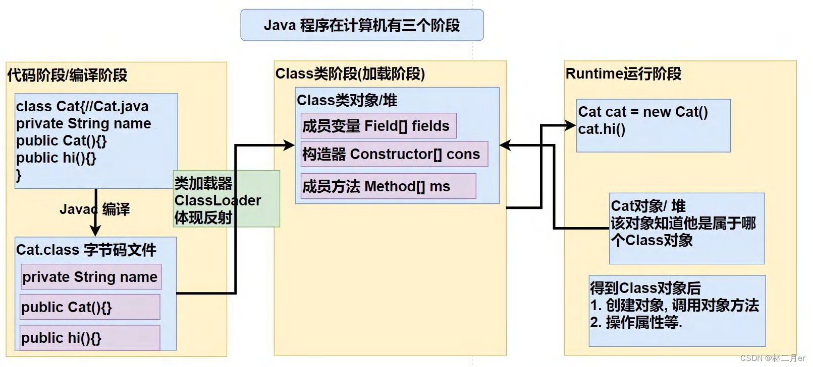
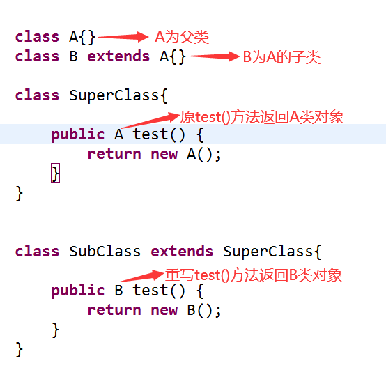
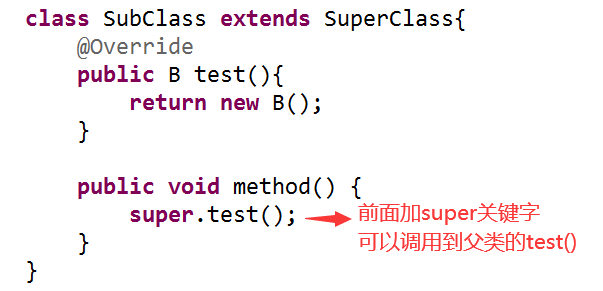
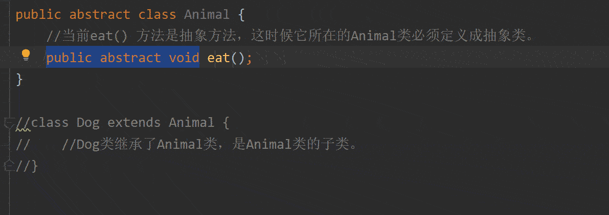
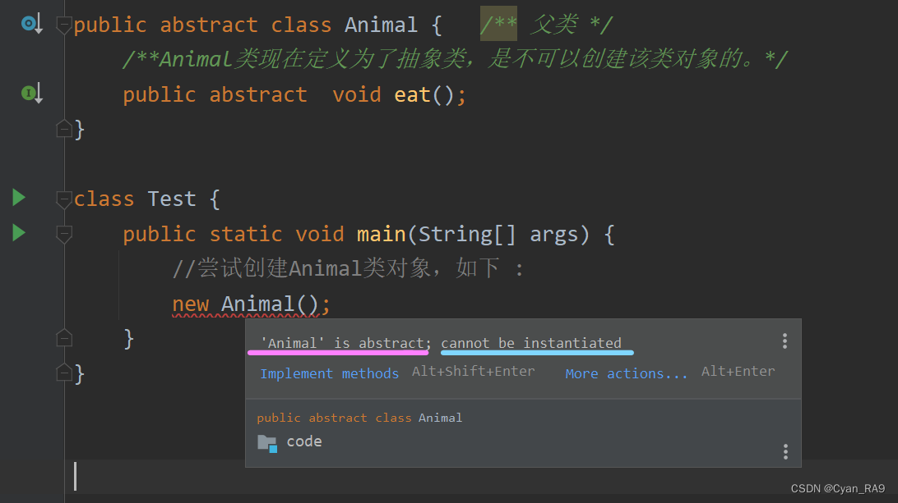
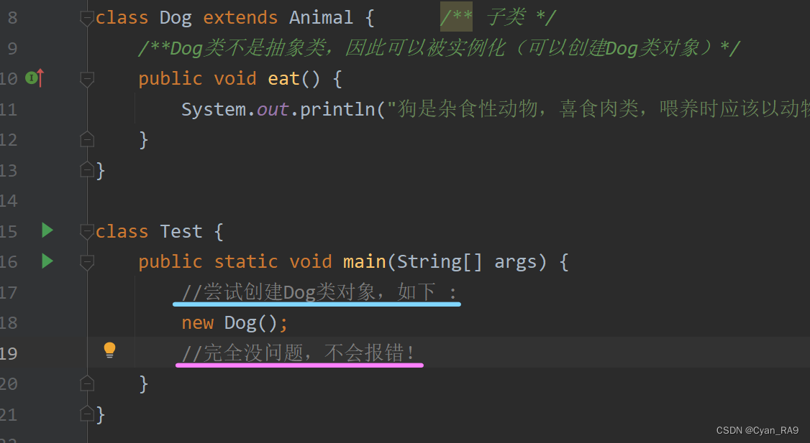
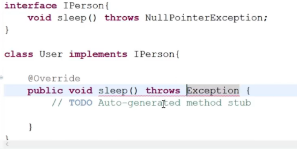
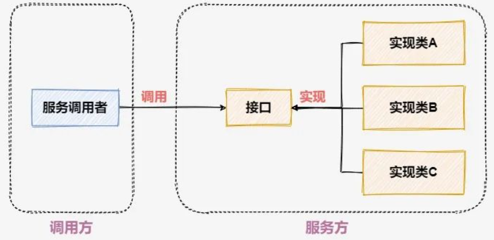
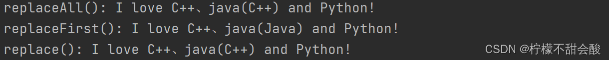

# Java基础知识

## 一、基本语法

***

```java{.line-numbers}
public class 文件名{
    public static void main(String[] args){
        System.out.println(100);
    }
}
```

## 二、数据类型定义

***

### 2.1  tip 1

```java{.line-numbers}
char c = '中';
//long类型后面需要加L/l作为后缀
long n = 99999L;
//float类型需要在后面加F/f作为后缀
float F = 11.6F;
```

### 2.2  基本数据类型和引用数据类型

- 基本数据类型（8）（基本数据类型变量存放数据本身）：```byte、short、int、long、float、double、char、boolean```

- 引用类型（引用类型变量保存数据的空间地址）：
  - 基本数据类型的封装类型：```Byte、Short、Integer、Long、Float、Double、Character、Boolean```
  - 数组、类（ **```String```** 属于类）、接口、枚举、注解

## 三、标识符命名规则

***

### 3.1 硬性要求

- 由数字、字母、下划线、$组成
- 不能以数字开头
- 不能是关键字
- 区分大小写

### 3.2 软性要求

- 小驼峰命名：方法、变量
- 大驼峰命名：类名

## 四、键盘录入

***

**例一**

```java{.line-numbers}
//1.导包，要找到scanner这个类在哪
//书写要注意，写在类定义的上面
import java.util.Scanner;
public class ScannerDemo{
    public static void main(String[] args){
        //2.创建对象，表示我现在准备要用Scanner这个类
        Scanner sc = new Scanner(System.in);
        //3.接收数据
        int i = sc.nextInt();
        System.out.println(i)；
    }
}
```

ps: 这个方法只能接收键盘录入的整数

**例二**

```java{.line-numbers}
import java.util.Scanner;
public calss ScannerDemo{
    public static void main(String[] args){
        Scanner sc = new Scanner(System.in);
        System.out.println('请输入第一个整数')
        int num1 = sc.nextInt();
        System.out.println('请输入第二个整数')
        int num2 = sc.nextInt();
        System.out.println(num1 + num2);
    }
}
```

## 五、取余的应用场景

***

- 可以用于判断，A是否可以被B整除，如 A % B ；10 % 3；
- 可以判断A是否为偶数，如 A % 2 结果为0，那么证明A是一个偶数；
- 斗地主发牌。

## 六、强制转换

***

**目的**：把取值范围大的数值赋值给取值范围小的变量
**eg**：

```java{.line-numbers}
//目标数据类型 变量名 = (目标数据类型) 被强转的数据类型
double a = 12.3;
int b = (int) a;
```

## 七、相加相关

***

- 字符相加：查询ASCII码表，输出ASCII相加的数字结果；
- 字符串相加：字符串拼接。

## 八、短路逻辑运算符&&，||

***

- &&效果等同于&，但是有短路效果。
- || 效果等同于 |，但是有短路效果。
- 短路效果：当左边的表达式可以决定最终的结果，就不会再运行右边的表达式。

## 九、switch相关

***

jdk11之后的switch语句支持以下写法：

```java{.line-numbers}
switch(){
    case 1 -> {
        ...;
    }
    case 2 -> {
        ...;
    }
    default -> {
        ...;
    }
}
//若大括号内只有一行代码，可以直接省略大括号，如下
switch(){
    case 1 -> ...;
    default -> ...;
}
//默认写法如下
switch(){
    case 1:
        ...;
        break;
    case 2:
        ...;
        break;
    default:
        ...;
        break;
}
```

## 十、包装类型的缓存机制

***

### 10.1 包装类型

&ensp;&ensp;&ensp;&ensp;Java中的包装类型是指将基本数据类型（如int、float、boolean等）转换为对象的类。Java语言为了能够让基础数据在某些特殊场合下用对象的形式表示或处理基础数据类型，就为每种基础数据类型都定义了一个包装类。每个包装类的对象当中，就包含一个基础类型的数据。这些类被称为包装类，它们的名字都是在基本数据类型前面加上“Integer”、“Float”、“Boolean”等前缀。包装类使得开发者可以使用面向对象的编程方式来操作基本数据类型，例如访问属性和执行方法。此外，包装类也是为了配合Java 5之后出现的泛型而设计的，因为在泛型中使用基本数据类型是不允许的，而包装类可以作为泛型集合的元素类型。

1. Java 基本数据类型的包装类型的大部分都用到了缓存机制来提升性能。```Byte```,```Short```,```Integer```,```Long``` 这 4 种包装类默认创建了数值 **[-128，127]** 的相应类型的缓存数据，```Character``` 创建了数值在 **[0,127]** 范围的缓存数据，```Boolean``` 直接返回 ```True``` or ```False```。

2. 两种浮点数类型的包装类 ```Float```,```Double``` 并没有实现缓存机制。

**记住：所有整型包装类对象之间值的比较，全部使用 equals 方法比较。**

## 十一、变量

### 11.1 成员变量和局部变量之间的区别

- **语法形式**：成员变量属于类，局部变量是在代码块或方法中定义的变量，或是方法的参数；成员变量可以被```public```,```private```,```static```等修饰符所修饰，而局部变量不能被访问控制符及```static```所修饰；但是，成员变量和局部变量都能被```final```所修饰。
- **储存方式**：如果成员变量是使用```static```修饰的，那么这个成员变量是属于类的，否则属于实例。而对象存在于堆内存，局部变量则存在于栈内存。
- **生存时间**：成员变量是对象的一部分，它随着对象的创建而存在，而局部变量随着方法的调用而自动生成，随着方法的调用结束而消亡。
- **默认值**：从变量是否有默认值来看，成员变量如果没有被赋初始值，则会自动以类型的默认值而赋值（例外：被final修饰的成员变量也必须显式地赋值），而局部变量则不会自动赋值。

### 11.2 静态变量的作用

&ensp;&ensp;&ensp;&ensp;静态变量也就是被```static```关键字修饰的变量。它可以被类的所有实例共享，无论一个类创建了多少个对象，他们都共享同一份静态变量。也就是说，静态变量只会被分配一次内存，无论创建多少对象，这样可以**节省内存**。
&ensp;&ensp;&ensp;&ensp;静态变量是通过类名来访问的，如```StaticVariableExample.staticVar```。

```java{.line-numbers}
public class StaticVariableExample {
    // 静态变量
    public static int staticVar = 0;
}
```

通常情况下，静态变量会被```final```关键字修饰成为常量。

#### 11.2.1. ```final```的作用

- **修饰类**：```final```修饰类时，该类不能被继承。
- **修饰方法**：```final```修饰的方法可以重载不可以继承。（但是有一个可以让子类和父类中同时出现的方法，这里将用到另一个关键字```private```，用```private```修饰的方法，只可以在本类中使用，其他类则没有访问的权限。当我们在被final修饰的方法前加上```private```后，子类便没有了该方法的访问权限，于是子类出现与父类相同的方法便不受final的影响）
- **修饰变量**：```final```修饰变量比较简单，修饰一个基本数据类型时，例如```int```它只能被赋值一次，而后不能改变.

参见：[final关键字详解](https://mp.weixin.qq.com/s?__biz=MzI5MTQ5NDY1MA==&mid=2247492178&idx=1&sn=99f839c4b11a8ab9e63b2941e98cc57c&chksm=ec0d6dc7db7ae4d1c0ddde31e900f668221fad36ea31a7db6447bd6d5f7015e9481bd1bcd24c&scene=27)

```java{.line-numbers}
public class ConstantVariableExample {
    // 常量
    public static final int constantVar = 0;
}
```

#### 11.2.2 ```static```的作用

 **```static```是什么？**

- 表示静态，可以用于修饰成员变量、成员方法。
- 其修饰后的成员变量，可以被类的所有对象共享（访问、修改）。

**```static```修饰的成员变量是什么？ 有什么特点？**

&ensp;&ensp;静态成员变量访问格式：

- 类名.静态成员变量（推荐）
- 对象.静态成员变量（不推荐）

&ensp;&ensp;实例成员变量访问格式：

- 对象.实例成员变量

**两种成员变量各自在什么情况下定义？**

- 静态成员变量：表示在线人数等需要被类的所有对象共享的信息时。
- 实例成员对象：属于每个对象，且每个对象的该信息不同。

**成员变量内存原理**


**```static```修饰的成员变量的内存原理**


**静态方法为什么不能调用非静态成员？**

- 静态方法是属于类的，在类加载的时候就会分配内存，可以通过类名直接访问。而非静态成员属于实例对象，只有在对象实例化之后才存在，需要通过类的实例对象去访问。
- 在类的非静态成员不存在的时候静态方法就已经存在了，此时调用在内存中还不存在的非静态成员，属于非法操作。

参见：[静态方法详解](https://blog.csdn.net/Javascript_tsj/article/details/127163683)

## 十二、接口

### 12.1 引言

&ensp;&ensp;&ensp;&ensp;接口，是 Java语言中一种引用类型，是方法的集合，如果说类的内部封装了成员变量、构造方法和成员方法，那么接口的内部主要就是封装了方法，包含抽象方法（JDK 7及以前），默认方法和静态方法（JDK 8），私有方法（JDK 9 ）。
&ensp;&ensp;&ensp;&ensp;接口的定义，它与定义类方式相似，但是使用```interface```关键字。它也会被编译成```.class```文件，但一定要明确它并不是类，而是另外一种引用数据类型。

### 12.2 定义

2.1. 定义接口要用到```interface```关键字，格式如下：

```java{.line-numbers}
interface 接口名{
}
```

2.2. 类和接口之间不再是继承，而是实现关系，用```implements```关键字表示。如下：

```java{.line-numbers}
class 类名 implements 接口名{
}
```

### 12.3 特点

#### 12.3.1 接口成员变量

&ensp;&ensp;&ensp;&ensp;接口没有成员变量，只有公有静态常量。对公有静态常量，初始化的路径只有——1.定义时2.静态代码块中，而接口中不允许出现代码块，而且接口没有构造方法。所以我们在接口中定义公有静态常量时，必须在定义时就赋初值。如下：

```java{.line-numbers}
public interface DemoInterface{
    public static final int i = 0;//public static final，这仨写不写都在
}
```

#### 12.3.2 接口成员方法

- JDK7.0版本及其之前，接口中仅支持公有的**抽象方法**：

```java
public abstract 返回值类型 方法名();//abstract可以省略，因为接口中的方法默认就是公有抽象方法
```

&ensp;&ensp;&ensp;&ensp;注意：实现类必须覆盖重写接口所有的抽象方法，除非实现类是抽象类。

- JDK8.0开始，接口中可以有**默认方法**和**静态方法**：

```java
public default 返回值类型 方法名(){}

public static 返回值类型 方法名(){}
```

&ensp;&ensp;&ensp;&ensp;想定义默认方法必须在前面添加```default```关键字，因为接口中的方法如果你什么都不写，默认是公有的抽象的方法。默认方法其实就是普通的成员方法，但是可以被实现类重写。**```default```关键字只能在接口中使用**。就算实现类要重写默认方法，实现类中重写后的方法也不能添加```default```修饰符，不然IDEA报错。

- JDK9.0以后，接口中可以有私有方法：

```java
private 返回值类型 方法名(){}
```

- **演示**（我们以Demo2接口为演示接口，以Imple类作为Demo2接口的实现类，最后以Test2类作为测试类，代码如下 : ）

```java{.line-numbers}
package knowledge.port.character.methods;

public interface Demo2{
    //抽象方法
    public abstract void hello_world();

    //默认方法
    public default void Noise(){
        System.out.println("你不要给我哇哇叫。");
    }

    //静态方法
    public static double Sum(double x, double y){
        return x + y;
    }

    //私有方法
    private void Own(){
        System.out.println("这是爷的私有方法。")
    }
    //私有方法只有接口自己能够调用
    public default void Invoke_Own(){
        this.Own();
    }
}

class Imple implements Demo2{
    @override
    public void hello_word(){
        System.out.println("你好。")
    }
}

class Test2{
    public static void main(String[] args){
        Demo2 d2 = new Imple();
        d2.Noise();
        System.out.println(Demo2.Sum(123,321));
        d2.Invoke_Own;
    }
}
```

- **运行结果**

### 12.4 总结

在Java 9+版本中，接口的内容可以有：

1. 成员变量其实是常量，格式：
   [public] [static] [final] 数据类型 常量名称 = 数据值;
   注意：
    常量必须进行赋值，而且一旦赋值不能改变。
    常量名称完全大写，用下划线进行分隔。

2. 接口中最重要的就是抽象方法，格式：
   [public] [abstract] 返回值类型 方法名称(参数列表);
   注意：实现类必须覆盖重写接口所有的抽象方法，除非实现类是抽象类。

3. 从Java 8开始，接口里允许定义默认方法，格式：
   [public] [default] 返回值类型 方法名称(参数列表) { 方法体 }
   注意：默认方法也可以被覆盖重写。

4. 从Java 8开始，接口里允许定义静态方法，格式：
   [public] [static] 返回值类型 方法名称(参数列表) { 方法体 }
   注意：应该通过接口名称进行调用，不能通过实现类对象调用接口静态方法。

5. 从Java 9开始，接口里允许定义私有方法，格式：
   普通私有方法：[private] 返回值类型 方法名称(参数列表) { 方法体 }
   静态私有方法：[private] [static] 返回值类型 方法名称(参数列表) { 方法体 }
   注意：private的方法只有接口自己才能调用，不能被实现类或别人使用。

6. 接口的子类（实现类）可以是抽象类，也可以是普通类。
   对于抽象实现类，可以不用实现接口的所有方法，因为抽象类本身容许存在抽象方法，语法上是通过的。对于普通实现类，要求实现接口的所有方法。

参见：
1：[CSDN文章1](https://blog.csdn.net/TYRA9/article/details/129174384)
2：[CSDN文章2](https://blog.csdn.net/m0_52196529/article/details/127192171)

## 十三、泛型

***

### 13.1 前言

#### 13.1.1 泛型的概念

&ensp;&ensp;&ensp;&ensp;泛型就是类在定义时无法确认类中成员的类型(属性，方法)，而是类再创建时指定具体的数据类型。
&ensp;&ensp;&ensp;&ensp;Java泛型允许类、接口和方法在定义时使用一个或多个类型参数，这些参数会在调用时被实际类型替换，增强了代码的**重用性**和**类型安全性**。通过使用泛型，我们可以编写出更通用的代码，同时也可以减少代码中的强制类型转换操作，提高代码的**可读性**和**可维护**性。
&ensp;&ensp;&ensp;&ensp;泛型在Java中实现的方式是使用**类型擦除技术**，即在编译时将泛型类型转化为原始类型，从而避免了类型检查的开销和运行时的类型转换。**泛型的本质是为了将类型参数化。**

#### 13.1.2 泛型的特点

1. 可以在编译时检查类型的安全性。

2. 可以减少类型转换的代码量。
3. 可以让程序员编写更加通用的代码，减少代码的重复。
4. 可以提高代码的可读性和可维护性。

#### 13.1.3 泛型的格式

```java
List<E>，这里的<E>就是泛型标志
Map<K,V>，这里<K,V>也是泛型标记

class 类名称 <泛型标识> {
  private 泛型标识  变量名; 
  .....
}

public class 类名<T,E,B>{
 private T a;
 public T getA(){}
 public void setA(T t){}
}
```

### 13.2 泛型类

#### 13.2.1 作用

使用场景：当你需要创建一个通用的数据结构，例如列表、栈、队列、字典等，这些结构可以处理各种类型的数据时，可以使用泛型类。

优势：泛型类提高了代码的可重用性，因为你可以使用一个类定义来处理不同类型的数据。此外，泛型类还可以提高类型安全性，因为它们在编译时检查类型，从而减少了运行时类型转换错误的可能性。

#### 13.2.2 格式

```java
public class 类名<T,E,B>{
 private T a;
 public T getA(){}
 public void setA(T t){}
}
```

其中的T表示类型参数，可以表示任何包装类型（基本类型不涉及泛型），这里的 T 就是泛型标识可以任意设置

#### 13.2.3 Java 常见的泛型标识以及其代表含义如下

  **T** ：代表一般的任何类。
  **E** ：代表 Element 元素的意思，或者 Exception 异常的意思。
  **K** ：代表 Key 的意思。
  **V** ：代表 Value 的意思，通常与 **K** 一起配合使用。
  **S** ：代表 Subtype 的意思，文章后面部分会讲解。

```java
public class FanXing <T> {
    private T value;

    public void setValue(T value) {
        this.value = value;
    }

    public T getValue() {
        return this.value = value;
    }
}
```

当创建一个泛型< T > 类对象时，会向尖括号 <> 中传入具体的数据类型（任何类型）。

```java
public static void main(String[] args){
        FanXing fanXing1 = new FanXing<>(); // 不传时相当于默认 Object 类型
        FanXing fanXing2 = new FanXing(); // 同上
        FanXing fanXing3 = new FanXing<String>();
        FanXing fanXing4 = new FanXing<Integer>();
    }

```

### 13.3 泛型接口

#### 13.3.1 作用

使用场景：当你需要设计一组具有通用操作的接口时，例如比较器、转换器、工厂等，这些接口可以应用于不同类型的对象，可以使用泛型接口。

优势：泛型接口提高了代码的可重用性，因为你可以使用一个接口定义来描述不同类型对象之间的通用操作。此外，泛型接口还可以提高类型安全性，因为它们在编译时检查类型，从而减少了运行时类型转换错误的可能性。

#### 13.3.2 格式

```java
public interface 接口名<泛型标识> {
    ...
}
```

如：

```java
// 接口定义
public interface FanXingInterface<T> {
    int n = 10;
//    T value;// 报错！ 接口中的属性默认是静态的，因此不能使用类型参数声明
    T show(T value);

    // 在jdk8 中，可以在接口中使用默认方法, 默认方法可以使用泛型接口的类型参数
    default T method(T value) {
        return null;
    }
}
```

#### 13.3.3 分类

- 接口实现类1，实现类中继承了泛型参数

```java
public class FanXingInterfaceImpl1<T> implements FanXingInterface <T>{
    @Override
    public T show(T value){
       return value;
    }
}
```

- 接口实现类2，实现类中定义了明确的类型

```java
public class FanXingInterfaceImpl2 implements FanXingInterface<String>{
    @Override
    public String show(String value){
        return value;
    }
}
```

- 接口子类接口，必须明确的类型

```java
public interface FanXingInterface3 extends FanXingInterface<String>{
    @Override
    default String show(String value) {
        return null;
    }

    @Override
    default String method(String value) {
        return null;
    }
}
```

### 13.4 泛型方法

#### 13.4.1 作用

使用场景：当你需要设计一个通用的方法，它可以处理不同类型的参数时，可以使用泛型方法。泛型方法在普通类和泛型类中都可以使用。

优势：泛型方法提高了代码的可重用性，因为你可以使用一个方法定义来处理不同类型的参数。此外，泛型方法有助于类型安全性，因为它们在编译时检查类型，从而减少了运行时类型转换错误的可能性。

#### 13.4.2 格式

```java
public <T> 返回类型 方法名 (类型参数 变量名) {
    ...
}
```

只有在方法签名中声明了的方法才是泛型方法，仅使用了泛型类定义的类型参数的方法并不是泛型方法，如下show1()：

```java
public class FanXingMethod <E>{
    // 泛型方法
    public <T> void show(T value){
        return;
    }
    // 非泛型方法
    public  void show1(E value){
        return;
    }
    // 泛型方法，使用泛型类中定义的泛型参数
    public <E> E show2(E value){
        return value;
    }
}
```

### 13.5 类型限定

#### 13.5.1 作用

使用场景：当你需要限制泛型类型参数的范围时，例如，只允许实现了某个接口或继承自某个类的类型作为参数，可以使用类型限定。

优势：类型限定可以增加代码的灵活性，使其适应更多的类型。同时，类型限定还可以确保泛型代码的正确性，因为它限制了可以作为类型参数的范围。

#### 13.5.2 示例

在 ArrayList 集合中，可以放入所有类型的对象，假设现在需要一个只存储了 String 类型对象的 ArrayList 集合。

代码如下：

```java
@ Test
public void test() {
    ArrayList list = new ArrayList();
    list.add("aaa");
    list.add("bbb");
    list.add("ccc");
    for (int i = 0; i < list.size(); i++) {
        System.out.println((String)list.get(i));
    }
}
```

- 上面代码没有任何问题，在遍历 ArrayList 集合时，只需将 Object 对象进行向下转型成 String 类型即可得到 String 类型对象。

但如果在添加 String 对象时，不小心添加了一个 Integer 对象，会发生什么？看下面代码：

```java
@Test
public void test() {
    ArrayList list = new ArrayList();
    list.add("aaa");
    list.add("bbb");
    list.add("ccc");
    list.add(111);
    for (int i = 0; i < list.size(); i++) {
        System.out.println((String)list.get(i));
    }
}
```

输出结果：


- 上述代码在编译时没有报错，但在运行时却抛出了一个 **ClassCastException** 异常，其原因是 Integer 对象不能强转为 String 类型。

那如何可以避免上述异常的出现？即我们希望当我们向集合中添加了不符合类型要求的对象时，编译器能直接给我们报错，而不是在程序运行后才产生异常。这个时候便可以使用**泛型**了。

使用泛型代码如下：

```java
@Test
public void test() {
    ArrayList<String> list = new ArrayList<>();
    list.add("aaa");
    list.add("bbb");
    list.add("ccc");
    list.add(111);// 在编译阶段，编译器会报错
    for (int i = 0; i < list.size(); i++) {
        System.out.println((String)list.get(i));
    }
}
```

- `<String>` 是一个泛型，其限制了 ArrayList 集合中存放对象的数据类型只能是 String，当添加一个非 String 对象时，编译器会直接报错。这样，我们便解决了上面产生的 ClassCastException 异常的问题（这样体现了泛型的类型安全检测机制）。

### 13.6 通配符 <?>

#### 13.6.1 泛型的继承

在介绍泛型通配符之前，先提出一个问题，在 Java 的多态中，我们知道可以将一个子类对象赋值给其父类的引用，这也叫向上转型。

如：

```java
public class GenericType {
    public static void main(String[] args) {  
        List list = new ArrayList();
    }  
}
```

- 上面的代码体现了 Java 的多态特性。

<div style="background-color:#D2D2D2; color: black; padding: 8px;">那现在我们思考一个问题，在 ArrayList&lt;T&gt; 泛型集合中，当传入 &lt;T&gt; 中的数据类型相同时，是否还能将一个 ArrayList&lt;T&gt; 对象赋值给其父类的引用 List&lt;T&gt;。
</div>

在 Java 标准库中的集合 ArrayList< T > 类实现了 List< T >接口，其源码大致如下：

```java
public class ArrayList<T> implements List<T> {...}
```

<div style="background-color:#D2D2D2; color: black; padding: 8px;">
那现在我们思考一个问题，在 ArrayList&lt;T&gt; 泛型集合中，当传入 &lt;T&gt; 中的数据类型相同时，是否还能将一个 ArrayList&lt;T&gt; 对象赋值给其父类的引用 List&lt;T&gt;。
</div>


```java
public class GenericType {
    public static void main(String[] args) {  
        List<Integer> list = new ArrayList<Integer>();
    }  
}
```

- 上面的代码没有问题， 即 ArrayList< T > 对象可以向上转型为 List< T >，但两者传入 < T > 中的数据类型必须相同

<div style="background-color:#D2D2D2; color: black; padding: 8px;">
继续思考一个问题，已知 Integer 类是 Number 类的子类，那如果 ArrayList&lt;&gt; 泛型集合中，在 &lt;&gt; 之间使用向上转型，也就是将 ArrayList&lt;Integer&gt; 对象赋值给 List&lt;Number&gt; 的引用，是否被允许呢？
</div>


```java
public class GenericType {
    public static void main(String[] args) {  
        List<Number> list01 = new ArrayList<Integer>();// 编译错误
        
  ArrayList<Number> list02 = new ArrayList<Integer>();// 编译错误
    }  
}
```

- 上面代码会报错，我们发现并不能把 ArrayList< Integer > 对象赋值给 List< Number >的引用，甚至不能把 ArrayList< Integer > 对象赋值给 ArrayList< Number >的引用。这也说明了**在一般泛型中，不能向上转型**。

<div style="background-color:#D2D2D2; color: black; padding: 8px;">
这是为什么？如果我们假设 ArrayList&lt;Integer&gt;可以向上转型为 ArrayList&lt;Number&gt;。
</div>


观察下面代码：

```java
public class GenericType {
    public static void main(String[] args) {  
        // 创建一个 ArrayList<Integer> 集合
  ArrayList<Integer> integerList = new ArrayList<>();
  
  // 添加一个 Integer 对象
  integerList.add(new Integer(123));
  
  // “向上转型”为 ArrayList<Number>
  ArrayList<Number> numberList = integerList;
  
  // 添加一个 Float 对象，Float 也是 Number 的子类，编译器不报错
  numberList.add(new Float(12.34));
  
  // 从 ArrayList<Integer> 集合中获取索引为 1 的元素（即添加的 Float 对象）：
  Integer n = integerList.get(1); // ClassCastException，运行出错
    }  
}
```

- 当我们把一个 ArrayList< Integer > 向上转型为 ArrayList< Number > 类型后，这个 ArrayList< Number > 集合就可以接收 Float 对象了，因为 Float 类是 Number 类的子类。
- 但是，ArrayList< Number > 实际上和 ArrayList< Integer > 是同一个集合，而在泛型的定义中， ArrayList< Integer > 集合是不可以接收 Float 对象的。这是因为，在使用 get() 方法获取集合元素的时候，编译器会自动将 Float 对象强转成 Integer 对象，而这会产生 ClassCastException 异常。

**正因如此，编译器为了避免发生这种错误，根本就不允许把 ArrayList< Integer >对象向上转型为 ArrayList< Number >；换而言之， ArrayList< Integer > 和 ArrayList< Number > 两者之间没有继承关系。**

#### 13.6.2 什么是泛型通配符

在现实编码中，确实有这样的需求：希望泛型能够处理某一类型范围内的类型参数，比如某个泛型类和它的子类，为此 Java 引入了泛型通配符这个概念。

**泛型通配符有 3 种形式**：

1. **< ? >**：被称作无限定的通配符。? 代表了任何一种数据类型，能代表任何一种数据类型的只有 null。需要注意的是： <?> 也是一个数据类型实参，它和 Number、String、Integer 一样都是一种实际的数据类型。

   注意：Object 本身也算是一种数据类型，但却不能代表任何一种数据类型，所以 ArrayList< Object > 和 ArrayList< ? > 的含义是不同的，前者类型是 Object，也就是继承树的最高父类，而后者的类型完全是未知的；ArrayList< ? > 是 ArrayList< Object > 逻辑上的父类。

2. **<? extends T>** ：被称作有上界的通配符。表示类型参数的范围是 T 和 T 的子类。使用 extends 通配符表示可以读，不能写。
   如：

```java
public class GenericType {
    public static void main(String[] args) {  
  ArrayList<Number> list01 = new ArrayList<Integer>();// 编译错误

  ArrayList<? extends Number> list02 = new ArrayList<Integer>();// 编译正确
    }  
}
```

3. **<? super T>** ：被称作有下界的通配符。表示类型参数的范围是 T 和 T 的超类，直至 Object。使用 super 通配符表示可以写，不能读。
   如：

```java
public class GenericType {
    public static void main(String[] args) {  
  ArrayList<Integer> list01 = new ArrayList<Number>();// 编译错误

  ArrayList<? super Integer> list02 = new ArrayList<Number>();// 编译正确
    }  
}
```

在引入泛型通配符之后，我们便得到了一个在逻辑上可以表示为某一类型参数范围的父类引用类型。举例来说，泛型通配符可以表示 Pair< Integer > 和 Pair< Number > 两者的父类引用类型。

### 13.7 类型擦除

#### 13.7.1 什么是类型擦除

泛型的本质是将**数据类型参数化**，它通过擦除的方式来实现，即编译器会在编译期间**擦除**代码中的所有泛型语法并相应的做出一些类型转换动作。

换而言之，**泛型信息只存在于代码编译阶段**，在代码编译结束后，与泛型相关的信息会被擦除掉，专业术语叫做**类型擦除**。也就是说，成功编译过后的 class 文件中不包含任何泛型信息，泛型信息不会进入到**运行时阶段**。

看一个例子，假如我们给 ArrayList 集合传入两种不同的数据类型，并比较它们的类信息。

代码如下：

```java
public class GenericType {
    public static void main(String[] args) {  
        ArrayList<String> arrayString = new ArrayList<String>();   
        ArrayList<Integer> arrayInteger = new ArrayList<Integer>();   
        System.out.println(arrayString.getClass() == arrayInteger.getClass());// true
    }  
}
```

- 在这个例子中，我们定义了两个 ArrayList 集合，不过一个是 ArrayList< String>，只能存储字符串。一个是 ArrayList< Integer>，只能存储整型对象。我们通过 arrayString 对象和 arrayInteger 对象的 getClass() 方法获取它们的类信息并比较，发现结果为true。
- 明明我们在 <> 中传入了两种不同的数据类型，按照上文所说的，它们的类型参数 T 不是应该被替换成我们传入的数据类型了吗，那为什么它们的类信息还是相同呢？ 这是因为，在编译期间，所有的泛型信息都会被擦除， ArrayList< Integer > 和 ArrayList< String >类型，在编译后都会变成ArrayList< Objec t>类型。

再看一个例子，假设定义一个泛型类如下：

```java
public class Caculate<T> {
 private T num;
}
```

在该泛型类中定义了一个属性 num，该属性的数据类型是泛型类声明的类型参数 T ，这个 T 具体是什么类型，我们也不知道，它只与外部传入的数据类型有关。将这个泛型类反编译。

代码如下：

```JAVA
public class Caculate {
 public Caculate() {}// 默认构造器，不用管
 
 private Object num;// T 被替换为 Object 类型
}
```

- 可以发现编译器**擦除**了 Caculate 类后面的泛型标识 < T >，并且将 num 的数据类型替换为 Object 类型，而替换了 T 的数据类型我们称之为**原始数据类型**。

*那么是不是所有的类型参数被擦除后都以 Object 类进行替换呢？*

*答案是否定的，大部分情况下，类型参数 T 被擦除后都会以 Object 类进行替换；而有一种情况则不是，那就是使用到了 extends 和 super 语法的有界类型参数（即泛型通配符）。*

#### 13.7.2 类型擦除的原理

其实在创建一个泛型类的对象时， Java 编译器是先检查代码中传入 < T > 的数据类型，并记录下来，然后再对代码进行编译，**编译的同时进行类型擦除**；在泛型信息被擦除后，若还需要使用到对象相关的泛型信息，编译器底层会自动进行类型转换（从原始类型转换为未擦除前的数据类型）。

*可以把泛型的类型安全检查机制和类型擦除想象成演唱会的验票机制：以 ArrayList< Integer> 泛型集合为例。*

1. 当我们在创建一个 ArrayList< Integer > 泛型集合的时候，ArrayList 可以看作是演唱会场馆，而< T >就是场馆的验票系统，Integer 是验票系统设置的门票类型；
2. 当验票系统设置好为< Integer >后，只有持有 Integer 门票的人才可以通过验票系统，进入演唱会场馆（集合）中；若是未持有 Integer 门票的人想进场，则验票系统会发出警告（编译器报错）。
3. 在通过验票系统时，门票会被收掉（类型擦除），但场馆后台（JVM）会记录下观众信息（泛型信息）。
4. 进场后的观众变成了没有门票的普通人（原始数据类型）。但是，在需要查看观众的信息时（操作对象），场馆后台可以找到记录的观众信息（编译器会自动将对象进行类型转换）。

举例如下：

```java
public class GenericType {
    public static void main(String[] args) {  
        ArrayList<Integer> arrayInteger = new ArrayList<Integer>();// 设置验票系统   
        arrayInteger.add(111);// 观众进场，验票系统验票，门票会被收走（类型擦除）
        Integer n = arrayInteger.get(0);// 获取观众信息，编译器会进行强制类型转换
        System.out.println(n);
    }  
}
```

### 13.8 特殊写法（来自AlbertShen）

**<T extends A & B>** 表明T继承了类 A 和 接口 B（注意不是实现接口 B），而且只能类在前，接口在后。T 既是 A 的子类，也是 B 的子接口。

参见：[泛型详解](https://blog.csdn.net/weixin_45395059/article/details/126006369)
[Java中的泛型 Generics in Java](https://www.bilibili.com/video/BV1H94y1a7bJ?vd_source=e8976dfc4f8802c42fff0ffb2429e64e)

## 十四、构造方法

***

### 14.1 概念

&ensp;&ensp;&ensp;&ensp;构造方法（构造器）是一个特殊的成员方法，名字必须与类名相同，在创建对象时由编译器自动调用，并且在整个对象的生命周期内只调用一次。构造方法的作用就是对对象中的成员进行初始化，并不负责给对象开辟空间。

**代码演示**

```Java{.line-numbers}
public class Data{
    public int year;
    public int month;
    public int day;

    //空参构造
    public Data() {}

    //有参构造方法
    public Data(int year, int month, int day){
        this.year = year;
        this.month = month;
        this.day = day;
        System.out.println("这是构造方法")；
    }

    public void printData(){
        System.out.println(year + "-" + month + "-" + day);
    }

    public static void main(String[] args){
        //创建一个对象
        Data data = new Data(2022,11,13);
        /*因为写了有参构造器，所以可以在创建对象时直接进行赋值，如果不赋值，调用的则是
        默认构造器（如果我们重载了有参的构造方法，记得都要把无参的构造方法也写出来，因
        为有的场景下并不知道具体的形参）*/
        data.printData();
    }
}
```

### 14.2 ```this```的作用

#### 14.2.1 ```this```是什么

- ```this```关键字的意义被解释为“指向当前对象的引用”，这个解释非常准确并且很精炼。

#### 14.2.2 作用

- this.属性名：表示本对象自己的属性
- this.方法名：表示本对象自己的方法
- this(参数)：表示本对象自身的构造方法

```java{.l;ine-numbers}
//构造方法1
public Person(String name, int age, int id){
    //调用构造方法2
    this(name, age);
    this.id = id;
}
//构造方法2
public Person(String name, int age){
    this.name = name;
    this.name = age;
}
/*
这两个构造方法当中前2行代码是相互重复的，为了避免这种重复性
的代码出现，我们可以在”构造方法1”当中调用”构造方法2”,这种”
this(参数)”的方式只能在”其他构造方法中”使用，不能在普通方法中用。
*/
```

- 外部类名.this.属性：表示在内部类中调用的是外部类的某个属性

参见：[内部类详解](https://blog.csdn.net/shalimu/article/details/105198961)

### 14.3 特性

- 构造方法的名字必须与类名相同。
- 没有返回值类型，设置成```void```也不行。
- 创建对象时由虚拟机自动调用，并且在对象的生命周期内只调用一次。
- 构造方法可以重载（用户可以根据自己的需求提供不同参数的构造方法），不能被重写。
- 如果用户没有显式定义构造方法，编译器就会默认生成一份构造方法，而且默认生成的构造方法一定是无参的。
- 构造方法中，可以通过```this```调用其他的构造方法来简化代码。（ ```this()```必须是构造方法中的第一条语句 ，且```this```不能形成环）
- 我们一直在不知不觉地使用构造方法，这也是为什么我们在创建对象的时候后面要加一个括号（因为要调用无参的构造方法）。如果我们重载了有参的构造方法，记得都要把无参的构造方法也写出来（无论是否用到），因为这可以帮助我们在创建对象的时候少踩坑。

参见：[构造方法详解](https://blog.csdn.net/m0_70322372/article/details/127829707)

## 十五、注解

***

### 15.1 注解的定义和基本语法

#### 15.1.1 定义

&ensp;&ensp;&ensp;&ensp;注解（Annotation）是Java语言中的一种特殊语法结构，它可以在代码中嵌入元数据（metadata），用于一些特殊的标记和说明。注解可以在编译时被读取，并在运行时使用。注解本质是一个继承了Annotation 的特殊接口。

**基本语法**

```java
@注解名称 (属性名1 = 属性值1...)
```

**示例**

```java
@Deprecated(since = "1.5")
public void dosth(){
    //...
}
```

&ensp;&ensp;&ensp;&ensp;此处使用了@Deprecated注解，表示该方法已经过时，不应再被使用。since属性指定了该方法从哪个版本开始被废弃。

#### 15.1.2 主要作用

- 生成文档，通过代码里标识的元数据生成javadoc文档。

- 编译检查，通过代码里标识的元数据让编译器在编译期间进行检查验证。
- 编译时动态处理，编译时通过代码里标识的元数据动态处理，例如动态生成代码。
- 运行时动态处理，运行时通过代码里标识的元数据动态处理，例如使用反射注入实例。

#### 15.1.3 常见分类

- **Java自带的标准注解**，包括@Override、@Deprecated和@SuppressWarnings，分别用于标明重写某个方法、标明某个类或方法过时、标明要忽略的警告，用这些注解标明后编译器就会进行检查。

- **元注解**，元注解是用于定义注解的注解，包括@Retention、@Target、@Inherited、@Documented，@Retention用于标明注解被保留的阶段，@Target用于标明注解使用的范围，@Inherited用于标明注解可继承，@Documented用于标明是否生成javadoc文档。
- **自定义注解**，可以根据自己的需求定义注解，并可用元注解对自定义注解进行注解。

### 15.2 内置注解的使用场景和用法

&ensp;&ensp;&ensp;&ensp;Java语言提供了一些内置注解，这些注解可以用来标记特定的场景，从而帮助编译器和开发者更好地理解代码的含义。以下是一些常见的内置注解及其使用场景和用法：

- @Override：**用来标记方法覆盖父类的方法**。如果一个方法使用了该注解，但是却没覆盖父类中的任何方法，编译器会报错。

- @Deprecated：**用来标记已经过时的方法或类**。如果一个方法或类使用了该注解，编译器会给出警告信息，提示开发者不要再使用该方法或类。
- @SuppressWarnings：**表示关闭编译器警告信息**。如果一个方法或类使用了该注解，并且方法中使用了可变参数，编译器会给出警告信息，提示开发者要确保该方法是类型安全的。
- @FunctionalInterface：用来标记函数式接口。如果一个接口使用了该注解，编译器会检查该接口是否符合函数式接口的定义，即是否只包含一个抽象方法。

示例代码：

```java
class A{
    public void test() {
        
    }
}

class B extends A{

    /**
        * 重载父类的test方法
        */
    @Override
    public void test() {
    }

    /**
        * 被弃用的方法
        */
    @Deprecated
    public void oldMethod() {
    }

    /**
        * 忽略告警
        * 
        * @return
        */
    @SuppressWarnings("rawtypes")
    public List processList() {
        List list = new ArrayList();
        return list;
    }
}
```

##### 15.2.1 内置注解 - @Override

我们先来看一下这个注解类型的定义：

```java
@Target(ElementType.METHOD)
@Retention(RetentionPolicy.SOURCE)
public @interface Override {
}
```

从它的定义我们可以看到，这个注解可以被用来修饰方法，并且它只在编译时有效，在编译后的class文件中便不再存在。这个注解的作用我们大家都不陌生，那就是告诉编译器被修饰的方法是重写的父类的中的相同签名的方法，编译器会对此做出检查，若发现父类中不存在这个方法或是存在的方法签名不同，则会报错。

##### 15.2.2 内置注解 - @Deprecated

这个注解的定义如下：

```java
@Documented
@Retention(RetentionPolicy.RUNTIME)
@Target(value={CONSTRUCTOR, FIELD, LOCAL_VARIABLE, METHOD, PACKAGE, PARAMETER, TYPE})
public @interface Deprecated {
}
```

从它的定义我们可以知道，它会被文档化，能够保留到运行时，能够修饰构造方法、属性、局部变量、方法、包、参数、类型。这个注解的作用是告诉编译器被修饰的程序元素已被“废弃”，不再建议用户使用。

##### 15.2.3 内置注解 - @SuppressWarnings

这个注解我们也比较常用到，先来看下它的定义：

```java
@Target({TYPE, FIELD, METHOD, PARAMETER, CONSTRUCTOR, LOCAL_VARIABLE})
@Retention(RetentionPolicy.SOURCE)
public @interface SuppressWarnings {
    String[] value();
}
```

它能够修饰的程序元素包括类型、属性、方法、参数、构造器、局部变量，只能存活在源码时，取值为String[]。它的作用是告诉编译器忽略指定的警告信息，它可以取的值可参照：[注解详解](https://www.pdai.tech/md/java/basic/java-basic-x-annotation.html)

### 15.3 元注解

上述内置注解的定义中使用了一些元注解（注解类型进行注解的注解类），在JDK 1.5中提供了4个标准的元注解：@Target，@Retention，@Documented，@Inherited, 在JDK 1.8中提供了两个元注解 @Repeatable和@Native。

#### 15.3.1 元注解 - @Target

<div style="background-color:#D2D2D2; color: black; padding: 8px;">
Target注解的作用是：描述注解的使用范围（即：被修饰的注解可以用在什么地方） 。
</div>

Target注解用来说明那些被它所注解的注解类可修饰的对象范围：注解可以用于修饰 packages、types（类、接口、枚举、注解类）、类成员（方法、构造方法、成员变量、枚举值）、方法参数和本地变量（如循环变量、catch参数），在定义注解类时使用了@Target 能够更加清晰的知道它能够被用来修饰哪些对象，它的取值范围定义在ElementType 枚举中。

```java
public enum ElementType {
 
    TYPE, // 类、接口、枚举类
 
    FIELD, // 成员变量（包括：枚举常量）
 
    METHOD, // 成员方法
 
    PARAMETER, // 方法参数
 
    CONSTRUCTOR, // 构造方法
 
    LOCAL_VARIABLE, // 局部变量
 
    ANNOTATION_TYPE, // 注解类
 
    PACKAGE, // 可用于修饰：包
 
    TYPE_PARAMETER, // 类型参数，JDK 1.8 新增
 
    TYPE_USE // 使用类型的任何地方，JDK 1.8 新增
 
}
```

#### 15.3.2 元注解 - @Retention & @RetentionTarget

<div style="background-color:#D2D2D2; color: black; padding: 8px;">
Reteniton注解的作用是：描述注解保留的时间范围（即：被描述的注解在它所修饰的类中可以被保留到何时） 。
</div>


Reteniton注解用来限定那些被它所注解的注解类在注解到其他类上以后，可被保留到何时，一共有三种策略，定义在RetentionPolicy枚举中。

```java
public enum RetentionPolicy {
    //此注解类型的信息只会记录在源文件中，编译时将被编译器丢弃，
    //也就是说不会保存在编译好的类信息中。
    SOURCE,  

    //编译器将注解记录在类文件中，但不会加载到JVM中。
    //如果一个注解声明没指定范围，则系统默认值就是Class。
    CLASS,     

    //注解信息会保留在源文件、类文件中，在执行的时也加载到Java的JVM中，因此可以反射性地读取。
    RUNTIME  
}
```

#### 15.3.3 元注解 - @Documented

<div style="background-color:#D2D2D2; color: black; padding: 8px;">
Documented注解的作用是：描述在使用 javadoc 工具为类生成帮助文档时是否要保留其注解信息。如果一个注解被@Documented注解，则它会被包含在JavaDoc中，方便开发者查看。
</div>


```java
@Target(ElementType.FIELD)
@Retention(RetentionPolicy.RUNTIME)
@Documented
public @interface Column {
    public String name() default "fieldName";
    public String setFuncName() default "setField";
    public String getFuncName() default "getField";
    public boolean defaultDBValue() default false;
}
```

#### 15.3.4 元注解 - @Inherited

<div style="background-color:#D2D2D2; color: black; padding: 8px;">
Inherited注解的作用：被它修饰的注解将具有继承性。如果某个类使用了被@Inherited修饰的注解，则其子类将自动具有该注解。
</div>


#### 15.3.5 元注解 - @Repeatable

<div style="background-color:#D2D2D2; color: black; padding: 8px;">
表示注解可以重复使用。当我们需要重复使用某个注解时，希望利用相同的注解来表现所有的形式时，我们可以借助@Repeatable注解。
</div>


#### 15.3.6 元注解 - @Native

<div style="background-color:#D2D2D2; color: black; padding: 8px;">
使用 @Native 注解修饰成员变量，则表示这个变量可以被本地代码引用，常常被代码生成工具使用。对于 @Native 注解不常使用，了解即可
</div>

### 15.4 注解与反射接口

定义注解后，如何获取注解中的内容呢？反射包java.lang.reflect下的AnnotatedElement接口提供这些方法。这里注意：只有注解被定义为RUNTIME后，该注解才能是运行时可见，当class文件被装载时被保存在class文件中的Annotation才会被虚拟机读取。

AnnotatedElement 接口是所有程序元素（Class、Method和Constructor）的父接口，所以程序通过反射获取了某个类的AnnotatedElement对象之后，程序就可以调用该对象的方法来访问Annotation信息。我们看下具体的接口

- ```boolean isAnnotationPresent(Class<?extends Annotation> annotationClass)```

判断该程序元素上是否包含指定类型的注解，存在则返回true，否则返回false。注意：此方法会忽略注解对应的注解容器。

- ```<T extends Annotation> T getAnnotation(Class<T> annotationClass)```

返回该程序元素上存在的、指定类型的注解，如果该类型注解不存在，则返回null。

- ```Annotation[ ] getAnnotations()```

返回该程序元素上存在的所有注解，若没有注解，返回长度为0的数组。

- ```<T extends Annotation> T[ ] getAnnotationsByType(Class<T> annotationClass)```

返回该程序元素上存在的、指定类型的注解数组。没有注解对应类型的注解时，返回长度为0的数组。该方法的调用者可以随意修改返回的数组，而不会对其他调用者返回的数组产生任何影响。getAnnotationsByType方法与 getAnnotation的区别在于，getAnnotationsByType会检测注解对应的重复注解容器。若程序元素为类，当前类上找不到注解，且该注解为可继承的，则会去父类上检测对应的注解。

- ```<T extends Annotation> T getDeclaredAnnotation(Class<T> annotationClass)```

返回直接存在于此元素上的所有注解。与此接口中的其他方法不同，该方法将忽略继承的注释。如果没有注释直接存在于此元素上，则返回null

- ```<T extends Annotation> T[ ] getDeclaredAnnotationsByType(Class<T> annotationClass)```

返回直接存在于此元素上的所有注解。与此接口中的其他方法不同，该方法将忽略继承的注释Annotation[] getDeclaredAnnotations()返回直接存在于此元素上的所有注解及注解对应的重复注解容器。与此接口中的其他方法不同，该方法将忽略继承的注解。如果没有注释直接存在于此元素上，则返回长度为零的一个数组。该方法的调用者可以随意修改返回的数组，而不会对其他调用者返回的数组产生任何影响。

### 15.5 自定义注解

当我们理解了内置注解, 元注解和获取注解的反射接口后，我们便可以开始自定义注解了。这个例子我把上述的知识点全部融入进来, 代码很简单：

- 定义自己的注解

```java
package com.pdai.java.annotation;

import java.lang.annotation.ElementType;
import java.lang.annotation.Retention;
import java.lang.annotation.RetentionPolicy;
import java.lang.annotation.Target;

@Target(ElementType.METHOD)
@Retention(RetentionPolicy.RUNTIME)

//自定义注解需要使用关键字@interface来定义
public @interface MyMethodAnnotation {

    //注解属性可以理解为注解中的变量，用来存储特定的信息。
    public String title() default "";

    public String description() default "";

}
```

- 使用注解

```java
package com.pdai.java.annotation;

import java.io.FileNotFoundException;
import java.lang.annotation.Annotation;
import java.lang.reflect.Method;
import java.util.ArrayList;
import java.util.List;

public class TestMethodAnnotation {

    @Override
    @MyMethodAnnotation(title = "toStringMethod", description = "override toString method")
    public String toString() {
        return "Override toString method";
    }

    @Deprecated
    @MyMethodAnnotation(title = "old static method", description = "deprecated old static method")
    public static void oldMethod() {
        System.out.println("old method, don't use it.");
    }

    @SuppressWarnings({"unchecked", "deprecation"})
    @MyMethodAnnotation(title = "test method", description = "suppress warning static method")
    public static void genericsTest() throws FileNotFoundException {
        List l = new ArrayList();
        l.add("abc");
        oldMethod();
    }
}
```

- 用反射接口获取注解信息

在TestMethodAnnotation中添加Main方法进行测试：

```java
public static void main(String[] args) {
    try {
        // 获取所有methods
        Method[] methods = TestMethodAnnotation.class.getClassLoader()
                .loadClass(("com.pdai.java.annotation.TestMethodAnnotation"))
                .getMethods();

        // 遍历
        for (Method method : methods) {
            // 方法上是否有MyMethodAnnotation注解
            if (method.isAnnotationPresent(MyMethodAnnotation.class)) {
                try {
                    // 获取并遍历方法上的所有注解
                    for (Annotation anno : method.getDeclaredAnnotations()) {
                        System.out.println("Annotation in Method '"
                                + method + "' : " + anno);
                    }

                    // 获取MyMethodAnnotation对象信息
                    MyMethodAnnotation methodAnno = method
                            .getAnnotation(MyMethodAnnotation.class);

                    System.out.println(methodAnno.title());

                } catch (Throwable ex) {
                    ex.printStackTrace();
                }
            }
        }
    } catch (SecurityException | ClassNotFoundException e) {
        e.printStackTrace();
    }
}
```

- 测试的输出

```java
Annotation in Method 'public static void com.pdai.java.annotation.TestMethodAnnotation.oldMethod()' : @java.lang.Deprecated()
Annotation in Method 'public static void com.pdai.java.annotation.TestMethodAnnotation.oldMethod()' : @com.pdai.java.annotation.MyMethodAnnotation(title=old static method, description=deprecated old static method)
old static method
Annotation in Method 'public static void com.pdai.java.annotation.TestMethodAnnotation.genericsTest() throws java.io.FileNotFoundException' : @com.pdai.java.annotation.MyMethodAnnotation(title=test method, description=suppress warning static method)
test method
Annotation in Method 'public java.lang.String com.pdai.java.annotation.TestMethodAnnotation.toString()' : @com.pdai.java.annotation.MyMethodAnnotation(title=toStringMethod, description=override toString method)
toStringMethod
```

**Java注解大全**
[Java注解大全](https://blog.csdn.net/qq_45807943/article/details/116980851)

## 十六、反射

***

### 16.1 反射基础

**反射（Reflection），Java 中的反射机制是指，Java 程序在运行期间可以获取到一个对象的全部信息。**

反射机制一般用来解决Java 程序运行期间，对某个实例对象一无所知的情况下，如何调用该对象内部的方法问题。

RTTI（Run-Time Type Identification）运行时类型识别。在《Thinking in Java》一书第十四章中有提到，其作用是在运行时识别一个对象的类型和类的信息。主要有两种方式：一种是“传统的”RTTI，它假定我们在编译时已经知道了所有的类型；另一种是**反射机制**，它允许我们在运行时发现和使用类的信息。反射就是把java类中的各种成分映射成一个个的Java对象例如：一个类有：成员变量、方法、构造方法、包等等信息，利用反射技术可以对一个类进行解剖，把各个组成部分映射成一个个对象。

反射原理图：



在Java 程序中，JVM 加载完一个类后，在堆内存中就会产生该类的一个 Class 对象，一个类在堆内存中最多只会有一个 Class 对象，这个Class 对象包含了该类的完整结构信息，我们通过这个 Class 对象便可以得到该类的完整结构信息。

<div style="background-color:#D2D2D2; color: black; padding: 8px;">
这里我们首先需要理解 Class类，以及类的加载机制； 然后基于此我们如何通过反射获取Class类以及类中的成员变量、方法、构造方法等。
</div>


### 16.2 Class类

#### 16.2.1 概述

1. Class也是一个类，其类名就叫Class，因此它也继承 Object 类。

2. Class类对象不是由我们程序员创建（new）出来的，而是在类加载时由 JVM 自动创建的。
3. 在堆内存中最多只会存在某个类的唯一的Class对象，因为类只会加载一次。
4. 每个类的实例对象都会知道自己对应的Class对象。
5. 通过Class类对象可以完整地得到其对应的类的信息，通过一系列反射 API。
6. 类的字节码二进制数据，是存放在方法区的，又称为类的元数据（包括方法代码、变量名、方法名、访问权限等等）。

<div style="background-color:#D2D2D2; color: black; padding: 8px;">
类class是由 JVM 在执行过程中动态加载的。JVM在第一次读取到一种类class时，会将其加载进内存。


每加载一种class，JVM就为其创建一个Class类的对象，并将两者关联起来。注意：这里的Class类是一个名字叫Class的类class。它长这样：
</div>

```java
public final class Class {
    private Class() {}
}
```

<div style="background-color:#D2D2D2; color: black; padding: 8px;">
以String类为例，当 JVM 加载String类时，它首先读取String.class文件到内存，然后，在堆中为String类创建一个Class类对象并将两者关联起来：
</div>


```java
Class cls = new Class(String);
```

<div style="background-color:#D2D2D2; color: black; padding: 8px;">
所以，JVM持有的每个Class类对象都指向一个数据类型（class或interface）：
</div>


```java{.line-numbers}
┌───────────────────────────┐
│      Class Instance       │──────> String
├───────────────────────────┤
│name = "java.lang.String"  │
└───────────────────────────┘
┌───────────────────────────┐
│      Class Instance       │──────> Random
├───────────────────────────┤
│name = "java.util.Random"  │
└───────────────────────────┘
┌───────────────────────────┐
│      Class Instance       │──────> Runnable
├───────────────────────────┤
│name = "java.lang.Runnable"│
└───────────────────────────┘
```

<div style="background-color:#D2D2D2; color: black; padding: 8px;">
一个Class类对象包含了其对应的类class的所有完整信息：
</div>


```java{.line-numbers}
┌───────────────────────────┐
│      Class Instance       │──────> String
├───────────────────────────┤
│name = "java.lang.String"  │
├───────────────────────────┤
│package = "java.lang"      │
├───────────────────────────┤
│super = "java.lang.Object" │
├───────────────────────────┤
│interface = CharSequence...│
├───────────────────────────┤
│field = value[],hash,...   │
├───────────────────────────┤
│method = indexOf()...      │
└───────────────────────────┘
```

由于JVM为每个加载的类class创建了对应的Class类对象，并在实例中保存了该类class的所有信息，包括类名、包名、父类、实现的接口、所有方法、字段等，因此，如果获取了某个Class类对象，我们就可以通过这个Class类对象获取到其对应的类class的所有信息。

**这种通过Class实例获取类class信息的方法称为反射（Reflection）。**

#### 16.2.2 获取class的Class实例的5个方法

1. 直接通过一个类class中的静态变量class获取

```java
Class cls = String.class;// class 是 String 类中的一个静态变量
```

2. 如果我们有一个类class的对象，可以通过该对象引用提供的getClass()方法获取

```java
String s = "Hello";
Class cls = s.getClass();// 调用 String类对象 s的 getClass() 方法获取
```

3. 如果知道一个类class的完整类名，可以通过class类的静态方法Class.forName()获取

```java
Class cls = Class.forName("java.lang.String");// java.lang.String 是 String 类的完整类名
```

4. 对于基本数据类型，通过基本数据类型.class获取：

```java
Class integerClass = int.class;
Class characterClass = char.class;
Class booleanClass = boolean.class;
System.out.println(integerClass);// int
```

5. 对于基本数据类型对应的包装类，可以通过类中的静态变量TYPE获取到Class类对象：

```java
Class type1 = Integer.TYPE;
Class type2 = Character.TYPE;
System.out.println(type1);// int
```

#### 16.2.3 动态加载

JVM在执行 Java程序的时候，并不是一次性把所有用到的class全部加载到内存，而是第一次需要用到class时才加载。例如：

```java
public class Main {
    public static void main(String[] args) {
        if (args.length > 0) {
            create(args[0]);
        }
    }

    static void create(String name) {
        Person p = new Person(name);
    }
}
```

- 当执行Main.java时，由于用到了Main类，因此，JVM 首先会把Main类对应的Class类对象Main.class加载到内存中。然而，并不会加载Person.class，除非程序执行到create()方法，JVM 发现需要加载Person类时，才会首次加载Person类对应的Class类对象Person.class。如果没有执行create()方法，那么Person.class根本就不会被加载。
- 这就是 JVM动态加载class的特性。

#### 16.2.4 小结

1. JVM为每个加载的类class及接口interface创建了对应的Class类对象来保存class及interface的所有信息；

2. 获取一个类class对应的Class类对象后，就可以获取该类class的所有信息；
3. 通过 Class类对象获取class信息的方法称为反射（Reflection）；
4. JVM 总是动态加载class，可以在运行期根据条件来控制加载类class。

### 16.3 访问字段

#### 16.3.1 通过反射获取字段

对任意的一个Object实例，只要我们获取了它对应的Class类对象，就可以获取它的一切信息。

我们先看看如何通过Class类对象获取其对应的类定义的字段信息。Class类提供了以下几个方法来获取字段：

1. ```Field getField(name)```：根据字段名获取某个 public 的 field（包括父类）

2. ```Field getDeclaredField(name)```：根据字段名获取当前类的某个 field（不包括父类）

3. ```Field[] getFields()```：获取所有 public 的 field（包括父类）

4. ```Field[] getDeclaredFields()```：获取当前类的所有 field（不包括父类）

示例代码如下：

```JAVA
public class Main {
    public static void main(String[] args) throws Exception {
        Class stdClass = Student.class;
        // 获取public字段"score":
        System.out.println(stdClass.getField("score"));
        // 获取继承的public字段"name":
        System.out.println(stdClass.getField("name"));
        // 获取private字段"grade":
        System.out.println(stdClass.getDeclaredField("grade"));
    }
}

class Student extends Person {
    public int score;
    private int grade;
}

class Person {
    public String name;
}
```

上述代码首先获取Student的Class实例，然后，分别获取public字段、继承的public字段以及private字段，打印出的Field如下：

```java
public int Student.score
public java.lang.String Person.name
private int Student.grade
```

- 一个Field对象包含了一个字段的所有信息：
  - getName()：返回字段名称，例如，"name"；
  - getType()：返回字段类型，也是一个Class类对象，例如，String.class；
  - getModifiers()：返回字段的修饰符，它是一个int，不同的 bit 表示不同的含义。

以String类的value字段为例，它的定义是：

```java
public final class String {
    private final byte[] value;
}
```

我们用反射获取该字段的信息，代码如下：

```java
Field f = String.class.getDeclaredField("value");
f.getName(); // "value"
f.getType(); // class [B 表示byte[]类型

int m = f.getModifiers();
Modifier.isFinal(m); // true
Modifier.isPublic(m); // false
Modifier.isProtected(m); // false
Modifier.isPrivate(m); // true
Modifier.isStatic(m); // false
```

#### 16.3.2 获取字段值

用反射拿到字段的一个Field类对象只是第一步，我们还可以拿到一个实例对象对应的该字段的值。例如，对于一个Person类对象，我们可以先拿到其name字段对应的Field，再获取这个Person类对象的name字段的值：

```java
import java.lang.reflect.Field;
public class Main {
    public static void main(String[] args) throws Exception {
        Person p = new Person("Xiao Ming");
        Class c = p.getClass();
        Field f = c.getDeclaredField("name");// 获取 private String name;
        Object value = f.get(p);
        System.out.println(value); // "Xiao Ming"
    }
}

class Person {
    private String name;

    public Person(String name) {
        this.name = name;
    }
}
```

- 上述代码先获取Person类对应的Class类对象，再通过该Class类对象获取Field类对象，然后，用Field.get(Object)获取指定Person类对象的指定字段的值。
- 运行代码，如果不出意外，会得到一个IllegalAccessException异常，这是因为name被定义为一个private字段，正常情况下，Main类无法访问Person类的private字段。要修复错误，可以将private改为public，或者，在调用Object value = f.get(p);前，先写一句：

```java
f.setAccessible(true);
```

- 调用Field.setAccessible(true)的意思是，别管这个字段是不是public，一律允许访问。
- 可以试着加上上述语句，再运行代码，就可以打印出private字段的值。

**疑问**：如果使用反射可以获取private字段的值，那么类的封装还有什么意义？

- 答案是一般情况下，我们总是通过p.name来访问Person的name字段，编译器会根据public、protected和private这些访问权限修饰符决定是否允许访问字段，这样就达到了数据封装的目的。
- 而反射是一种非常规的用法，使用反射，首先代码非常繁琐；其次，它更多地是给工具或者底层框架来使用，目的是在不知道目标对象任何信息的情况下，获取特定字段的值。

此外，setAccessible(true)可能会失败。 如果 JVM 运行期存在SecurityManager，那么它会根据规则进行检查，有可能阻止setAccessible(true)。例如，某个SecurityManager可能不允许对java和javax开头的package的类调用setAccessible(true)，这样可以保证 JVM 核心库的安全。

#### 16.3.3 设置字段值

通过 Field 类对象既然可以获取到指定对象的字段值，自然也可以设置字段的值。

设置字段值是通过Field.set(Object, Object)实现的，其中第一个Object参数是指定的对象，第二个Object参数是待修改的值。示例代码如下：

```java
import java.lang.reflect.Field;

public class Main {
    public static void main(String[] args) throws Exception {
        Person p = new Person("Xiao Ming");
        System.out.println(p.getName()); // "Xiao Ming"
        Class c = p.getClass();
        Field f = c.getDeclaredField("name");// 获取 private String name;
        f.setAccessible(true);// 允许对 private 字段进行访问
        f.set(p, "Xiao Hong");// 设置 p 的 name 的值
        System.out.println(p.getName()); // "Xiao Hong"
    }
}

class Person {
    private String name;

    public Person(String name) {
        this.name = name;
    }

    public String getName() {
        return this.name;
    }
}
```

- 运行上述代码，输出的name字段从Xiao Ming变成了Xiao Hong，说明通过反射可以直接修改指定对象的字段的值。
- 同样的，修改非public字段，需要调用setAccessible(true)。

#### 16.3.4 小结

1. Java 的反射 API 提供的Field类封装了对应的类定义的全部字段的所有信息：
2. 通过Class类对象的方法可以获取Field类对象：getField()，getFields()，getDeclaredField()，getDeclaredFields()；
3. 通过Field类对象可以获取类定义字段信息：getName()，getType()，getModifiers()；
4. 通过Field类对象可以读取或设置某个对象的字段的值，如果存在访问限制，则需要调用setAccessible(true)来访问非public字段。
5. 通过反射读写字段是一种非常规的方法，它会破坏对象的封装。

### 16.4 调用方法

#### 16.4.1 概述

我们已经能通过Class类的Field类对象获取其对应的类class中定义的所有字段信息，同样的，可以通过Class类获取所有Method信息。Class类提供了以下几个方法来获取类class中定义的Method：

1. ```Method getMethod(name, Class...)```：获取某个public的Method（包括父类）
2. ```Method getDeclaredMethod(name, Class...)```：获取当前类的某个Method（不包括父类）
3. ```Method[] getMethods()```：获取所有public的Method（包括父类）
4. ```Method[] getDeclaredMethods()```：获取当前类的所有Method（不包括父类）

示例代码如下：

```java
public class Main {
    public static void main(String[] args) throws Exception {
        Class stdClass = Student.class;
        // 获取 public方法 getScore，形参类型为 String:
        System.out.println(stdClass.getMethod("getScore", String.class));
        // 获取继承的 public方法 getName，无参数:
        System.out.println(stdClass.getMethod("getName"));
        // 获取 private方法 getGrade，形参类型为 int:
        System.out.println(stdClass.getDeclaredMethod("getGrade", int.class));
    }
}

class Student extends Person {
    public int getScore(String type) {
        return 99;
    }
    private int getGrade(int year) {
        return 1;
    }
}

class Person {
    public String getName() {
        return "Person";
    }
}
```

- 上述代码首先获取Student的Class类对象，然后，分别获取Student类中定义的public方法、继承的public方法以及private方法，打印出的Method类似：

```java
public int Student.getScore(java.lang.String)
public java.lang.String Person.getName()
private int Student.getGrade(int)
```

**一个Method类对象包含一个方法的所有信息：**

- getName()：返回方法名称，例如："getScore"；
- getReturnType()：返回方法的返回值类型，也是一个Class实例，例如：String.class；
- getParameterTypes()：返回方法的参数类型，是一个Class数组，例如：{String.class, int.class}；
- getModifiers()：返回方法的修饰符，它是一个int，不同的 bit 表示不同的含义。

#### 16.4.2 调用方法的细节

当我们获取到一个Method类对象时，就可以对它进行调用。我们以下面的代码为例：

```java
// 一般情况下调用 String 类的 substring() 方法
String s = "Hello world";
//substring(n)代表获取索引从n开始后的字符串
String r = s.substring(6); // "world"
```

如果用反射来调用substring方法，需要以下代码：

```java
import java.lang.reflect.Method;

public class Main {
    public static void main(String[] args) throws Exception {
        // String 对象:
        String s = "Hello world";
        // 获取 String substring(int)方法，形参为 int:
        Method m = String.class.getMethod("substring", int.class);
        // 在 s 对象上调用该方法并获取结果:
        //// invoke(Object obj, Object...args) 第一个参数是所在方法的对象，第二个参数是调用方法的参数
        String r = (String) m.invoke(s, 6);
        // 打印调用结果:
        System.out.println(r);
    }
}
```

- 注意到substring()有两个重载方法，我们获取的是String substring(int)这个方法（即形参类型为 int，且只有一个）。思考一下如何获取String substring(int, int)方法。
- 对Method类对象调用invoke方法就相当于调用该substring(int)方法，invoke的第一个参数是实例对象（即在哪个实例对象上调用该方法），后面的实参要与方法参数的类型一致，否则将报错。

#### 16.4.3 调用静态方法

如果获取到的Method表示一个静态方法，调用静态方法时，由于无需指定实例对象，所以invoke方法传入的第一个参数永远为null。我们以Integer.parseInt(String)方法为例：

```java
import java.lang.reflect.Method;

public class Main {
    public static void main(String[] args) throws Exception {
        // 获取 Integer.parseInt(String) 方法，参数为 String:
        Method m = Integer.class.getMethod("parseInt", String.class);
        // 调用该静态方法并获取结果:
        Integer n = (Integer) m.invoke(null, "12345");
        // 打印调用结果:
        System.out.println(n);// 12345
    }
}
```

#### 16.4.4 调用非public方法

和Field类对象类似，对于非 public 方法，我们虽然可以通过Class.getDeclaredMethod()获取该方法的实例对象，但直接对其调用将得到一个IllegalAccessException异常。为了调用非 public 方法，我们通过Method.setAccessible(true)允许其调用：

```java
import java.lang.reflect.Method;

public class Main {
    public static void main(String[] args) throws Exception {
        Person p = new Person();
        Method m = p.getClass().getDeclaredMethod("setName", String.class);
        m.setAccessible(true);
        m.invoke(p, "Bob");
        System.out.println(p.name);// Bob
    }
}

class Person {
    String name;
    
    private void setName(String name) {
        this.name = name;
    }
}
```

- 同样，setAccessible(true)可能会失败。如果 JVM 运行期存在SecurityManager，那么它会根据规则进行检查，有可能阻止setAccessible(true)。例如，某个SecurityManager可能不允许对java和javax开头的package的类调用setAccessible(true)，这样可以保证 JVM 核心库的安全。

#### 16.4.5 多态

我们来考虑这样一种情况：一个Person类定义了hello()方法，并且它的子类Student也重写了hello()方法，那么，从Person.class获取的Method，作用于Student类对象时，调用的hello()方法到底是哪个？

```java
import java.lang.reflect.Method;

public class Main {
    public static void main(String[] args) throws Exception {
        // 获取Person的 hello方法:
        Method h = Person.class.getMethod("hello");
        // 对 Student实例调用 hello方法:
        h.invoke(new Student());
    }
}

class Person {
    public void hello() {
        System.out.println("Person:hello");
    }
}

class Student extends Person {
    public void hello() {
        System.out.println("Student:hello");
    }
}
```

- 运行上述代码，发现输出的是Student:hello，因此，使用反射调用方法时，仍然遵循多态原则：即总是调用实际类型的重写方法（如果存在）。 上述的反射代码：

```java
Method m = Person.class.getMethod("hello");
m.invoke(new Student());
```

- 实际上相当于：

```java
Person p = new Student();
p.hello();
```

#### 16.4.6 小结

1. Java 的反射 API 提供的Method类对象封装了类定义的全部方法的所有信息：
2. 通过Class类对象的方法可以获取Method类对象：getMethod()，getMethods()，getDeclaredMethod()，getDeclaredMethods()；
3. 通过Method类对象可以获取方法信息：getName()，getReturnType()，getParameterTypes()，getModifiers()；
4. 通过Method类对象可以调用某个对象的方法：Object invoke(Object instance, Object... parameters)；
5. 通过设置setAccessible(true)来访问非public方法；
6. 通过反射调用方法时，仍然遵循多态原则。

### 16.5 调用构造方法（构造器）

一般情况下，我们通常使用new操作符创建新的对象：

```JAVA
Person p = new Person();
```

如果通过反射来创建新的对象，可以调用Class提供的newInstance()方法：

```JAVA
Person p = Person.class.newInstance();
```

- 调用Class.newInstance()的局限是，它只能调用该类的public无参构造方法。如果构造方法带有参数，或者不是public，就无法直接通过Class.newInstance()来调用。

为了调用任意的构造方法，Java 的反射 API 提供了Constructor类对象，它包含一个构造方法的所有信息，通过Constructor类对象可以创建一个类的实例对象。Constructor类对象和Method类对象非常相似，不同之处仅在于它是一个构造方法，并且，调用结果总是返回一个类的实例对象：

```java
import java.lang.reflect.Constructor;

public class Main {
    public static void main(String[] args) throws Exception {
        // 获取构造方法 Integer(int)，形参为 int
        Constructor cons1 = Integer.class.getConstructor(int.class);
        // 调用构造方法:
        // 传入的形参必须与构造方法的形参类型相匹配
        Integer n1 = (Integer) cons1.newInstance(123);
        System.out.println(n1);

        // 获取构造方法Integer(String)，形参为 String
        Constructor cons2 = Integer.class.getConstructor(String.class);
        Integer n2 = (Integer) cons2.newInstance("456");
        System.out.println(n2);
    }
}
```

**通过Class实例获取Constructor的方法如下：**

1. getConstructor(Class...)：获取某个public的Constructor；
2. getDeclaredConstructor(Class...)：获取某个Constructor；
3. getConstructors()：获取所有public的Constructor；
4. getDeclaredConstructors()：获取所有Constructor。

**注意：Constructor类对象只含有当前类定义的构造方法，和父类无关，因此不存在多态的问题。**

同样，调用非public的Constructor时，必须首先通过setAccessible(true)设置允许访问。但setAccessible(true)也可能会失败。

**小结**

1. Constructor类对象封装了其对应的类定义的构造方法的所有信息；
2. 通过Class类对象可以获取Constructor类对象：getConstructor()，getConstructors()，getDeclaredConstructor()，getDeclaredConstructors()；
3. 通过Constructor类对象可以创建一个对应类的实例对象：newInstance(Object... parameters)； 通过设置setAccessible(true)来访问非public构造方法。

### 16.6 获取继承方法

#### 16.6.1 获取Class类对象方法的复习

1. 当我们获取到某个Class类对象时，实际上就获取到了一个类的类型：

```java
Class cls = String.class; // 获取到 String 的 Class类对象
```

2. 还可以用类对象的getClass()方法获取：

```java
String s = "";
Class cls = s.getClass(); // s是String，因此获取到String的Class
```

3. 最后一种获取Class的方法是通过Class.forName("")，传入Class的完整类名获取：

```java
Class s = Class.forName("java.lang.String");
```

这三种方式获取的Class类对象都是同一个对象，因为 JVM 对每个加载的Class只创建一个Class类对象来表示它的类型。

#### 16.6.2 获取父类的Class

有了Class类对象，我们还可以获取它的父类的Class类对象：

```java
public class Main {
    public static void main(String[] args) throws Exception {
        Class i = Integer.class;
        Class n = i.getSuperclass();
        System.out.println(n);
        Class o = n.getSuperclass();
        System.out.println(o);
        System.out.println(o.getSuperclass());
    }
}
```

- 运行上述代码，可以看到，Integer的父类类型是Number，Number的父类是Object，Object的父类是null。除Object外，其他任何非接口interface的Class类对象都必定存在一个父类类型。

#### 16.6.3 获取接口interface

由于一个类可能实现一个或多个接口，通过Class我们就可以查询到实现的接口类型。例如，查询Integer实现的接口：

```java
import java.lang.reflect.Method;

public class Main {
    public static void main(String[] args) throws Exception {
        Class s = Integer.class;
        Class[] is = s.getInterfaces();
        for (Class i : is) {
            System.out.println(i);
        }
    }
}
```

运行上述代码可知，Integer实现的接口有：

- java.lang.Comparable
- java.lang.constant.Constable
- java.lang.constant.ConstantDesc

要特别注意：getInterfaces()方法只返回当前类直接实现的接口类型，并不包括其父类实现的接口类型：

```java
// reflection
import java.lang.reflect.Method;

public class Main {
    public static void main(String[] args) throws Exception {
        Class s = Integer.class.getSuperclass();
        Class[] is = s.getInterfaces();
        for (Class i : is) {
            System.out.println(i);
        }
    }
}
```

- Integer的父类是Number，Number类实现的接口是java.io.Serializable。

此外，对所有接口interface的Class类对象调用getSuperclass()返回的是null，获取接口的父接口要用getInterfaces()：

```java
System.out.println(java.io.DataInputStream.class.getSuperclass()); 
// 输出 java.io.FilterInputStream。因为 DataInputStream 继承自 FilterInputStream

System.out.println(java.io.Closeable.class.getSuperclass()); 
// 输出 null。因为对接口调用 getSuperclass()总是返回 null，获取接口的父接口要用 getInterfaces()
```

- 如果一个类没有实现任何interface，那么getInterfaces()返回空数组。

#### 16.6.4 继承关系

当我们判断一个对象是否是某个类型时，正常情况下，使用instanceof操作符：

```java
Object n = Integer.valueOf(123);
boolean isDouble = n instanceof Double; // false
boolean isInteger = n instanceof Integer; // true
boolean isNumber = n instanceof Number; // true
boolean isSerializable = n instanceof java.io.Serializable; // true
```

如果是两个Class类对象，要判断一个向上转型是否成立，可以调用isAssignableFrom()方法：

```java
// Integer i = ?
Integer.class.isAssignableFrom(Integer.class); // true，因为Integer可以赋值给Integer
// Number n = ?
Number.class.isAssignableFrom(Integer.class); // true，因为Integer可以赋值给Number
// Object o = ?
Object.class.isAssignableFrom(Integer.class); // true，因为Integer可以赋值给Object
// Integer i = ?
Integer.class.isAssignableFrom(Number.class); // false，因为Number不能赋值给Integer
```

**x.class.isAssignableFrom(y.class)中，x的范围应当大于y。**

#### 16.6.5 小结

1. 通过Class对象可以获取继承关系：
   - Class getSuperclass()：获取父类类型；
   - Class[] getInterfaces()：获取当前类实现的所有接口。
2. 通过Class对象的isAssignableFrom()方法可以判断一个向上转型是否可以实现。

### 16.7 动态代理

我们来比较 Java 的类class和接口interface的区别：

- 可以实例化类class（非abstract）；
- 不能实例化接口interface。

所有接口interface类型的变量总是通过某个实现了接口的类的对象向上转型再赋值给接口类型的变量：

```java
CharSequence cs = new StringBuilder();
```

有没有可能不编写实现类，直接在运行期创建某个interface的实例呢？

这是可能的，因为 Java 标准库提供了一种动态代理（Dynamic Proxy）的机制：可以在运行期动态创建某个interface的实例。

什么叫运行期动态创建？听起来好像很复杂。所谓动态代理，是和静态相对应的。我们来看静态代理代码怎么写：

1. 定义接口

```java
public interface Hello {
    void morning(String name);
}
```

2. 编写实现类

```java
public class HelloWorld implements Hello {
    public void morning(String name) {
        System.out.println("Good morning, " + name);
    }
}
```

3. 创建实例，转型为接口并调用

```java
Hello hello = new HelloWorld();
hello.morning("Bob");
```

- 这种方式就是我们通常编写代码的方式。

还有一种方式是动态代码，我们仍然先定义了接口Hello，但是我们并不去编写实现类，而是直接通过 JDK 提供的一个Proxy.newProxyInstance()方法创建了一个Hello接口对象。这种没有实现类但是在运行期动态创建了一个接口对象的方式，我们称为动态代理。JDK 提供的动态创建接口对象的方式，就叫动态代理。

一个最简单的动态代理实现如下：

```java
import java.lang.reflect.InvocationHandler;
import java.lang.reflect.Method;
import java.lang.reflect.Proxy;

public class Main {
    public static void main(String[] args) {
        InvocationHandler handler = new InvocationHandler() {
            @Override
            public Object invoke(Object proxy, Method method, Object[] args) throws Throwable {
                System.out.println(method);
                if (method.getName().equals("morning")) {
                    System.out.println("Good morning, " + args[0]);
                }
                return null;
            }
        };
        Hello hello = (Hello) Proxy.newProxyInstance(
            Hello.class.getClassLoader(), // 传入ClassLoader
            new Class[] { Hello.class }, // 传入要实现的接口
            handler); // 传入处理调用方法的InvocationHandler
        hello.morning("Bob");
    }
}

interface Hello {
    void morning(String name);
}
```

在运行期动态创建一个interface实例的方法如下：

1. 定义一个InvocationHandler实例，它负责实现接口的方法调用；
2. 通过Proxy.newProxyInstance()创建interface实例，它需要3个参数：
   - 使用的ClassLoader，通常就是接口类的ClassLoader；
   - 需要实现的接口数组，至少需要传入一个接口进去；
   - 用来处理接口方法调用的InvocationHandler实例。
3. 将返回的Object强制转型为接口。

动态代理实际上是JVM在运行期动态创建class字节码并加载的过程，它并没有什么黑魔法，把上面的动态代理改写为静态实现类大概长这样：

```java
public class HelloDynamicProxy implements Hello {
    InvocationHandler handler;
    public HelloDynamicProxy(InvocationHandler handler) {
        this.handler = handler;
    }
    public void morning(String name) {
        handler.invoke(
           this,
           Hello.class.getMethod("morning", String.class),
           new Object[] { name });
    }
}
```

- 其实就是 JVM 帮我们自动编写了一个上述类（不需要源码，可以直接生成字节码），并不存在可以直接实例化接口的黑魔法。

**小结**

1. Java 标准库提供了动态代理功能，允许在运行期动态创建一个接口的实例；
2. 动态代理是通过Proxy创建代理对象，然后将接口方法“代理”给InvocationHandler完成的。

## 十七、值传递与引用传递

### 17.1 阐释

- 值传递：对形参的修改不会影响到实参

```java{.line-numbers}
public static void main(String[] args){
    int a = 8;
    f(a);
    System.out.println("实参：" + a);
}

public static void f(int a){
    a = 16;
    System.out.println("形参：" + a);
}
//打印结果：
//形参：16
//实参：8
```

- 引用传递：对形参的修改能够影响到实参

注意：java只有值传递

## 十八、Object通用方法

***

### 18.1 equals()

#### 18.1.1 暴力原则

&ensp;&ensp;&ensp;&ensp;基本数据类型比较用 ==，对象用equals()。

#### 18.1.2 ==相关

&ensp;&ensp;&ensp;&ensp;== 比较的是值。对基本数据类型来说，== 比较的是值；对引用类型来说，== 比较的是对象的内存地址（因为引用类型的值是对象地址）。

#### 18.1.3 equals()相关

##### i. equals()是Object顶层父类中定义的方法。如下：

```java{.line-numbers}
public class Object{
    public boolean equals(Object obj){
        return (this = obj);
    }
}
```

##### ii. 每个类都能重写1中所说的方法，如果没有重写，则equals()和 == 等价。

```java{.line-numbers}
//自定义的类的重写例子如下
public class person{
    @override 
    public boolean equals(Object o){
        if (this == o) return true;
        if (o == null || getClass() != o.getClass()) return false;
        Person person = (Person) o;
        return name.equals(person.name);
    }
}
```

##### iii. String重写了equals()方法，所以在比较字符串的值时，我们应该使用equals()。

```java{.line-numbers}
public boolean equals(Object anObject){

//如果是同一个对象
    if (this == anObject){

            return true;

        }

        //如果传递进来的参数是String类的实例

    if (anObject instanceof String){

        String anotherString = (String)anObject;

        int n = count;//字符串长度

        if (n == anotherString.count) //如果长度相等就进行比较 
        {

            char v1[] = value;//取每一个位置的字符

            char v2[] = anotherString.value;

            int i = offset;

            int j = anotherString.offset;

                while (n-- != 0) //对于每一位置逐一比较
                {

                        if (v1[i++] != v2[j++])

                        return false;

                    }

                return true;

              } 

        }

    return false;

}
```

#####  iv. 用此方法要注意空指针异常，好的习惯是用常量去比较变量：

```java{.line-numbers}
String s1 = null;
String s2 = new String("njm")

System.out.println("njm".equals(s1));//正常
System.out.println(Objects.equals(s1,s2));//正常（Objects是Java工具，可以避免空指针异常
System.out.println(s1.equals(s2));//空指针异常
```

##### v.equals()不能比较基本数据类型。在比较包装类型和数值时，保证类型一致才能使用equals()。

### 18.2 hashCode()

#### 18.2.1 什么是hashCode？

hashCode就是对象的散列码，是根据对象的某些信息推导出的一个整数值，默认情况下表示是对象的存储地址。通过散列码，可以提高检索的效率，主要用于在散列存储结构中快速确定对象的存储地址，如Hashtable、hashMap中。也就是说：**hashCode() 在散列表中才有用，在其它情况下没用**。

为什么说hashcode可以提高检索效率呢？

我们先看一个例子：
如果想判断一个集合是否包含某个对象，最简单的做法是怎样的呢？
逐一取出集合中的每个元素与要查找的对象进行比较，当发现该元素与要查找的对象进行equals()比较的结果为true时，则停止继续查找并返回true，否则，返回false。
如果一个集合中有很多个元素，比如有一万个元素，并且没有包含要查找的对象时，则意味着你的程序需要从集合中取出一万个元素进行逐一比较才能得到结论，这样做的效率是非常低的。
这时，可以采用哈希算法（散列算法）来提高从集合中查找元素的效率，将数据按特定算法直接分配到不同区域上。将集合分成若干个存储区域，每个对象可以计算出一个哈希码，可以将哈希码分组（使用不同的hash函数来计算的），每组分别对应某个存储区域，根据一个对象的哈希码就可以确定该对象应该存储在哪个区域，大大减少查询匹配元素的数量。

HashSet就是采用哈希算法存取对象的集合，它内部采用对某个数字n进行取余的方式对哈希码进行分组和划分对象的存储区域，当从HashSet集合中查找某个对象时，Java系统首先调用对象的hashCode()方法获得该对象的哈希码，然后根据哈希吗找到相应的存储区域，最后取得该存储区域内的每个元素与该对象进行equals()比较，这样就不用遍历集合中的所有元素就可以得到结论。

下面通过String类的hashCode()计算一组散列码：

```java{.line-numbers}
//方式一
public class HashCodeTest {
    public static void main(String[] args) {
       int hash= 0;
       String s= "ok";
       //StringBuilder类是一种特殊的可变字符串的操作类，可以把它看做成一种特殊的对象容器。(简单讲的话就是一种特殊的字符串类型)
       StringBuilder sb = new StringBuilder(s);
        
       System.out.println(s.hashCode() + "  " + sb.hashCode());
        
       String t = new String("ok");
       StringBuilder tb =new StringBuilder(s);
       System.out.println(t.hashCode() + "  " + tb.hashCode());
    }
}
```

- 运行结果：

```text
3548  1829164700
3548  2018699554
```

我们可以看出，字符串s与t拥有相同的散列码，这是因为字符串的散列码是由内容导出的。而字符串缓冲sb与tb却有着不同的散列码，这是因为StringBuilder没有重写hashCode()方法，它的散列码是由Object类默认的hashCode()计算出来的对象存储地址，所以散列码自然也就不同了。那么该如何重写出一个较好的hashCode方法呢，其实并不难，我们只要合理地组织对象的散列码，就能够让不同的对象产生比较均匀的散列码。例如下面的例子：

```java
public class Model {
    private String name;
    private double salary;
    private int sex;
    
    @Override
    public int hashCode() {
        return name.hashCode() + new Double(salary).hashCode() + new Integer(sex).hashCode();
        }
}
```

上面的代码我们通过合理的利用各个属性对象的散列码进行组合，最终便能产生一个相对比较好的或者说更加均匀的散列码.
java 7中对hashCode方法做了两个改进，首先java发布者希望我们使用更加安全的调用方式来返回散列码，也就是使用null安全的方法Objects.hashCode（注意不是Object而是java.util.Objects）方法，这个方法的优点是如果参数为null，就只返回0，否则返回对象参数调用的hashCode的结果。Objects.hashCode 源码如下：

```java
public static int hashCode(object o){
    return o != null ? o.hashCode() : 0;
}
```

所以修改后的代码如下：

```java{.line-numbers}
//方式二
public class Model {
    private String name;
    private double salary;
    private int sex;
    
    @Override
    public int hashCode() {
        return Objects.hashCode(name) + new Double(salary).hashCode() + new Integer(sex).hashCode();
        }
}
```

java 7还提供了另外一个方法java.util.Objects.hash(Object... objects)，当我们需要组合多个散列值时可以调用该方法。进一步简化上述的代码：

```java{.line-numbers}
public class Model{
    private String name;
    private double salary;
    private int sex;

    @Override
    public int hashCode(){
        return Objects.hash(name,salary,sex);
    }
}
```

还有一点要说的，如果我们提供的是一个数组类型的变量的话，那么我们可以调用Arrays.hashCode()来计算它的散列码，这个散列码是由数组元素的散列码组成的。

#### 18.2.2 equals() 与 hashCode() 的联系

##### i. 不会创建“类对应的散列表”

这里所说的“不会创建类对应的散列表”是说：我们不会在HashSet, Hashtable, HashMap等等这些本质是散列表的数据结构中，用到该类。例如，不会创建该类的HashSet集合。

在这种情况下，该类的“hashCode() 和 equals() ”没有半毛钱关系的！

这种情况下，equals() 用来比较该类的两个对象是否相等。而hashCode() 则根本没有任何作用，所以，不用理会hashCode()。

##### ii. 会创建“类对应的散列表”

这里所说的“会创建类对应的散列表”是说：我们会在HashSet, Hashtable, HashMap等等这些本质是散列表的数据结构中，用到该类。例如，会创建该类的HashSet集合。

在这种情况下，该类的“hashCode() 和 equals() ”是有关系的：

1. 如果两个对象相等，那么它们的hashCode()值一定相同。这里的相等是指，通过equals()比较两个对象时返回true。
2. 如果两个对象hashCode()相等，它们并不一定相等。因为在散列表中，hashCode()相等，即两个键值对的哈希值相等。然而哈希值相等，并不一定能得出键值对相等。补充说一句：“两个不同的键值对，哈希值相等”，这就是哈希冲突。

此外，在这种情况下。若要判断两个对象是否相等，除了要覆盖equals()之外，也要覆盖hashCode()函数。否则，equals()无效。

例如，创建Person类的HashSet集合，必须同时覆盖Person类的equals() 和 hashCode()方法。

如果单单只是覆盖equals()方法。我们会发现，equals()方法没有达到我们想要的效果。

##### iii. 为什么重写 equals() 时必须重写 hashCode() 方法？

两个相等的会创建“类对应的散列表”的类的对象的 hashCode 值必须是相等的。也就是说如果 equals 方法判断两个对象是相等的，那这两个对象的 hashCode 值也要相等。如果重写 equals() 时没有重写 hashCode() 方法的话就可能会导致 equals 方法判断是相等的两个对象，hashCode 值却不相等，可能会导致HashSet中出现重复元素。

在重写这两个方法的时候，主要注意保持一下几个特性：

1. 如果两个对象的equals()结果为true，那么这两个对象的hashCode一定相同；
2. 两个对象的hashCode()结果相同，并不能代表两个对象的equals()一定为true，只能够说明这两个对象在一个散列存储结构中。
3. 如果对象的equals()被重写，那么对象的hashCode()也要重写。

### 18.3 toString()

#### 18.3.1 概述

1. toString()作用
   toString() 方法用于返回一个表示指定 char 值的 String 对象。结果是长度为 1 的字符串，仅由指定的 char 组成。

2. 语法

```java
String toString(char ch)//ch--要转换的字符
```

3. 返回值

返回指定 char 值的字符串表示形式。


需要注意的是，Object类的toString()方法的返回值并不总是对于对象的描述，它只是一个简单的用于标识该对象的字符串。如果你希望获取对象的特定信息的字符串表示形式，需要在你自己类中覆盖toString()方法并提供一个自定义的实现来满足你的需求。就是重写一个toString方法。

#### 18.3.2 toString()方法的返回

简单来说，如果子类不重写toString()方法，那么默认它的返回值为：全类名+@+哈希值的十六进制，此处的全类名指的是包名+类名，而@仅仅只是一个符号而已，没有什么特殊含义。

### 18.4 clone()

#### 18.4.1 Java中对象的创建

clone顾名思义就是复制，在Java语言中，clone方法被对象调用，所以会复制对象。所谓的复制对象，首先要分配一个和源对象同样大小的空间，在这个空间中创建一个新的对象。那么在Java语言中，有几种方式可以创建对象呢？

1. 使用new操作符创建一个对象
2. 使用clone方法复制一个对象 

若需修改一个对象，同时不想改变调用者的对象，就要制作该对象的一个本地副本。这也是本地副本最常见的一种用途。若决定制作一个本地副本，只需简单地使用clone()方法即可。Clone是“克隆”的意思，即制作完全一模一样的副本。这个方法在基础类Object中定义成“protected”（受保护）模式。但在希望克隆的任何衍生类中，必须将其覆盖为“public”模式。例如，标准库类Vector覆盖了clone()，所以能为Vector调用clone()。

**注意**：写clone()方法时，通常都有一行代码 super.clone();
clone 有缺省行为，super.clone();因为首先要把父类中的成员复制到位，然后才是复制自己的成员。 

#### 18.4.2 浅克隆

## 十九、面向对象三大特征

### 19.1 封装

#### 19.1.1 概念

&ensp;&ensp;&ensp;&ensp;封装是指把一个对象的状态信息（也就是属性）隐藏在对象内部，不允许外部对象直接访问对象的内部信息。但是可以提供一些可以被外界访问的方法来操作属性。就好像我们看不到挂在墙上的空调的内部的零件信息（也就是属性），但是可以通过遥控器（方法）来控制空调。如果属性不想被外界访问，我们大可不必提供方法给外界访问。但是如果一个类没有提供给外界访问的方法，那么这个类也没有什么意义了。就好像如果没有空调遥控器，那么我们就无法操控空凋制冷，空调本身就没有意义了（当然现在还有很多其他方法 ，这里只是为了举例子）。

#### 19.1.2 示例

```java{.line-numbers}
public class Student {
    private int id;//id属性私有化
    private String name;//name属性私有化

    //获取id的方法
    public int getId() {
        return id;
    }

    //设置id的方法
    public void setId(int id) {
        this.id = id;
    }

    //获取name的方法
    public String getName() {
        return name;
    }

    //设置name的方法
    public void setName(String name) {
        this.name = name;
    }
}
```

### 19.2 继承

#### 19.2.1 概念

&ensp;&ensp;&ensp;&ensp;不同类型的对象，相互之间经常有一定数量的共同点。例如，小明同学、小红同学、小李同学，都共享学生的特性（班级、学号等）。同时，每一个对象还定义了额外的特性使得他们与众不同。例如小明的数学比较好，小红的性格惹人喜爱；小李的力气比较大。继承是使用已存在的类的定义作为基础建立新类的技术，新类的定义可以增加新的数据或新的功能，也可以用父类的功能，但不能选择性地继承父类。通过使用继承，可以快速地创建新的类，可以提高代码的重用，程序的可维护性，节省大量创建新类的时间 ，提高我们的开发效率。

#### 19.2.2 特点

1. 子类拥有父类对象所有的属性和方法（包括私有属性和私有方法），但是父类中的私有属性和方法子类是无法访问，**只是拥有**。
2. 子类可以拥有自己属性和方法，即子类可以对父类进行扩展。
3. 子类可以用自己的方式实现父类的方法。

### 19.3 多态

#### 19.3.1 概念

&ensp;&ensp;&ensp;&ensp;多态，顾名思义，表示一个对象具有多种的状态，具体表现为父类的引用指向子类的实例。例如：狗和猫都是动物，动物共同的行为都有吃这个动作，而狗可以表现为啃骨头，猫则可以表现为吃老鼠。这就是多态的表现，即同一件事情，发生在不同对象的身上，就会产生不同的结果。

#### 19.3.2 条件

1. 继承关系：存在继承关系的类之间才能够使用多态性。多态性通常通过一个父类用变量引用子类对象来实现。
2. 方法重写：子类必须重写（Override）父类的方法。通过在子类中重新定义和实现父类的方法，可以根据子类的特点行为改变这个方法的行为，如猫和狗吃东西的独特行为。
3. 父类引用指向子类对象：使用父类的引用变量来引用子类对象。这样可以实现对不同类型的对象的统一操作，而具体调用哪个子类的方法会在运行时多态决定

#### 19.3.3 案例

```java{.line-numbers}
class Animal {
    public void sound() {
        System.out.println("动物发出声音");
    }
}

class Dog extends Animal {
    @Override
    public void sound() {
        System.out.println("狗发出汪汪声");
    }
}

class Cat extends Animal {
    @Override
    public void sound() {
        System.out.println("猫发出喵喵声");
    }
}

public class Main {
    public static void main(String[] args) {
        Animal animal1 = new Dog(); // 父类引用指向子类对象
        Animal animal2 = new Cat(); // 父类引用指向子类对象

        animal1.sound(); // 输出：狗发出汪汪声
        animal2.sound(); // 输出：猫发出喵喵声
    }
}
```

#### 19.3.4 特点

1. 对象类型和引用类型之间具有继承（类）/实现（接口）的关系；
2. 引用类型变量发出的方法调用的到底是哪个类中的方法，必须在程序运行期间才能确定；
3. 多态不能调用“只在子类存在但父类不存在”的方法；
4. 如果子类重写了父类的方法，真正执行的是子类覆盖的方法，如果子类没有覆盖父类的方法，执行的是父类的方法。

## 二十、重写

***

### 20.1 概念

&ensp;&ensp;&ensp;&ensp;在面向对象编程中，重写（Override）指的是子类重新定义和实现了从父类继承而来的方法，以改变方法的行为。子类通过重写方法可以提供自己特定的实现，使得父类方法的行为在子类对象的身上有不同的表现。
&ensp;&ensp;&ensp;&ensp;Java语言中引入重写机制，为的就是让我们在编码的时不必受限于父类。子类可以继承父类的方法以减少编码量，但是如果认为父类的某个方法不适合自身，或者这个方法效率不高，子类完全可以重新编写一个更加适合自身或效率更高的同名方法去代替它。
&ensp;&ensp;&ensp;&ensp;即使我们使用父类的引用去指向子类的对象，只要引用实际所指向的对象是子类的对象，那么通过这个引用调用方法的时候，调用到的就是子类的方法，父类的中的那个方法仿佛被屏蔽了，因此方法的重写也叫“覆盖”。
&ensp;&ensp;&ensp;&ensp;其实，“重写”和“覆盖”这两个词是从两个不同的角度描述了这种编程机制。“重写”是从编码的角度来说的，它体现了子类“重新编写”了父类的某个方法，因此叫“重写”。而“覆盖”是从代码运行效果的角度来说的，它形象的体现出：当子类重写了父类的某个方法之后，当子类对象通过方法名称调用该方法，不会调用到父类中定义的那个方法，只能调用到子类中所定义的那个同名方法，父类中的那个方法如同被子类中重新定义的同名方法覆盖住不见踪影一样，因此叫“覆盖”。

#### 案例

```java{.line-numbers}
class Animal {
    public void sound() {
        System.out.println("动物发出声音");
    }
}

class Dog extends Animal {
    @Override
    public void sound() {
        System.out.println("狗发出汪汪声");
    }
}

class Cat extends Animal {
    @Override
    public void sound() {
        System.out.println("猫发出喵喵声");
    }
}

public class Main {
    public static void main(String[] args) {
        Animal animal1 = new Dog(); // 父类引用指向子类对象
        Animal animal2 = new Cat(); // 父类引用指向子类对象

        animal1.sound(); // 输出：狗发出汪汪声
        animal2.sound(); // 输出：猫发出喵喵声
    }
}
```

### 20.2 方法重写的具体规则：三同不降不多抛

**三同**：方法签名（方法名称、参数列表和返回类型）必须与父类中被重写的方法相同。如果方法名称不相同，将被编译器视为子类新扩展出的方法。同理，如果方法的参数不同，则被编译器视为子类新增加了一个“重载”关系的方法。如果返回值不同，则被编译器视为违反重写规则。

   但有一种特殊情况，编译器会认为是合法的，那就是：父类原方法声明的返回值是一个父类类型，子类的重写方法声明的是一个子类类型，我们直接看下图。
   
   SuperClass是SubClass的父类，A又是B的父类，它们都有相同的父子继承关系，编译器认为这种重写方式是合法的。

**不降**：子类重写的方法的访问修饰符的权限不能低于父类中被重写方法的访问修饰符权限。
如：如果父类方法被```public```修饰，则子类中重写该方法就不能声明为 ```protected```。

**不多抛**：重写的方法不能抛出比父类中被重写的方法更多或更宽泛的异常。子类中重写的方法可以抛出相同的异常或更具体的异常，或者不抛出异常。
如：如果父类的方法声明抛出 ```IOException```，则子类中重写的方法可以抛出 ```IOException``` 或 ```FileNotFoundException```，或者不抛出异常，但不能抛出比 ```IOException``` 更通用的异常，如 ```Exception```。

### 20.3 重写的三种情况

**父类要求子类重写**
这种情况其实就是指父类无法定义出某个方法的实现过程，于是只能把这个方法定义成抽象方法，从而强制子类去重写这个抽象方法。这个过程虽然被称为“实现”，但它实际上就是对某个方法的重写。因为从本质上来讲，这个过程就是把父类的一个没有实现过程的空方法(即抽象方法)重新编写为一个有具体实现过程的方法。

**父类中的方法不适合子类**
   子类如果继承了父类的某个方法，但发现这个方法并不适合自己，就需要重写这个方法。最典型的例子就是表示字符串的String类继承了Object类的equals()方法。但Object类中的equals()方法是用来比较两个对象是否为同一个对象，String类则希望自己的equals()方法能够比较两个字符串的“内容”是否相同，于是在String类当中就重写了equals()方法。

**父类中的方法效率较低或算法陈旧**
   第三种情况就是：由于各种历史问题的原因，导致原先父类中定义的方法存在效率偏低或算法陈旧，以及线程不安全等情况，并且我们还不能修改父类方法的源代码。在这种情况下，子类就可以用更先进的实现过程来重写父类中的方法。

### 20.4 @override再会面

&ensp;&ensp;&ensp;&ensp;我们在实际开发过程中，有的时候会因为粗心导致子类并没有真正的重写父类的方法。比如说父类定义的方法名为”sum”，而子类中却把这个方法错误的写成了”snm”。程序员可能因为粗心没有发现这个错误，导致自己写了半天代码却没有实现“覆盖”的效果。为了避免这种错误，我们在重写某个方法的时候，可以在方法的上面加上```@Override```注解。一旦加上这个注解，编译器就知道这个方法是意图覆盖父类中的某个方法，于是就会检查父类中是否有同名方法，如果发现子类中的方法与父类中任何一个方法都不同名，那么就标出语法错误来提示程序员。同时，其他程序员看到```@Override```注解，也能立刻明白这个方法是重写了父类的某个方法。因此，我们最好在所有重写的方法前面都要加上```@Override```注解。

### 20.5 在重写步骤中使用super关键字

&ensp;&ensp;&ensp;&ensp;当子类重写了父类中的某个方法之后，如果从子类内部去调用这个方法的时候，调用到的一定是重写之后的那个方法。
&ensp;&ensp;&ensp;&ensp;但是，如果我们希望在子类内部调用父类中那个被覆盖了的test()方法该怎么办呢？这时候，我们必须在方法的前面加上super关键字，代码如下：


### 20.6 重写和重载的区别

#### 20.6.1 概念

- 重载（Overload）指的是在同一个类中，根据方法的参数列表的不同，定义多个具有相同名称但参数类型或个数不同的方法。重载的方法具有相同的名称，但方法签名不同。

- 重写（Override）指的是子类重新定义和实现了从父类中继承的方法。重写的方法具有与父类方法相同的名称、参数列表和返回类型。

#### 20.6.2 具体区别

1. 定义位置：重载方法定义在同一个类中，而重写方法定义在父类和子类之间。

2. 方法签名：重载方法具有相同的名称，但方法签名（参数类型和个数）不同。重写方法具有相同的名称和方法签名。

3. 继承关系：重载方法不涉及继承关系，可以在同一个类中定义。重写方法是在子类中对父类方法的重新定义和实现。

4. 运行时调用：重载方法是根据方法的参数列表的不同进行静态绑定，在编译时确定。重写方法是根据对象的实际类型进行动态绑定，在运行时确定。

5. 目的：重载方法用于在同一个类中实现相似功能但具有不同参数的方法。重写方法用于子类重新定义父类方法的行为，以适应子类的特定需求。

### 20.7 多态的优缺点

**优点**

1. 灵活性和可扩展性：多态性使得代码具有更高的灵活性和可扩展性。通过使用父类类型的引用变量，可以以统一的方式处理不同类型的对象，无需针对每个具体的子类编写特定的代码。

2. 代码复用：多态性可以促进代码的复用。可以将通用的操作定义在父类中，然后由子类继承并重写这些操作。这样一来，多个子类可以共享相同的代码逻辑，减少了重复编写代码的工作量。

3. 可替换性：多态性允许将一个对象替换为其子类的对象，而不会影响程序的其他部分。这种可替换性使得系统更加灵活和可维护，可以方便地添加新的子类或修改现有的子类，而无需修改使用父类的代码。

4. 代码扩展性：通过引入新的子类，可以扩展现有的代码功能，而无需修改现有的代码。这种可扩展性使得系统在需求变化时更加容易适应和扩展。

**缺点**

1. 运行时性能损失：多态性需要在运行时进行方法的动态绑定，这会带来一定的性能损失。相比于直接调用具体的子类方法，多态性需要在运行时确定要调用的方法，导致额外的开销。

2. 代码可读性下降：多态性使得代码的行为变得更加动态和不确定。在某些情况下，可能需要跟踪代码中使用的对象类型和具体的方法实现，这可能降低代码的可读性和理解性。

3. 限制访问子类特有成员：通过父类类型的引用变量，只能访问父类及其继承的成员，无法直接访问子类特有的成员。如果需要访问子类特有的成员，就需要进行**向下转型**操作，这增加了代码的复杂性和维护的难度。

参见：[多态详解](https://blog.csdn.net/qq_61635026/article/details/131245120)

## 二十一、抽象类

***

### 21.1 言简意赅的定性

&ensp;&ensp;&ensp;&ensp;**抽象类中的成员只比非抽象类多一种——抽象方法。其他都和非抽象类一样。**
&ensp;&ensp;&ensp;&ensp;当一个类中给出的信息不够全面时，（比方说有无法确定的行为），它给出的信息不足以描绘出一个具体的对象，这时我们往往不会实例化该类，这种类就是抽象类。打个比方，对于Animal类，是，所有的动物都有吃喝的行为，定义eat方法可以描述动物“吃”这一行为，但是每种动物吃的都不一样，因此一个eat方法并不能准确描述吃什么，怎么吃。这时Animal给出的信息就不足够描述一个对象，我们就不能去实例化Animal类。示例：

```java{.line-numbers}
public abstract class Animal {
    //Animal类此时就是一个抽象类。
}
 
class Dog extends Animal {
    //Dog类继承了Animal类，是Animal类的子类。
}
```

### 21.2 抽象方法

#### 21.2.1 概述

&ensp;&ensp;&ensp;&ensp;我们将“只有方法声明，没有方法体”的一类方法统称为抽象方法，抽象方法用关键字abstract修饰。需要注意的是，如果一个方法已经确定是抽象方法，那么它绝不能再有方法体，即不能出现大括号，而是只需要在()后面添加一个分号即可，否则IDEA会提示报错信息。
&ensp;&ensp;&ensp;&ensp;还要注意一点，如果某个类中已经出现了抽象方法，那这个类必须定义成抽象类，否则会报错。

&ensp;&ensp;&ensp;&ensp;也就是说，**拥有抽象方法的类一定是抽象类；但是抽象类不一定有抽象方法**。

#### 21.2.2 应用

 &ensp;&ensp;&ensp;&ensp;当父类需要定义一个方法，却不能明确该方法的具体实现细节时，可以将该方法定义为```abstract```，具体实现细节延迟到子类。（让子类重写这个方法）
 &ensp;&ensp;&ensp;&ensp;就比如我们刚才说的——Animal类中的eat() 方法，我们可以先将其定义为抽象方法，然后在子类中，比如说Dog类中重写eat() 方法，给出对Dog类对象“吃”这一行为的一些具体描述。

```java{.line-numbers}
package knowledge.polymorphism.about_abstract.introduction;
 
public abstract class Animal {   /** 父类 */
    //将Animal类中的eat() 方法定义为抽象类，具体实现延迟到子类。
    public abstract void eat();
}
 
class Dog extends Animal {      /** 子类 */
    //子类重写父类的抽象方法，也称为子类实现了该抽象方法。
    public void eat() {
        System.out.println("狗是杂食性动物，喜食肉类，喂养时应该以动物蛋白为主，素食为辅。");
    }
}
 
class Test {
    public static void main(String[] args) {
        Dog dog = new Dog();
        dog.eat();
    }
}
```


#### 21.2.3 特点

2.3.1. 若父类中定义了一个抽象方法，要求其所有非抽象子类都必须重写该抽象方法。否则IDEA会报错。


2.3.2. 抽象方法用```abstract```关键字修饰。这里再补充一点——抽象方法不能再使用```private```，```final``` 或者```static```关键字来修饰，即```abstract```不能与```private```，```final```或```static```共同出现，这是因为定义抽象方法的目的就是想将方法的具体实现延迟到子类，最终是要被子类重写的，而private，final，static这几个关键字都和“方法重写”的目的背道而驰。

### 21.3 抽象类特点

#### 21.3.1 abstract相关

 &ensp;&ensp;&ensp;&ensp;abstract关键字只能用于修饰类和方法，用于声明抽象类和抽象方法。其中，抽象类必须使用abstract关键字修饰。声明时格式如下 :

```java{.line-numbers}
//抽象类
public abstract class Animal {
    //抽象方法
    public abstract void eat();        //抽象方法最后加一个分号即可，不可以有大括号。
}
```

#### 21.3.2 抽象类不能被实例化，只能创建其子类对象

&ensp;&ensp;&ensp;&ensp;我们不能创建抽象类对象（这里的对象指的是堆空间中真正的对象，即不能“new 抽象类”）。



&ensp;&ensp;&ensp;&ensp;当然，如果抽象类的子类没有用abstract关键字修饰，那么我们可以创建其子类对象，如下图所示 :



#### 21.3.3 抽象类子类的两个选择

&ensp;&ensp;&ensp;&ensp;如果某个类继承了一个抽象类，那么这个类有两个选择——要么实现父类所有的抽象方法，要么子类本身也定义成抽象类。定义成抽象类需要满足我们我们上面所说的定义抽象类的条件——类中提供的信息不足以描述一个对象，或者类中有无法确定的行为需要延迟到子类实现。
&ensp;&ensp;&ensp;&ensp;现在我们在character包下创建一个Food类，将Food类定义为抽象类，并定义showNutrition()抽象方法，该方法将来要打印出食物的主要营养，具体实现延迟到子类；然后分别创建子类Meat类和Fruit类去继承Food类，我们在Meat类中重写Food类的showNutrition() 方法，使其打印出肉类的主要营养价值；同时，另一个子类Fruit类不去实现showNutrition() 方法，而是将其定义为抽象类。最后，以Test类为测试类，在测试类中创建子类对象并调用showNutrition() 方法。
&ensp;&ensp;&ensp;&ensp;  Food类，Meat类，Fruit类，Test类代码如下 :

```java{.line-numbers}
package knowledge.polymorphism.about_abstract.character;
 
public abstract class Food {            /** 父类 : Food类 */
    //记住，抽象方法没有方法体
    public abstract void showNutrition();
}
 
class Meat extends Food {               /** 子类 : Meat类 */
    @Override
    public void showNutrition() {
        System.out.println("肉类是蛋白质、脂肪、维生素B2、维生素B1、烟酸和铁的重要来源。");
    }
}
 
abstract class Fruit extends Food {     /** 子类 : Fruit类 */
}
    
class Test {                            /** 测试类 : Test类 */
    public static void main(String[] args) {
        Meat meat = new Meat();
        meat.showNutrition();
    }
}
```


&ensp;&ensp;&ensp;&ensp; 我们也可以再定义一个CiLi类表示水果中的刺梨，然后让刺梨类去继承Fruit类，并在CiLi类中去实现showNutrition() 方法；Fruit类不变，Test类和CiLi类代码如下 :

```java{.line-numbers}
class CiLi extends Fruit {
    @Override
    public void showNutrition() {
        System.out.println("刺梨是当之无愧的水果界的VC之王，VC含量高达2585mg/100g！");
    }
}
 
class Test {
    public static void main(String[] args) {/** 测试类 : Test类 */
        Meat meat = new Meat();
        meat.showNutrition();
        System.out.println("----------------------------------------");
 
        CiLi ciLi = new CiLi();
        ciLi.showNutrition();
    }
}
```


## 二十二、异常

### 22.1 什么是异常

#### 22.1.1 异常的概念与分类

&ensp;&ensp;&ensp;&ensp; 在Java中，异常（Exception）是指程序执行过程中可能出现的不正常情况或错误。它是一个事件，它会干扰程序的正常执行流程，并可能导致程序出现错误或崩溃。
&ensp;&ensp;&ensp;&ensp;异常在Java中是以对象的形式表示的，这些对象是从```Throwable```类或其子类派生而来。```Throwable```是异常类层次结构的根类，它有两个主要的子类：```Exception```和```Error```。

&ensp;&ensp;&ensp;&ensp;在Java中，异常可以按照其类型进行分类。下面是Java中异常的主要分类：

1. 可检查异常（Checked Exceptions）：**可检查异常是指在编译时会被检查的异常，程序必须显式地处理它们，否则编译器会报错**。可检查异常通常表示程序在运行过程中可能出现的外部条件或错误。例如，文件不存在、网络连接问题、输入/输出异常（IOException）、SQL异常（SQLException）等。可检查异常是CheckedException类（及其子类）的实例。
2. 运行时异常（Runtime Exceptions）：运行时异常也被称为非检查异常（Unchecked Exceptions）。这些异常在编译时不会被强制检查，而是在程序运行时才会抛出。运行时异常通常表示程序内部的错误或逻辑错误，例如，空指针引用、除以零等。运行时异常是RuntimeException类（及其子类）的实例。**运行时异常在编译时不会被强制检查，因此可以选择捕获和处理它们，但也可以选择不处理**。
3. 错误（Errors）：错误表示Java虚拟机（JVM）本身出现的严重问题，通常无法恢复或处理。错误可能是内存溢出、堆栈溢出等严重问题。**与异常不同，错误一般不应该被捕获和处理，因为它们指示了无法解决的问题**。错误是Error类（及其子类）的实例。

### 22.2 异常的处理

#### 22.2.1 自己处理异常（捕获）

&ensp;&ensp;&ensp;&ensp;**通过```try-catch```语句进行处理**

##### i. 单个异常处理

**语法规则**

```java{.line-numbers}
try{
    //放置程序可能出现问题的代码
}catch(异常类型 异常名称){
    //放置处理异常的代码
}finally{
    //释放资源
}
```

&ensp;&ensp;&ensp;&ensp;catch中声明的异常类型应该相同，或者有继承关系，才能捕获到。

**案例**

```java{.line-numbers}
public class ExceptionDemo{
    public static void main(String[] args){
        System.out.println("第一段代码");
        int i = 10;
        try{
            //new ArithmeticException()，默认发生
            //NullPointerException e = new ArithmeticException()，这是错误的，因为两种异常类型不是继承关系
            //Exception e = new ArithmeticException()，这个可以，因为是继承关系，catch()中如果是Exception e，则默认此语句发生
            System.out.println(i/0)
        }catch(ArithmeticException e/*也可以写Exception e或RuntimeException e*/){
            System.out.println("除数为0");
        }
        System.out.println("第二段代码");
    }
}
```

**运行结果**


##### ii. 多个异常处理

&ensp;&ensp;&ensp;&ensp;try块中有多行代码，都有可能出现异常信息，程序执行的时候是从上往下执行，遇到异常情况就会跳出try块，剩余的代码就不会执行了。程序只会同时抛出一个异常，先发现谁，就抛出谁，不会抛出多个异常。
&ensp;&ensp;&ensp;&ensp;各个catch()应该按照()中的异常类型，从子类到父类进行排列，以免父类捕获到异常后跳出catch，子类捕获不到。

**语法规则**

```java{.line-numbers}
try{
    //放置程序可能出现问题的代码
}catch(异常类型 异常名称){
    //放置处理异常的代码
}catch(异常类型 异常名称){
    //放置处理异常的代码
}...
 catch(异常类型 异常名称){
    //放置处理异常的代码
}finally{
    //释放资源
}
```

**案例**

```java{.line-numbers}
public class ExceptionDemo{
    public static void main(String[] args){
        System.out.println("第一段代码");
        int i = 10;
        String str = null;
        int[] arr = new int[3];
        try{
            System.out.println(i/0);
            System.out.println(str.lenth());
            arr[10] = 100;
        }catch(NullPointerException e){
            System.out.println("空指针异常");
        }catch(ArithmeticException e){
            System.out.println("除数为零");
        }catch(ArrayIndexOutOfBoundsException e){
            System.out.println("数组下标越界异常");
        }catch(Exception e){
            e.printStackTrace();//将此throwable及其追踪输出至标准错误流（详细地定位到异常信息）
        }
        System.out.println("第二段代码");
    }
}
```

**运行结果**


**遗留的问题**

**Q**：以上案例反映的是运行时异常，那么编译时异常和错误该怎么处理？

**A**：错误（error）是无法处理的，而编译时异常在写代码的时候就应该要处理了。

##### iii. 异常的处理流程可以概括为以下几个步骤

1. 执行可能引发异常的代码块。这部分代码通常被包裹在```try```块中。

2. 当在```try```块中发生异常时，程序会立即跳转到与异常类型匹配的```catch```块。catch块用于捕获和处理特定类型的异常。
3. 在匹配的```catch```块中，根据异常的类型执行相应的操作，例如输出错误消息、记录日志或采取其他处理措施。多个```catch```块可以按照顺序排列，以处理不同类型的异常。
4. 如果没有匹配的```catch```块或异常在```catch```块中未被处理，异常将被传递给上一级调用栈，继续寻找异常处理代码。
5. 如果在当前方法中没有合适的异常处理代码，异常将继续向上层调用栈传递，直到找到能够处理异常的地方。
6. 如果在调用栈中找到能够处理异常的```catch```块，相应的异常处理代码将被执行。
7. 在异常处理完成后，程序将继续执行```try-catch```结构之后的代码。
8. 如果存在```finally```代码块，不论异常是否发生，```finally```中的代码都会被执行。```finally```代码块通常用于释放资源、进行清理操作或确保一些必要的代码逻辑得以执行。

#### 22.2.2 通过异常的声明处理异常（通过```throws```关键字）

- **```throws```的语法格式**

```java
[修饰符] 返回值类型 方法名(参数列表) [throws 异常类1,异常类2.....]
```

- **示例**

```java{.line-numbers}
public static void main(String[] args){
    try{
        calc();
    }catch(Exception e){
        e.printStackTrace();
    }

    System.out.println("******");//检验程序是否运行到这儿
}

public static int calc() throws ArithmeticException,NullPointerException,Exception/*表明这个方法体内可能出现的异常*/{
    int a = 10;
    int b = 0;
    int result = a/b;
    return result;
}
```

- **```throws```的作用**
  在定义一个方法的时候可以使用throws关键字声明，使用throws关键字的方法不处理该异常，而是交给方法的调用者进行处理。

- **注意**：

1. 如果一个方法声明的是编译时异常，则在调用这个方法的时候就必须处理这个异常（谁调用谁处理，用 try-catch 处理），如：

```java{.line-numbers}
import java.text.*;

public static void main(String[] args){
    try{
        show();
    }catch(ParseException e){
        e.printStackTrace();
    }
    System.out.println("******");
}

public static void show() throws ParseException{
    String str = "2024-03-17";
    SimpleDateFormat sdf = new SimpleDateFormat("yyyy-MM-dd");
    sdf.parse(str);
}

```

2. 在重写一个方法的时候，它所声明的异常范围不能被扩大。下图即为错误示例。

   

&ensp;&ensp;&ensp;&ensp;在Java中，异常的抛出是通过使用```throw```关键字来实现的。```throw```关键字用于抛出一个异常对象，将异常传递给调用者或上层调用栈。

### 22.3 ```throw```关键字

- **作用**
  在指定的方法中抛出指定的异常。
- **格式**

```java
 throw new xxxException("异常产生的原因");
```

- **示例1**

```java{.line-numbers}
public static void main(String[] args){
    try{
        calc();
    }catch(Exception e){
        e.printStackTrace();//可以把异常产生的原因打印出来
    }

    System.out.println("******");//检验程序是否运行到这儿
}

public static int calc() throws ArithmeticException{
    int a = 10;
    int b = 0;
    if(b == 0){
        throw new ArithmeticException("除数为0，不能运算")
    }
    int result = a/b;
    return result;
}
```

- **throw和throws的区别**
  1. throws用在方法名的后面，跟的是异常类名，throw用于方法体内，跟的是异常对象。

  2. throws可以跟多个异常类名，用逗号隔开，throw只能抛出一个异常对象。
  3. throws表示抛出异常，由该方法的调用者来处理，throw表示抛出异常，由方法体内的语句处理。
  4. throws表示出现异常的一种可能性，并不一定发生，throw则是抛出了具体的异常，产生了具体的Exception对象。
- **注意**
  - ```throw```关键字必须写在方法的内部。

  - ```throw```关键字后边new的对象必须是Exception或Exception的子类对象。
  - ```throw```关键字抛出指定的异常对象，我们就必须处理这个异常对象。如果抛出的是编译时异常，用户必须处理，否则无法通过编译。
  - 如果抛出的是 RunTimeException 或者 RunTimeException 的子类，则可以不用处理，     直接交给JVM来处理。
  - 异常一旦抛出，其后的代码就不会执行。

- **示例2**

```java{.line-numbers}
public class Example {
    public static void main(String[] args) {
        try {
            int result = divide(10, 0); // 调用自定义方法
            System.out.println("结果：" + result);
        } catch (ArithmeticException e) {
            System.out.println("发生了算术异常：" + e.getMessage());
        }
    }
    
    public static int divide(int num1, int num2) {
        if (num2 == 0) {
            throw new ArithmeticException("除数不能为零"); // 抛出算术异常，常见异常之一
        }
        return num1 / num2;
    }
}
```

&ensp;&ensp;&ensp;&ensp;```divide()``` 方法用于计算两个数的除法操作。如果除数为零，将会抛出一个算术异常（```ArithmeticException```）。在```main()```方法中，我们调用了```divide()```方法，并使用```try-catch```块来捕获可能抛出的异常。如果捕获到算术异常，将会输出相应的错误信息。

### 22.4 ```finally```关键字

- 语法规则**

```java{.line-numbers}
try{
    //放置程序可能出现问题的代码
}catch(异常类型 异常名称){
    //放置处理异常的代码
}finally{
    //释放资源
}
```

- **```finally```作用**

  在Java中，```finally```代码块用于定义无论是否发生异常都会被执行的代码。无论是在异常被捕获和处理后，还是在异常未被捕获时，```finally```代码块中的代码都会被执行。```finally```代码块通常用于释放资源或执行必要的清理操作。

    在写程序时，有些特定的代码，不论程序是否发生异常，都需要执行，比如程序中打开的资源：网络连接、数据库连接、IO流等，在程序正常或者异常退出时，必须要对资源进进行回收。另外，因为异常会引发程序的跳转，可能导致有些语句执行不到，finally就是用来解决这些问题的。

- **示例**


- **finally中的代码一定会执行吗？**

  不一定的！在某些情况下，finally 中的代码不会被执行。

  就比如说 finally 之前虚拟机被终止运行的话，finally 中的代码就不会被执行。如下：

```java{.line-numbers}
try {
    System.out.println("Try to do something");
    throw new RuntimeException("RuntimeException");
} catch (Exception e) {
    System.out.println("Catch Exception -> " + e.getMessage());
    // 终止当前正在运行的Java虚拟机
    System.exit(1);
} finally {
    System.out.println("Finally");
}
```

&ensp;&ensp;&ensp;输出

```
Try to do something
Catch Exception -> RuntimeException
```

&ensp;&ensp;&ensp;另外，在以下 2 种特殊情况下，```finally``` 块的代码也不会被执行：

1. 程序所在的线程死亡。

2. 关闭 CPU

   其他情况下都一定会执行。

- **注意**
  - 不建议在finally当中出现return语句。假设你在try语句体抛出异常的语句之前return了1，catch中return了2,但是finally中又return了3，最后返回的结果一定是3，因为这是会产生一个覆盖的，返回的一定是最后执行的那个语句。

### 22.5 自定义异常类

- 首先有一点很重要，就是一定要去继承一个父类，但是最后不要继承运行时间的异常类，最好是总的异常类Exception，如果你去继承了一个运行时的异常类，那在编译阶段就看不出你自己写的这个类有什么问题，就很难去排查。

- 自定义异常类示例
  我们看下面的代码，我们可以想到，用户名或密码都是可能出现异常的地方，但是java里没有定义这个异常，那此时我们就要自定义异常。（参考 ```ArithmeticException``` 编写）

```java{.line-numbers}
/*
 自定义异常类1：密码错误
 */
  //一定要继承一个异常父类
 public class PasswordException extends RuntimeException {
 
    public PasswordException() {
    }
 
    public PasswordException(String message) {
        super(message);
    }
}

/*
 自定义异常类2：用户名错误
 */
public class UserNameException extends RuntimeException{
    public UserNameException(){
    }

    public UserNameException(String message){
        super(message);
    }
}
```

具体实现

```java{.line-numbers}
public class Login {
    private String userName = "admin";
    private String password = "12345";
                                        //可能会抛出这俩异常
    public void loginInfo(String userName, String password) throws UserNameException,PasswordException{
        if(!this.userName.equals(userName)){
            //System.out.println("用户名有误");
            throw new UserNameException("用户名有误");
        }
        if(!this.password.equals(password)){
            //System.out.println("密码有误");
            throw new PasswordException("密码有误");
        }
        System.out.println("登录成功");
    }
 
    public static void main(String[] args) {
 
        Login login = new Login();
        try {
            login.loginInfo("admin1", "12345");
        }catch (UserNameException e){
            e.printStackTrace();//定位异常
            System.out.println("UserNameException");
 
        }catch (PasswordException e){
            e.printStackTrace();
            System.out.println("PasswordException");
        }
    }
}

```

最后

自定义异常通常会继承自 Exception 或者 RuntimeException
继承自 Exception 的异常默认是受查异常
继承自 RuntimeException 的异常默认是非受查异常

参见：
[链接1](https://blog.csdn.net/iiiiiihuang/article/details/130671801)
[链接2](https://blog.csdn.net/Fire_Cloud_1/article/details/127135009?spm=1001.2101.3001.6650.12&utm_medium=distribute.pc_relevant.none-task-blog-2%7Edefault%7ECTRLIST%7ERate-12-127135009-blog-130671801.235%5Ev43%5Epc_blog_bottom_relevance_base4&depth_1-utm_source=distribute.pc_relevant.none-task-blog-2%7Edefault%7ECTRLIST%7ERate-12-127135009-blog-130671801.235%5Ev43%5Epc_blog_bottom_relevance_base4&utm_relevant_index=16)
[链接3](https://blog.csdn.net/qq_61635026/article/details/131104866)

## 二十三、instanceof关键字

### 23.1 作用

 ```instanceof``` 严格来说是Java中的一个双目运算符，用来测试一个对象是否为一个类的实例，用法为：

```java
boolean result = obj instanceof Class
```

其中 obj 为一个对象，Class 表示一个类或者一个接口，当 obj 为 Class 的对象，或者是其直接或间接子类，或者是其接口的实现类，结果result 都返回 true，否则返回false。

注意：编译器会检查 obj 是否能转换成右边的class类型，如果不能转换则直接报错，如果不能确定类型，则通过编译，具体看运行时定。

### 23.2 obj的限定与用法

- obj 必须为引用类型，不能是基本类型（instanceof 运算符只能用作对象的判断）。

  ```java
  int i = 0;
  System.out.println(i instanceof Integer);//编译不通过
  System.out.println(i instanceof Object);//编译不通过
  ```

- 如果 obj 为 null，那么将返回 false。

- obj 为 class 类的实例对象的情况（最普遍的用法）。

  ```java
  Integer integer = new Integer(1);
  System.out.println(integer instanceof  Integer);//true
  ```

- obj 为 class 接口的实现类的情况。
  集合中有个上层接口 List，其有个典型实现类 ArrayList

```java
public class ArrayList<E> extends AbstractList<E>
    implements List<E>, RandomAccess, Cloneable, java.io.Serializable
```

&ensp;&ensp;&ensp;&ensp;所以我们可以用 instanceof 运算符判断 某个对象是否是 List 接口的实现类，如果是返回 true，否则返回 false 。

```java
ArrayList arrayList = new ArrayList();
System.out.println(arrayList instanceof List);//true
```

&ensp;&ensp;&ensp;&ensp;或者反过来也是返回 true

```java
List list = new ArrayList();
System.out.println(list instanceof ArrayList);//true
```

- obj 为 class 类的直接或间接子类的对象
  我们新建一个父类 Person.class，然后再创建它的一个子类 Man.class 。

```java
public class Person {

}

public class Man extends Person{
 
}
//测试
Person p1 = new Person();
Person p2 = new Man();
Man m1 = new Man();
System.out.println(p1 instanceof Man);//false
System.out.println(p2 instanceof Man);//true
System.out.println(m1 instanceof Man);//true
```

注意第一种情况， p1 instanceof Man ，Man 是 Person 的子类，Person 不是 Man 的子类，所以返回结果为 false。

## 二十四、JavaBean

***

### 24.1 JavaBean简介

#### 24.1.1 为什么要引入JavaBean？

JavaBean 是一种 Java 类，是一种JAVA语言写成的可重（chong）用组件（Component），它遵循特定的命名约定并实现特定接口和规范。使用 JavaBean 可以将数据封装成对象，这样可以方便地进行操作和管理。引入 JavaBean 的主要目的是为了提高 Java 代码的可维护性和可重用性。

为写成JavaBean，类必须是具体的和公共的，并且具有无参数的构造器。JavaBean 通过提供符合一致性设计模式的公共方法将内部域暴露成员属性，通过set和get方法获取。众所周知，属性名称符合这种模式，其他Java 类可以通过自省机制(反射机制)发现和操作这些JavaBean 的属性。

JavaBean 具有以下几个优点：

1. 封装性：将数据封装在对象内，只暴露必要的属性和方法，屏蔽内部实现细节，提高安全性。
2. 可重用性：JavaBean 可以被其他程序调用，使得代码具有更好的可重用性，减少了代码的冗余。
3. 可扩展性：JavaBean 支持继承和多态特性，可以方便地扩展和修改代码，使得代码更加灵活和易于维护。
4. 规范性：JavaBean 遵循一定的规范，使得代码结构清晰、易读易懂，并且符合 Java 编程的惯例和标准。
5. 工具支持：JavaBean 可以被各种开发工具支持，如 Eclipse、NetBeans 等，方便编写和调试代码。

因此，引入 JavaBean 可以帮助开发人员更好地组织和管理代码，提高代码的可维护性和可重用性。

#### 24.1.2 JavaBean的种类

1. 实体类Bean（Entity Bean）：主要用于封装持久化数据的JavaBean。

2. 会话Bean（Session Bean）：主要用于支持应用程序的业务逻辑处理。

3. 消息驱动Bean（Message-Driven Bean）：主要用于在分布式系统中处理异步消息。

4. 工具类Bean（Utility Bean）：主要包含各种工具方法，如日期处理、字符串处理等。

5. 显示类Bean（GUI Bean）：主要用于实现用户界面组件，如文本框、按钮等。

6. 事件类Bean（Event Bean）：主要用于封装事件信息，如鼠标点击事件、键盘事件等。

7. 配置类Bean（Configuration Bean）：主要用于存储应用程序的配置信息，如数据库连接信息、邮件服务器信息等。

8. 证类Bean（Validation Bean）：主要用于验证表单输入数据的合法性，如身份证号码、电话号码等。

#### 24.1.3 JavaBean的设计要求

1. 必须提供一个默认的公共构造函数，不带参数，并且没有返回值，这个构造方法可以是 public 的，也可以是 protected 或者是 package-private 的。

2. 所有属性需要使用 private 修饰，并且必须使用公共 getter 和 setter 方法来访问和修改属性的值。

3. 属性名必须遵循标准的命名规范（驼峰式命名），例如：属性 foo 的 getter 方法应该命名为 getFoo()，setter 方法应该命名为 setFoo()。

4. 应该实现 java.io.Serializable 接口，以允许 JavaBean 实例在网络上进行传输或存储到文件中。

5. 如果需要，可以提供自定义的序列化和反序列化方法，以便对属性进行更精细的控制。

如果一个Java类同时满足上述所有条件，则它就可以被称为JavaBean，将能够利用诸如 IDE 自动生成代码、JavaBean 之间的互操作性等工具和功能。

也即：

1. 类名需要见名知意
2. 成员变量用private修饰
3. 提供至少两个构造方法
   - 无参构造方法
   - 带全部参数的构造方法
4. 成员方法
   - 提供每一个成员对应的setXxx(),getXxx()
   - 如果还有其他行为，也需要写上

#### 22.1.4 JavaBean示例代码

下面是一个简单的 JavaBean 的示例代码：

```java
public class Person implements Serializable {

  private String name;

  private int age;

  private String gender;

  public Person() {

    // 默认构造函数

  }

  public Person(String name, int age, String gender) {
    this.name = name;
    this.age = age;
    this.gender = gender;
  }

  public void setName(String name) {
    this.name = name;
  }

  public void setAge(int age) {
    this.age = age;
  }

  public void setGender(String gender) {
    this.gender = gender;
  }

  public String getName() {
    return name;
  }

  public int getAge() {
    return age;
  }

  public String getGender() {
    return gender;
  }

  //快捷键:
  //alt + insert
  //alt + Fn + insert
}
```

这个 JavaBean 表示一个人的基本信息，包括姓名、年龄和性别。它遵循了上面提到的 JavaBean 设计要求，具有默认构造函数、私有属性和公共 getter/setter 方法，并实现了 Serializable 接口。使用这个 JavaBean 非常简单，可以创建一个新的 Person 实例并访问其属性：

```java
Person person = new Person();

person.setName("John");

person.setAge(30);

person.setGender("Male");


System.out.println(person.getName()); // 输出 "John"

System.out.println(person.getAge()); // 输出 "30"

System.out.println(person.getGender()); // 输出 "Male"
```

### 24.2 JavaBean应用

待补充……

参见：
[链接1](https://blog.csdn.net/fuhanghang/article/details/84074561)
[链接2](https://blog.csdn.net/2301_77162163/article/details/131231597)

## 二十五、SPI

### 25.1 SPI概述

#### 25.1.1 概述

SPI 即 ```Service Provider Interface``` ，字面意思就是：“服务提供者的接口”，专门提供给服务提供者或者扩展框架功能的开发者去使用的一个接口。SPI 将服务接口和具体的服务实现分离开来，将服务调用方和服务实现者解耦，能够提升程序的扩展性、可维护性。修改或者替换服务实现并不需要修改调用方。例如SpringBoot 的自动装配就是基于spring 的 SPI 扩展机制和EnableAutoConfiguration实现的

#### 25.1.2 SPI 和 API 的区别

API（Application Programming Interface） 中的接口是服务提供者给服务调用者的一个功能列表，而 SPI 中更多强调的是，服务调用者对服务实现的一种约束，服务提供者根据这种约束实现的服务，可以被服务调用者发现。



一般模块之间都是通过通过接口进行通讯，那我们在服务调用方和服务实现方（也称服务提供者）之间引入一个“接口”。当实现方提供了接口和实现，我们可以通过调用实现方的接口从而拥有实现方给我们提供的能力，这就是 API ，这种接口和实现都是放在实现方的。


**当接口存在于调用方这边时，就是 SPI**，由接口调用方确定接口规则，然后由不同的厂商去根据这个规则对这个接口进行实现，从而提供服务。

举个例子：公司 H 是一家科技公司，新设计了一款芯片，然后现在需要量产了，而市面上有好几家芯片制造业公司，这个时候，只要 H 公司指定好了这芯片生产的标准（定义好了接口标准），那么这些合作的芯片公司（服务提供者）就按照标准交付自家特色的芯片（提供不同方案的实现，但是给出来的结果是一样的）。

### 25.2 Demo演示

#### 25.2.1 调用方创建（Service Provider Interface）

新建一个java项目，新建 Logger 接口，这个就是 SPI ，服务提供者接口，后面的服务提供者就要针对这个接口进行实现。

```java
package com.shawn.up.spi;

public interface Logger {
    void info(String msg);
    void debug(String msg);
}
```

接下来就是 LoggerService 类，这个主要是为服务使用者（调用方）提供特定功能的。这个类也是实现 Java SPI 机制的关键所在。

```java
package com.shawn.up.spi;

import java.util.ArrayList;
import java.util.List;
import java.util.ServiceLoader;

public class LoggerService {
    private static final LoggerService SERVICE = new LoggerService();

    private final Logger logger;

    private final List<Logger> loggerList;

    private LoggerService() {
        ServiceLoader<Logger> loader = ServiceLoader.load(Logger.class);
        List<Logger> list = new ArrayList<>();
        for (Logger log : loader) {
            list.add(log);
        }
        // LoggerList 是所有 ServiceProvider
        loggerList = list;
        if (!list.isEmpty()) {
            // Logger 只取一个
            logger = list.get(0);
        } else {
            logger = null;
        }
    }

    public static LoggerService getService() {
        return SERVICE;
    }

    public void info(String msg) {
        if (logger == null) {
            System.out.println("info 中没有发现 Logger 服务提供者");
        } else {
            logger.info(msg);
        }
    }

    public void debug(String msg) {
        if (loggerList.isEmpty()) {
            System.out.println("debug 中没有发现 Logger 服务提供者");
        }
        loggerList.forEach(log -> log.debug(msg));
    }
}
```

## 二十六、语法糖

***

### 26.1 什么是语法糖？

**语法糖（Syntactic Sugar）** 也称糖衣语法，是英国计算机学家 Peter.J.Landin 发明的一个术语，指在计算机语言中添加的某种语法，这种语法对语言的功能并没有影响，但是更方便程序员使用。简而言之，语法糖让程序更加简洁，有更高的可读性。

### 26.2 Java中的常见语法糖

前面提到过，语法糖的存在主要是方便开发人员使用。但其实， Java 虚拟机并不支持这些语法糖。这些语法糖在编译阶段就会被还原成简单的基础语法结构，这个过程就是解语法糖。

说到编译，大家肯定都知道，Java 语言中，javac命令可以将后缀名为.java的源文件编译为后缀名为.class的可以运行于 Java 虚拟机的字节码。如果你去看com.sun.tools.javac.main.JavaCompiler的源码，你会发现在compile()中有一个步骤就是调用desugar()，这个方法就是负责解语法糖的实现的。

Java 中最常用的语法糖主要有**泛型**、**变长参数**、**条件编译**、**自动拆装箱**、**内部类等**。本文主要来分析下这些语法糖背后的原理。一步一步剥去糖衣，看看其本质。

#### 26.2.1 switch 支持 String 与枚举

前面提到过，从 Java 7 开始，Java 语言中的语法糖在逐渐丰富，其中一个比较重要的就是 Java 7 中switch开始支持String。

在开始之前先科普下，Java 中的switch自身原本就支持基本类型。比如int、char等。对于int类型，直接进行数值的比较。对于char类型则是比较其 ascii 码。所以，对于编译器来说，switch中其实只能使用整型，任何类型的比较都要转换成整型。比如byte。short，char(ackii 码是整型)以及int。

那么接下来看下switch对String的支持，有以下代码：

```java
public class switchDemoString {
    public static void main(String[] args) {
        String str = "world";
        switch (str) {
        case "hello":
            System.out.println("hello");
            break;
        case "world":
            System.out.println("world");
            break;
        default:
            break;
        }
    }
}
```

反编译后内容如下：

```java
public class switchDemoString
{
    public switchDemoString()
    {
    }
    public static void main(String args[])
    {
        String str = "world";
        String s;
        switch((s = str).hashCode())
        {
        default:
            break;
        case 99162322:
            if(s.equals("hello"))
                System.out.println("hello");
            break;
        case 113318802:
            if(s.equals("world"))
                System.out.println("world");
            break;
        }
    }
}
```

看到这个代码，你知道原来 字符串的 switch 是通过equals()和hashCode()方法来实现的。 还好hashCode()方法返回的是int，而不是long。

仔细看下可以发现，进行switch的实际是哈希值，然后通过使用equals方法比较进行安全检查，这个检查是必要的，因为哈希可能会发生碰撞。因此它的性能是不如使用枚举进行 switch 或者使用纯整数常量，但这也不是很差。

#### 26.2.2 泛型

对于 Java 虚拟机来说，他根本不认识Map<String, String> map这样的语法。需要在编译阶段通过类型擦除的方式进行解语法糖。

类型擦除的主要过程如下：

1. 将所有的泛型参数用其最左边界（最顶级的父类型）类型替换。
2. 移除所有的类型参数。

以下代码：

```java
Map<String, String> map = new HashMap<String, String>();
map.put("name", "hollis");
map.put("wechat", "Hollis");
map.put("blog", "www.hollischuang.com");
```

解语法糖之后会变成：

```java
Map map = new HashMap();
map.put("name", "hollis");
map.put("wechat", "Hollis");
map.put("blog", "www.hollischuang.com");
```

以下代码：

```java
public static <A extends Comparable<A>> A max(Collection<A> xs) {
    Iterator<A> xi = xs.iterator();
    A w = xi.next();
    while (xi.hasNext()) {
        A x = xi.next();
        if (w.compareTo(x) < 0)
            w = x;
    }
    return w;
}
```

类型擦除后会变成：

```java
 public static Comparable max(Collection xs){
    Iterator xi = xs.iterator();
    Comparable w = (Comparable)xi.next();
    while(xi.hasNext())
    {
        Comparable x = (Comparable)xi.next();
        if(w.compareTo(x) < 0)
            w = x;
    }
    return w;
}
```

虚拟机中没有泛型，只有普通类和普通方法，所有泛型类的类型参数在编译时都会被擦除，泛型类并没有自己独有的Class类对象。比如并不存在List&lt;String&gt;.class或是List&lt;Integer&gt;.class，而只有List.class。

#### 26.2.3 自动装箱与拆箱

自动装箱就是 Java 自动将原始类型值转换成对应的对象，比如将 int 的变量转换成 Integer 对象，这个过程叫做装箱，反之将 Integer 对象转换成 int 类型值，这个过程叫做拆箱。

因为这里的装箱和拆箱是自动进行的非人为转换，所以就称作为自动装箱和拆箱。原始类型 byte, short, char, int, long, float, double 和 boolean 对应的封装类为 Byte, Short, Character, Integer, Long, Float, Double, Boolean。

先来看个自动装箱的代码：

```java
 public static void main(String[] args) {
    int i = 10;
    Integer n = i;
}
```

反编译后代码如下:

```java
public static void main(String args[])
{
    int i = 10;
    Integer n = Integer.valueOf(i);
}
```

再来看个自动拆箱的代码：

```java
public static void main(String[] args) {
 
    Integer i = 10;
    int n = i;
}
```

反编译后代码如下：

```java
public static void main(String args[])
{
    Integer i = Integer.valueOf(10);
    int n = i.intValue();
}
```

从反编译得到内容可以看出，在装箱的时候自动调用的是Integer的valueOf(int)方法。而在拆箱的时候自动调用的是Integer的intValue方法。

所以，**装箱过程是通过调用包装器的 valueOf 方法实现的，而拆箱过程是通过调用包装器的 xxxValue 方法实现的。**

#### 26.2.4 可变长参数

可变参数(variable arguments)是在 Java 1.5 中引入的一个特性。它允许一个方法把任意数量的值作为参数。在方法签名中使用省略号（...）表示可以接受任意数量的同类型参数。

在以下可变参数代码中，其中 print 方法接收可变参数：

```java
public static void main(String[] args)
    {
        print("Holis", "公众号:Hollis", "博客：www.hollischuang.com", "QQ：907607222");
    }
 
public static void print(String... strs)
{
    for (int i = 0; i < strs.length; i++)
    {
        System.out.println(strs[i]);
    }
}
```

反编译后代码：

```java
public static void main(String args[])
{
    print(new String[] {
        "Holis", "\u516C\u4F17\u53F7:Hollis", "\u535A\u5BA2\uFF1Awww.hollischuang.com", "QQ\uFF1A907607222"
    });
}
 
public static transient void print(String strs[])//transient 用来表示一个成员变量不是该对象序列化的一部分
{
    for(int i = 0; i < strs.length; i++)
        System.out.println(strs[i]);
 
}
```

#### 26.2.5 枚举

Java SE5 提供了一种新的类型-Java 的枚举类型，关键字enum可以将一组具名的值的有限集合创建为一种新的类型，而这些具名的值可以作为常规的程序组件使用，这是一种非常有用的功能。

（[枚举用法](https://www.runoob.com/java/java-enum.html)）

要想看源码，首先得有一个类吧，那么枚举类型到底是什么类呢？是enum吗？答案很明显不是，enum就和class一样，只是一个关键字，他并不是一个类，那么枚举是由什么类维护的呢，我们简单的写一个枚举：

```java
public enum t {
    SPRING,SUMMER;
}
```

然后我们使用反编译，看看这段代码到底是怎么实现的，反编译后代码内容如下：

```java
public final class T extends Enum
{
    private T(String s, int i)
    {
        super(s, i);
    }
    public static T[] values()
    {
        T at[];
        int i;
        T at1[];
        System.arraycopy(at = ENUM$VALUES, 0, at1 = new T[i = at.length], 0, i);
        return at1;
    }
 
    public static T valueOf(String s)
    {
        return (T)Enum.valueOf(demo/T, s);
    }
 
    public static final T SPRING;
    public static final T SUMMER;
    private static final T ENUM$VALUES[];
    static
    {
        SPRING = new T("SPRING", 0);
        SUMMER = new T("SUMMER", 1);
        ENUM$VALUES = (new T[] {
            SPRING, SUMMER
        });
    }
}
```

通过反编译后代码我们可以看到，public final class T extends Enum，说明，该类是继承了Enum类的，同时final关键字告诉我们，这个类也是不能被继承的。

当我们使用enum来定义一个枚举类型的时候，编译器会自动帮我们创建一个final类型的类继承Enum类，所以枚举类型不能被继承。

#### 26.2.6 内部类

内部类又称为嵌套类，可以把内部类理解为外部类的一个普通成员。内部类就是在一个类中再定义一个类,内部类也是封装的体现.它可以被声明为 public、protected、private 或默认访问控制符。内部类可以访问外部类的所有成员变量和方法，包括私有成员。内部类可以用来实现一些特殊的功能，比如实现回调函数、事件处理等。常见的内部类包括实例内部类(成员内部类)、静态内部类、本地内部类、匿名内部类等。

（[内部类用法](https://blog.csdn.net/m0_63463510/article/details/130775640)）

内部类之所以也是语法糖，是因为它仅仅是一个编译时的概念，outer.java里面定义了一个内部类inner，一旦编译成功，就会生成两个完全不同的.class文件了，分别是outer.class和outer$inner.class。所以内部类的名字完全可以和它的外部类名字相同。

```java
public class OutterClass {
    private String userName;
 
    public String getUserName() {
        return userName;
    }
 
    public void setUserName(String userName) {
        this.userName = userName;
    }
 
    public static void main(String[] args) {
 
    }
 
    class InnerClass{
        private String name;
 
        public String getName() {
            return name;
        }
 
        public void setName(String name) {
            this.name = name;
        }
    }
}
```

以上代码编译后会生成两个 class 文件：OutterClass $InnerClass.class 、OutterClass.class 。当我们尝试对OutterClass.class文件进行反编译的时候，命令行会打印以下内容：Parsing OutterClass.class...Parsing inner class OutterClass $InnerClass.class... Generating OutterClass.jad 。他会把两个文件全部进行反编译，然后一起生成一个OutterClass.jad文件。文件内容如下：

```java
public class OutterClass
{
    class InnerClass
    {
        public String getName()
        {
            return name;
        }
        public void setName(String name)
        {
            this.name = name;
        }
        private String name;
        final OutterClass this$0;
 
        InnerClass()
        {
            this.this$0 = OutterClass.this;
            super();
        }
    }
 
    public OutterClass()
    {
    }
    public String getUserName()
    {
        return userName;
    }
    public void setUserName(String userName){
        this.userName = userName;
    }
    public static void main(String args1[])
    {
    }
    private String userName;
}
```

#### 26.2.7 条件编译

—般情况下，程序中的每一行代码都要参加编译。但有时候出于对程序代码优化的考虑，希望只对其中一部分内容进行编译，此时就需要在程序中加上条件，让编译器只对满足条件的代码进行编译，将不满足条件的代码舍弃，这就是条件编译。

如在 C 或 CPP 中，可以通过预处理语句来实现条件编译。其实在 Java 中也可实现条件编译。我们先来看一段代码：

```java
public class ConditionalCompilation {
    public static void main(String[] args) {
        final boolean DEBUG = true;
        if(DEBUG) {
            System.out.println("Hello, DEBUG!");
        }
 
        final boolean ONLINE = false;
 
        if(ONLINE){
            System.out.println("Hello, ONLINE!");
        }
    }
}
```

反编译后代码如下:

```java
public class ConditionalCompilation
{
 
    public ConditionalCompilation()
    {
    }
 
    public static void main(String args[])
    {
        boolean DEBUG = true;
        System.out.println("Hello, DEBUG!");
        boolean ONLINE = false;
    }
}
```

首先，我们发现，在反编译后的代码中没有System.out.println("Hello, ONLINE!");，这其实就是条件编译。当if(ONLINE)为 false 的时候，编译器就没有对其内的代码进行编译。

所以，Java 语法的条件编译，是通过判断条件为常量的 if 语句实现的。其原理也是 Java 语言的语法糖。根据 if 判断条件的真假，编译器直接把分支为 false 的代码块消除。通过该方式实现的条件编译，必须在方法体内实现，而无法在正整个 Java 类的结构或者类的属性上进行条件编译，这与 C/C++的条件编译相比，确实更有局限性。在 Java 语言设计之初并没有引入条件编译的功能，虽有局限，但是总比没有更强。

#### 26.2.8 断言

**什么是断言**：断言是编程中常用的一种技术手段，它用于在程序执行时验证某些条件是否满足。如果条件成立，则程序继续执行；否则程序抛出异常或直接终止。Java 断言机制就是一个典型的断言实现，在代码中使用 assert 断言关键字定义一个条件表达式来验证程序假设的正确性。

**断言的作用**：断言的主要作用是在开发和调试阶段快速定位和解决问题，有效避免因为程序中存在非预期的逻辑错误而导致程序崩溃或产生误判的情况。相对于传统的 if/else 或 try/catch 方式，使用 assert 断言可以更加简洁明了地表达程序的状态或逻辑关系，提高程序的可读性和可维护性。

**断言的优点**：

1. 提高代码的健壮性：使用断言可以检查程序中存在的非预期情况，有效避免程序中可能存在的潜在错误，提高代码的健壮性。
2. 提高代码的可读性：使用断言可以清晰明了地表达程序的状态或逻辑关系，使代码更加简洁易读。
3. 提高代码的可维护性：使用断言可以帮助开发人员更快速地定位和解决问题，提高代码的可维护性。

**基本语法**：

```java
    assert condition : error message;
```

其中，condition 是一个布尔类型的条件表达式，表示需要检查的条件；error message 是一个字符串类型的错误提示信息，用于在断言失败时输出。如果 condition 的值为 false，则程序会在此处抛出 AssertionError 异常，输出 error message 指定的错误提示信息。

如：

```java
public class MathUtils {
    public static int square(int num) {
        //使用 assert 断言检查输入参数是否为正数
        assert num > 0 : "Input parameter must be positive";
        return num * num;
        //在调用 square() 方法时，如果输入参数为负数，则会中断程序并抛出 AssertionError 异常。
    }
}
```

**实例**：

在 Java 中，assert关键字是从 JAVA SE 1.4 引入的，为了避免和老版本的 Java 代码中使用了assert关键字导致错误，Java 在执行的时候默认是不启动断言检查的（这个时候，所有的断言语句都将忽略！），如果要开启断言检查，则需要用开关-enableassertions或-ea来开启，使用 -da 或 -disableassertions 禁用断言。

看一段包含断言的代码：

```java
public class AssertTest {
    public static void main(String args[]) {
        int a = 1;
        int b = 1;
        assert a == b;
        System.out.println("公众号：Hollis");
        assert a != b : "Hollis";
        System.out.println("博客：www.hollischuang.com");
    }
}
```

反编译后代码如下：

```java
public class AssertTest {
   public AssertTest()
    {
    }

    public static void main(String args[]){
    int a = 1;
    int b = 1;
    if(!$assertionsDisabled && a != b)
        throw new AssertionError();
    System.out.println("\u516C\u4F17\u53F7\uFF1AHollis");
    if(!$assertionsDisabled && a == b)
    {
        throw new AssertionError("Hollis");
    } else
    {
        System.out.println("\u535A\u5BA2\uFF1Awww.hollischuang.com");
        return;
    }
}
 
static final boolean $assertionsDisabled = !com/hollis/suguar/AssertTest.desiredAssertionStatus();
 
}
```

很明显，反编译之后的代码要比我们自己的代码复杂的多。所以，使用了 assert 这个语法糖我们节省了很多代码。其实断言的底层实现就是 if 语言，如果断言结果为 true，则什么都不做，程序继续执行，如果断言结果为 false，则程序抛出 AssertError 来打断程序的执行。-enableassertions会设置$assertionsDisabled 字段的值。

#### 26.2.9 数值字面量

在 java 7 中，数值字面量，不管是整数还是浮点数，都允许在数字之间插入任意多个下划线。这些下划线不会对字面量的数值产生影响，目的就是方便阅读。

比如：

```java
    public class Test {
        public static void main(String... args) {
            int i = 10_000;
            System.out.println(i);
        }
    }
```

反编译后：

```java
    public class Test
    {
      public static void main(String[] args)
      {
        int i = 10000;
        System.out.println(i);
      }
    }
```

反编译后就是把_删除了。也就是说 编译器并不认识在数字字面量中的_，需要在编译阶段把他去掉。

#### 26.2.10 for-each (重要)

##### i. 引入与语法

Java的for-each特性最初出现于JDK 1.5中，并被称为“增强的for循环”。它的设计旨在提供一种简洁、易读的语法，用于遍历集合或数组中的元素，从而减少了使用传统for循环时可能出现的冗余代码和错误机会。

换言之，for-each是基于迭代器模式的一种改进版本，它使我们能够以简单直观的方式遍历集合或数组中的每个元素并对其执行相应操作。相比起传统for循环，for-each语句的使用更加直观，使得代码更容易理解和维护。

传统的遍历数组，我们经常使用for循环来遍历数组中每个元素。

如：

```java
public class Main{
    public static void main(String args[]){
        int a[] = new int[]{1,2,3,4,5};
        for (int x=0; x<a.length; x++){
            System.out.print(a[x] + "、");  //1、2、3、4、5、
            }
        }
}
```

然而在for-each循环中可以简化for循环的复杂结构且不需要使用数组下标就可实现数组的遍历。在JDK1.5中定义了for-each的形式如以下：

```java
for (类型名 变量名 : 数组或集合) {
    // 在此处执行针对变量的操作
}
```

如：

```java
 
public class Main {  
    public static void main(Stringl args[]){
        int a[] = new int[]{1,2,3,4,5};	
        for (int i : a){
            System.out.println( i + "、");  //1、2、3、4、5、
        }
	}
}
```

##### ii. 优缺点

**优点**：

1. 在for-each语法中，element_type指定了集合或数组中元素的类型。循环的每一次迭代中，变量element代表当前遍历到的元素值。collection表示要遍历的数组或集合，而在每次循环中，collection会自动将数组或集合的内容逐个赋值给element。
2. 通过使用for-each循环，我们无需关心索引的问题。每次循环中，for-each会自动地从数组或集合中取出当前的元素值，并将其赋给element变量。这样一来，我们可以直接访问和操作element变量，而不需要使用索引来访问数组或集合中的元素。这大大简化了代码的书写，并且避免了索引操作可能引发的错误。

**缺点**：

1. 当使用Java中的for-each语法进行遍历集合或数组时，有一些限制性特性需要注意。首先，由于for-each底层使用迭代器进行循环遍历，就意味着在遍历过程中是无法修改集合或数组的长度的。这是因为在遍历过程中修改集合或数组长度可能会导致迭代器的状态异常，从而引发错误。
2. foreach循环中无法直接访问当前元素的索引。在普通的for循环中，我们可以通过索引来访问和操作集合或数组中的元素，但是在foreach循环中，我们无法直接获取当前元素的索引。这是由于foreach循环的设计目的是为了简化代码，尽可能降低开发者的负担。因此，如果需要使用元素的索引，我们需要通过其他方式解决这个问题，比如使用一个额外的变量来记录索引值。

#### 26.2.11 try-with-resource

**语法**：

```java
try (ResourceType resource = new ResourceType(args...)) {
    // 代码块
} catch (ExceptionType e) {
    // 异常处理
}
```

在try关键字后面的括号中声明并初始化一个或多个资源。注意：【这些资源必须实现了AutoCloseable接口，这个接口中只有一个方法close()，用于关闭资源】

在代码块执行完毕之后，Java会自动调用这些资源的close()方法，释放资源。

**示例**：

Java 里，对于文件操作 IO 流、数据库连接等开销非常昂贵的资源，用完之后必须及时通过 close 方法将其关闭，否则资源会一直处于打开状态，可能会导致内存泄露等问题。

关闭资源的常用方式就是在finally块里是释放，即调用close方法。比如，我们经常会写这样的代码：

```java
public static void main(String[] args) {
    BufferedReader br = null;
    try {
        String line;
        br = new BufferedReader(new FileReader("d:\\hollischuang.xml"));
        while ((line = br.readLine()) != null) {
            System.out.println(line);
        }
    } catch (IOException e) {
        // handle exception
    } finally {
        try {
            if (br != null) {
                br.close();
            }
        } catch (IOException ex) {
            // handle exception
        }
    }
}
```

从 Java 7 开始，jdk 提供了一种更好的方式关闭资源，使用try-with-resources语句，改写一下上面的代码，效果如下：

```java
public static void main(String... args) {
    try (BufferedReader br = new BufferedReader(new FileReader("d:\\ hollischuang.xml"))) {
        String line;
        while ((line = br.readLine()) != null) {
            System.out.println(line);
        }
    } catch (IOException e) {
        // handle exception
    }
}
```

看，这简直是一大福音啊，虽然我之前一般使用IOUtils去关闭流，并不会使用在finally中写很多代码的方式，但是这种新的语法糖看上去好像优雅很多呢。看下他的背后：

```java
public static transient void main(String args[]){
        BufferedReader br;
        Throwable throwable;
        br = new BufferedReader(new FileReader("d:\\ hollischuang.xml"));
        throwable = null;
        String line;
        try
        {
            while((line = br.readLine()) != null)
                System.out.println(line);
        }
        catch(Throwable throwable2)
        {
            throwable = throwable2;
            throw throwable2;
        }
        if(br != null)
            if(throwable != null)
                try
                {
                    br.close();
                }
                catch(Throwable throwable1)
                {
                    throwable.addSuppressed(throwable1);
                }
            else
                br.close();
            break MISSING_BLOCK_LABEL_113;
            Exception exception;
            exception;
            if(br != null)
                if(throwable != null)
                    try
                    {
                        br.close();
                    }
                    catch(Throwable throwable3)
                      {
                        throwable.addSuppressed(throwable3);
                    }
                else
                    br.close();
        throw exception;
        IOException ioexception;
        ioexception;
    }
```

其实背后的原理也很简单，那些我们没有做的关闭资源的操作，编译器都帮我们做了。所以，再次印证了，语法糖的作用就是方便程序员的使用，但最终还是要转成编译器认识的语言。

#### 26.2.12 Lambda表达式 

见：[Java中的Lambda表达式 - Lambda Expressions in Java](https://www.bilibili.com/video/BV1HN4y1C7CQ?vd_source=e8976dfc4f8802c42fff0ffb2429e64e)

##### i. 函数式接口（functional interface）

函数式接口指只含有一个抽象方法的接口。Lambda表达式只能用于函数式接口上，它在实现接口功能的时候省略了接口的类的创建，极大地精简了代码。由于函数式接口使用的次数较少，而lambda表达式的使用便于用完即弃，很好地避免了创建只用一次的类，从而精简代码，节省空间。

Lambda表达式允许将函数作为方法的参数，或者将代码块作为数据进行传递。它的引入主要解决了以下几个问题：

1. 匿名内部类的冗余代码：在Java之前的版本中，为了实现函数的传递，常常需要使用匿名内部类来定义一个函数接口的实现。这导致代码冗长、可读性较差。Lambda表达式的引入简化了匿名内部类的语法，让代码更加简洁明了。
2. 函数式编程的支持：函数式编程强调将函数作为第一类对象进行传递和操作。Lambda表达式提供了一种便捷的语法形式，使得函数可以作为参数传递给方法，或者作为返回值返回。
3. 并行编程的支持：函数式编程中的纯函数天然具备无副作用的特性，这使得在并行编程中更容易实现可靠的多线程和并行处理。Lambda表达式的引入使得Java在并行编程方面具备了更好的支持。

##### ii. Lambda表达式的使用

**基本语法**

Lambda表达式的基本语法如下：

```java
(parameters) -> expression
```

或

```java
(parameters) -> { statements; }
```

其中，参数可以是任意合法的Java参数列表（lambda 形参列表的参数类型可以省略（类型推断））；，可以为空或包含一个或多个参数。箭头（->）将参数与Lambda主体分隔开来。

Lambda主体可以是一个表达式，也可以是一个代码块。如果主体是一个表达式，它将直接返回该表达式的结果。如果主体是一个代码块，它将按照常规的Java语法执行，并且您可能需要使用return语句来返回值。

**示例**：

1. 无参数的Lambda表达式：

```JAVA
() -> System.out.println("Hello, Lambda!");
```

1. 带有参数的Lambda表达式：

```JAVA
(x, y) -> System.out.println(x + y);

```

2. 带有多行代码的Lambda表达式：

```JAVA
(x, y) -> {
    int sum = x + y;
    System.out.println("Sum: " + sum);
    return sum;
}
```

**案例**

```java
//接口部分
public interface Message() {
    void send(String name, String title);
}
```

```java
//主函数部分
public class Main {
    public static void main(String[] args) {
        send((name, tittle) -> {
            System.out.println("this is an email to " + tittle + " " + name);
            //输出：this is an email to Mr. Hush
        })
    }

    static void sendMessage(Message message) {
        message.send("Hush", "Mr.");
    }
}
```

## 二十七、String相关

***

### 27.1 String

参见：
[链接1](https://blog.csdn.net/lu202032/article/details/117047712)
[链接2](https://blog.csdn.net/m0_71777195/article/details/131498454)

- **String的使用**

1. String：字符串，使用一对“”引起来表示。
2. String声明为final，不可以被继承。
3. 字符串的字符使用Unicode进行编码，一个字符(不区分字母还是汉字)占两个字节。
4. String实现了Serializable接口：表示字符串是支持序列化的，说明可以在网络上传输，
   实现了Comparable接口：表示String可以比较大小。
5. String类内部定义了final char[] value用于存储字符串数据。
6. 一定要注意：value是一个final类型，不可以修改：即value不能指向新的地址，但是单个字符内容是可以变化的。
7. String代表不可变的字符序列，简称：不可变性。
   体现：
   1. 当对字符串重新赋值时，需要重新指定内存区域赋值，不能使用原有的value进行赋值。
   2. 当对现有的字符串进行连接操作时，也需要重新指定内存区域赋值，不能使用原有的value进行赋值。
   3. 当调用String的replace()方法修改指定字符或字符串时，也需要重新指定内存区域赋值，不能使用原有的value进行赋值。
8. 通过字面量的方式(区别于new)给一个字符串赋值，此时的字符串值声明在字符串常量池中。
9. 字符串常量池中是不会存储相同内容的字符串的。

> 一些细节：
>
> - String 真正不可变有下面几点原因：
>   - 保存字符串的数组被 `final` 修饰且为私有的，并且 `String` 类没有提供/暴露修改这个字符串的方法。
>   - String 类被 final 修饰导致其不能被继承，进而避免了子类破坏 String 不可变。
> - 性能：
>   每次对 `String` 类型进行改变的时候，都会生成一个新的 `String` 对象，然后将指针指向新的 `String` 对象。`StringBuffer` 每次都会对 `StringBuffer` 对象本身进行操作，而不是生成新的对象并改变对象引用。相同情况下使用 `StringBuilder` 相比使用 `StringBuffer` 仅能获得 10%~15% 左右的性能提升，但却要冒多线程不安全的风险。
> - 不可变的好处：
>   - 可以缓存 hash 值：因为 String 的 hash 值经常被使用，例如 String 用做 HashMap 的 key。不可变的特性可以使得 hash 值也不可变，因此只需要进行一次计算。
>   - String Pool 的需要：如果一个 String 对象已经被创建过了，那么就会从 String Pool 中取得引用。只有 String 是不可变的，才可能使用 String Pool。
>   - 安全性：String 经常作为参数，String 不可变性可以保证参数不可变。例如在作为网络连接参数的情况下如果 String 是可变的，那么在网络连接过程中，String 被改变，会导致改变 String 对象的那一方以为现在连接的是其它主机，而实际情况却不一定是。
>   - 线程安全：String 不可变性天生具备线程安全，可以在多个线程中安全地使用。


- **String的实例化**

1. 通过字面量定义的方式

```java
String str = "Runoob";
```

1. 通过new + 构造器() 的方式

```java
String str2=new String("Runoob");
```

String 创建的字符串存储在公共池中，而 new 创建的字符串对象在堆上：

```java
String s1 = "Runoob";              // String 直接创建
String s2 = "Runoob";              // String 直接创建
String s3 = s1;                    // 相同引用
String s4 = new String("Runoob");   // String 对象创建
String s5 = new String("Runoob");   // String 对象创建
```


- **字符串常量池的作用了解吗？**

字符串常量池 是 JVM 为了提升性能和减少内存消耗针对字符串（String 类）专门开辟的一块区域，主要目的是为了避免字符串的重复创建。

```java
// 在堆中创建字符串对象”ab“
// 将字符串对象”ab“的引用保存在字符串常量池中
String aa = "ab";
// 直接返回字符串常量池中字符串对象”ab“的引用
String bb = "ab";
System.out.println(aa==bb);// true
```

### 27.2 StringBuffer

StringBuffer`类表示一个可变的字符序列。`StringBuffer`的API与`StringBuilder`互相兼容，但是`StringBuffer`是线程安全的。

在使用`StringBuffer`类时，每次都会对`StringBuffer`对象本身进行操作，而不是生成新的对象，所以如果需要对字符串进行修改推荐使用`StringBuffer`。

字符串缓冲区可供多个线程使用。这些方法在必要时进行同步，以便任何特定实例上的所有操作都表现得好像它们以某个串行顺序出现，这与所涉及的每个单独线程所进行的方法调用的顺序一致。 

#### 27.2.1 StringBuffer的常用方法

1. `public StringBuffer append(boolean b)`

该方法的作用是追加内容到当前`StringBuffer`对象的末尾，类似于字符串的连接。调用该方法以后，`StringBuffer`对象的内容也发生改变，例如：

```java
StringBuffer sb = new StringBuffer(“abc”);

sb.append(true);

//则对象sb的值将变成”abctrue”
```

2. `public StringBuffer deleteCharAt(int index)`

该方法的作用是删除指定位置的字符，然后将剩余的内容形成新的字符串。例如：

```java
StringBuffer sb = new StringBuffer(“Test”);

sb. deleteCharAt(1);

//Tst
```

3. `public StringBuffer delete(int start,int end)`

该方法的作用是删除指定区间以内的所有字符，包含`start`，不包含end索引值的区间。例如：

```java
StringBuffer sb = new StringBuffer(“TestString”);

sb. delete (1,4);

//TString（删除索引值1（包括）到索引值4（不包括）之间的所有字符）
```

4. `public StringBuffer insert(int offset, boolean b)`

该方法的作用是在`StringBuffer`对象中插入内容，然后形成新的字符串。例如：

```java
StringBuffer sb = new StringBuffer(“TestString”);

sb.insert(4,false);

//TestfalseString
```

5. `public StringBuffer reverse()`

该方法的作用是将StringBuffer对象中的内容反转，然后形成新的字符串。例如：

```java
StringBuffer sb = new StringBuffer(“abc”);

sb.reverse();

//cba
```

6. `public void setCharAt(int index, char ch)`

该方法的作用是修改对象中索引值为index位置的字符为新的字符ch。例如：

```java
StringBuffer sb = new StringBuffer(“abc”);

sb.setCharAt(1,’D’);

//aDc
```

7. `public void trimToSize()`

该方法的作用是将StringBuffer对象的中存储空间缩小到和字符串长度一样的长度，减少空间的浪费。

8. `replace(int start, int end, String str)`

使用给定 `String` 中的字符替换此序列的子字符串中的字符。

### 27.3 StringBuilder

StringBuilder 可以看成是一个容器，创建之后里面的内容是可变的。

- 基本使用

```java
public class RunoobTest{
    public static void main(String args[]){
        StringBuilder sb = new StringBuilder(10);
        sb.append("Runoob..");
        System.out.println(sb);  
        sb.append("!");
        System.out.println(sb); 
        sb.insert(8, "Java");
        System.out.println(sb); 
        sb.delete(5,8);
        System.out.println(sb);  
    }
}

/*
Runoob..
Runoob..!
Runoob..Java!
RunooJava!
*/
```

<!-- 图片已移除：原文件路径指向临时目录，无法访问 -->

- 链式编程 

```java
public class StringBuilderDemo4 {
    public static void main(String[] args) {
        //1.创建对象
        StringBuilder sb = new StringBuilder();

        //2.添加字符串
        sb.append("aaa").append("bbb").append("ccc").append("ddd");

        System.out.println(sb);//aaabbbcccddd

        //3.再把StringBuilder变回字符串
        String str = sb.toString();
        System.out.println(str);//aaabbbcccddd

    }
}

```

> StringBuffer 也支持链式编程

### 27.4 三者的联系与区别

1. 可变性

String 是不可变的。StringBuilder 与 StringBuffer 都继承自 AbstractStringBuilder 类，在 AbstractStringBuilder 中也是使用字符数组保存字符串，不过没有使用 final 和 private 关键字修饰，最关键的是这个 AbstractStringBuilder 类还提供了很多修改字符串的方法比如 append 方法。

2. 线程安全性

String 中的对象是不可变的，也就可以理解为常量，线程安全。AbstractStringBuilder 是 StringBuilder 与 StringBuffer 的公共父类，定义了一些字符串的基本操作，如 expandCapacity、append、insert、indexOf 等公共方法。StringBuffer 对方法加了同步锁或者对调用的方法加了同步锁，所以是线程安全的。StringBuilder 并没有对方法进行加同步锁，所以是非线程安全的。

3. 性能

每次对 String 类型进行改变的时候，都会生成一个新的 String 对象，然后将指针指向新的 String 对象。StringBuffer 每次都会对 StringBuffer 对象本身进行操作，而不是生成新的对象并改变对象引用。相同情况下使用 StringBuilder 相比使用 StringBuffer 仅能获得 10%~15% 左右的性能提升，但却要冒多线程不安全的风险。

4. 使用场景

- 操作少量的数据: 适用 `String`
- 单线程操作字符串缓冲区下操作大量数据: 适用 `StringBuilder`
- 多线程操作字符串缓冲区下操作大量数据: 适用 `StringBuffer`（速度快）

## 二十八、序列化

## 二十九、Stream流

### 29.1 不可变集合


#### 29.1.1 什么是不可变集合

​	是一个长度不可变，内容也无法修改的集合

#### 29.1.2 使用场景

​	如果某个数据不能被修改，把它防御性地拷贝到不可变集合中是个很好的实践。

​	当集合对象被不可信的库调用时，不可变形式是安全的。

简单理解：

​	不想让别人修改集合中的内容

比如说：

1，斗地主的54张牌，是不能添加，不能删除，不能修改的

2，斗地主的打牌规则：单张，对子，三张，顺子等，也是不能修改的

3，用代码获取的操作系统硬件信息，也是不能被修改的

#### 29.1.3 不可变集合分类

* 不可变的list集合
* 不可变的set集合
* 不可变的map集合

#### 29.1.4 不可变的list集合

```java
public class ImmutableDemo1 {
    public static void main(String[] args) {
        /*
            创建不可变的List集合
            "张三", "李四", "王五", "赵六"
        */

        //一旦创建完毕之后，是无法进行修改的，在下面的代码中，只能进行查询操作
        List<String> list = List.of("张三", "李四", "王五", "赵六");

        System.out.println(list.get(0));
        System.out.println(list.get(1));
        System.out.println(list.get(2));
        System.out.println(list.get(3));

        System.out.println("---------------------------");

        for (String s : list) {
            System.out.println(s);
        }

        System.out.println("---------------------------");


        Iterator<String> it = list.iterator();
        while(it.hasNext()){
            String s = it.next();
            System.out.println(s);
        }
        System.out.println("---------------------------");

        for (int i = 0; i < list.size(); i++) {
            String s = list.get(i);
            System.out.println(s);
        }
        System.out.println("---------------------------");

        //list.remove("李四");
        //list.add("aaa");
        list.set(0,"aaa");
    }
}
```

#### 29.1.5 不可变的Set集合

```java
public class ImmutableDemo2 {
    public static void main(String[] args) {
        /*
           创建不可变的Set集合
           "张三", "李四", "王五", "赵六"


           细节：
                当我们要获取一个不可变的Set集合时，里面的参数一定要保证唯一性
        */

        //一旦创建完毕之后，是无法进行修改的，在下面的代码中，只能进行查询操作
        Set<String> set = Set.of("张三", "张三", "李四", "王五", "赵六");

        for (String s : set) {
            System.out.println(s);
        }

        System.out.println("-----------------------");

        Iterator<String> it = set.iterator();
        while(it.hasNext()){
            String s = it.next();
            System.out.println(s);
        }

        System.out.println("-----------------------");
        //set.remove("王五");
    }
}
```

#### 29.1.6 不可变的Map集合

##### i. 键值对个数小于等于10

```java
public class ImmutableDemo3 {
    public static void main(String[] args) {
       /*
        创建Map的不可变集合
            细节1：
                键是不能重复的
            细节2：
                Map里面的of方法，参数是有上限的，最多只能传递20个参数，10个键值对
            细节3：
                如果我们要传递多个键值对对象，数量大于10个，在Map接口中还有一个方法
        */

        //一旦创建完毕之后，是无法进行修改的，在下面的代码中，只能进行查询操作
        Map<String, String> map = Map.of("张三", "南京", "张三", "北京", "王五", "上海",
                "赵六", "广州", "孙七", "深圳", "周八", "杭州",
                "吴九", "宁波", "郑十", "苏州", "刘一", "无锡",
                "陈二", "嘉兴");

        Set<String> keys = map.keySet();
        for (String key : keys) {
            String value = map.get(key);
            System.out.println(key + "=" + value);
        }

        System.out.println("--------------------------");

        Set<Map.Entry<String, String>> entries = map.entrySet();
        for (Map.Entry<String, String> entry : entries) {
            String key = entry.getKey();
            String value = entry.getValue();
            System.out.println(key + "=" + value);
        }
        System.out.println("--------------------------");
    }
}
```

##### ii. 键值对个数大于10

```java
public class ImmutableDemo4 {
    public static void main(String[] args) {

        /*
            创建Map的不可变集合,键值对的数量超过10个
        */

        //1.创建一个普通的Map集合
        HashMap<String, String> hm = new HashMap<>();
        hm.put("张三", "南京");
        hm.put("李四", "北京");
        hm.put("王五", "上海");
        hm.put("赵六", "北京");
        hm.put("孙七", "深圳");
        hm.put("周八", "杭州");
        hm.put("吴九", "宁波");
        hm.put("郑十", "苏州");
        hm.put("刘一", "无锡");
        hm.put("陈二", "嘉兴");
        hm.put("aaa", "111");

        //2.利用上面的数据来获取一个不可变的集合
/*
        //获取到所有的键值对对象（Entry对象）
        Set<Map.Entry<String, String>> entries = hm.entrySet();
        //把entries变成一个数组
        Map.Entry[] arr1 = new Map.Entry[0];
        //toArray方法在底层会比较集合的长度跟数组的长度两者的大小
        //如果集合的长度 > 数组的长度 ：数据在数组中放不下，此时会根据实际数据的个数，重新创建数组
        //如果集合的长度 <= 数组的长度：数据在数组中放的下，此时不会创建新的数组，而是直接用
        Map.Entry[] arr2 = entries.toArray(arr1);
        //不可变的map集合
        Map map = Map.ofEntries(arr2);
        map.put("bbb","222");*/


        //Map<Object, Object> map = Map.ofEntries(hm.entrySet().toArray(new Map.Entry[0]));

        Map<String, String> map = Map.copyOf(hm);
        map.put("bbb","222");
    }
}
```

### 29.2 Stream流

#### 29.2.1 体验Stream流【理解】

- 案例需求

  按照下面的要求完成集合的创建和遍历

  - 创建一个集合，存储多个字符串元素
  - 把集合中所有以"张"开头的元素存储到一个新的集合
  - 把"张"开头的集合中的长度为3的元素存储到一个新的集合
  - 遍历上一步得到的集合

- 原始方式示例代码

  ```java
  public class MyStream1 {
      public static void main(String[] args) {
          //集合的批量添加
          ArrayList<String> list1 = new ArrayList<>(List.of("张三丰","张无忌","张翠山","王二麻子","张良","谢广坤"));
          //list.add()
  
          //遍历list1把以张开头的元素添加到list2中。
          ArrayList<String> list2 = new ArrayList<>();
          for (String s : list1) {
              if(s.startsWith("张")){
                  list2.add(s);
              }
          }
          //遍历list2集合，把其中长度为3的元素，再添加到list3中。
          ArrayList<String> list3 = new ArrayList<>();
          for (String s : list2) {
              if(s.length() == 3){
                  list3.add(s);
              }
          }
          for (String s : list3) {
              System.out.println(s);
          }      
      }
  }
  ```

- 使用Stream流示例代码

  ```java
  public class StreamDemo {
      public static void main(String[] args) {
          //集合的批量添加
          ArrayList<String> list1 = new ArrayList<>(List.of("张三丰","张无忌","张翠山","王二麻子","张良","谢广坤"));
  
          //Stream流
          list1.stream().filter(s->s.startsWith("张"))
                  .filter(s->s.length() == 3)
                  .forEach(s-> System.out.println(s));
      }
  }
  ```

- Stream流的好处

  - 直接阅读代码的字面意思即可完美展示无关逻辑方式的语义：获取流、过滤姓张、过滤长度为3、逐一打印
  - Stream流把真正的函数式编程风格引入到Java中
  - 代码简洁

#### 29.2.2 Stream流的常见生成方式【应用】

- Stream流的思想

  

- Stream流的三类方法

  - 获取Stream流
    - 创建一条流水线,并把数据放到流水线上准备进行操作
  - 中间方法
    - 流水线上的操作
    - 一次操作完毕之后,还可以继续进行其他操作
  - 终结方法
    - 一个Stream流只能有一个终结方法
    - 是流水线上的最后一个操作

- 生成Stream流的方式

  - Collection体系集合

    使用默认方法stream()生成流， default Stream&lt;E&gt; stream()

  - Map体系集合

    把Map转成Set集合，间接的生成流

  - 数组

    通过Arrays中的静态方法stream生成流

  - 同种数据类型的多个数据

    通过Stream接口的静态方法of(T... values)生成流

- 代码演示

  ```java
  public class StreamDemo {
      public static void main(String[] args) {
          //Collection体系的集合可以使用默认方法stream()生成流
          List<String> list = new ArrayList<String>();
          Stream<String> listStream = list.stream();
  
          Set<String> set = new HashSet<String>();
          Stream<String> setStream = set.stream();
  
          //Map体系的集合间接的生成流
          Map<String,Integer> map = new HashMap<String, Integer>();
          Stream<String> keyStream = map.keySet().stream();
          Stream<Integer> valueStream = map.values().stream();
          Stream<Map.Entry<String, Integer>> entryStream = map.entrySet().stream();
  
          //数组可以通过Arrays中的静态方法stream生成流
          String[] strArray = {"hello","world","java"};
          Stream<String> strArrayStream = Arrays.stream(strArray);
        
        	//同种数据类型的多个数据可以通过Stream接口的静态方法of(T... values)生成流
          Stream<String> strArrayStream2 = Stream.of("hello", "world", "java");
          Stream<Integer> intStream = Stream.of(10, 20, 30);
      }
  }
  ```

#### 29.2.3 Stream流中间操作方法【应用】

- 概念

  中间操作的意思是,执行完此方法之后,Stream流依然可以继续执行其他操作

- 常见方法

  | 方法名                                                     | 说明                                                       |
  | ---------------------------------------------------------- | ---------------------------------------------------------- |
  | Stream&lt;T&gt; filter(Predicate predicate)                | 用于对流中的数据进行过滤                                   |
  | Stream&lt;T&gt; limit(long maxSize)                        | 返回此流中的元素组成的流，截取前指定参数个数的数据         |
  | Stream&lt;T&gt; skip(long n)                               | 跳过指定参数个数的数据，返回由该流的剩余元素组成的流       |
  | static &lt;T&gt; Stream&lt;T&gt concat(Stream a, Stream b) | 合并a和b两个流为一个流                                     |
  | Stream&lt;T&gt; distinct()                                 | 返回由该流的不同元素（根据Object.equals(Object) ）组成的流 |

- filter代码演示

  ```java
  public class MyStream3 {
      public static void main(String[] args) {
  //        Stream<T> filter(Predicate predicate)：过滤
  //        Predicate接口中的方法	boolean test(T t)：对给定的参数进行判断，返回一个布尔值
  
          ArrayList<String> list = new ArrayList<>();
          list.add("张三丰");
          list.add("张无忌");
          list.add("张翠山");
          list.add("王二麻子");
          list.add("张良");
          list.add("谢广坤");
  
          //filter方法获取流中的 每一个数据.
          //而test方法中的s,就依次表示流中的每一个数据.
          //我们只要在test方法中对s进行判断就可以了.
          //如果判断的结果为true,则当前的数据留下
          //如果判断的结果为false,则当前数据就不要.
  //        list.stream().filter(
  //                new Predicate<String>() {
  //                    @Override
  //                    public boolean test(String s) {
  //                        boolean result = s.startsWith("张");
  //                        return result;
  //                    }
  //                }
  //        ).forEach(s-> System.out.println(s));
  
          //因为Predicate接口中只有一个抽象方法test
          //所以我们可以使用lambda表达式来简化
  //        list.stream().filter(
  //                (String s)->{
  //                    boolean result = s.startsWith("张");
  //                        return result;
  //                }
  //        ).forEach(s-> System.out.println(s));
  
          list.stream().filter(s ->s.startsWith("张")).forEach(s-> System.out.println(s));
  
      }
  }
  ```

- limit&skip代码演示

  ```java
  public class StreamDemo02 {
      public static void main(String[] args) {
          //创建一个集合，存储多个字符串元素
          ArrayList<String> list = new ArrayList<String>();
  
          list.add("林青霞");
          list.add("张曼玉");
          list.add("王祖贤");
          list.add("柳岩");
          list.add("张敏");
          list.add("张无忌");
  
          //需求1：取前3个数据在控制台输出
          list.stream().limit(3).forEach(s-> System.out.println(s));
          System.out.println("--------");
  
          //需求2：跳过3个元素，把剩下的元素在控制台输出
          list.stream().skip(3).forEach(s-> System.out.println(s));
          System.out.println("--------");
  
          //需求3：跳过2个元素，把剩下的元素中前2个在控制台输出
          list.stream().skip(2).limit(2).forEach(s-> System.out.println(s));
      }
  }
  ```

- concat&distinct代码演示

  ```java
  public class StreamDemo03 {
      public static void main(String[] args) {
          //创建一个集合，存储多个字符串元素
          ArrayList<String> list = new ArrayList<String>();
  
          list.add("林青霞");
          list.add("张曼玉");
          list.add("王祖贤");
          list.add("柳岩");
          list.add("张敏");
          list.add("张无忌");
  
          //需求1：取前4个数据组成一个流
          Stream<String> s1 = list.stream().limit(4);
  
          //需求2：跳过2个数据组成一个流
          Stream<String> s2 = list.stream().skip(2);
  
          //需求3：合并需求1和需求2得到的流，并把结果在控制台输出
  //        Stream.concat(s1,s2).forEach(s-> System.out.println(s));
  
          //需求4：合并需求1和需求2得到的流，并把结果在控制台输出，要求字符串元素不能重复
          Stream.concat(s1,s2).distinct().forEach(s-> System.out.println(s));
      }
  }
  ```

#### 29.2.4 Stream流终结操作方法【应用】

- 概念

  对数据使用Stream流的方式操作完毕后,可以把流中的数据收集到集合中

- 常用方法

  | 方法名                         | 说明               |
  | ------------------------------ | ------------------ |
  | R collect(Collector collector) | 把结果收集到集合中 |

- 工具类Collectors提供了具体的收集方式

  | 方法名                                                       | 说明                   |
  | ------------------------------------------------------------ | ---------------------- |
  | public static &lt;T&gt; Collector toList()                   | 把元素收集到List集合中 |
  | public static &lt;T&gt; Collector toSet()                    | 把元素收集到Set集合中  |
  | public static  Collector toMap(Function keyMapper,Function valueMapper) | 把元素收集到Map集合中  |

- 代码演示

  ```java
  // toList和toSet方法演示 
  public class MyStream7 {
      public static void main(String[] args) {
          ArrayList<Integer> list1 = new ArrayList<>();
          for (int i = 1; i <= 10; i++) {
              list1.add(i);
          }
  
          list1.add(10);
          list1.add(10);
          list1.add(10);
          list1.add(10);
          list1.add(10);
  
          //filter负责过滤数据的.
          //collect负责收集数据.
                  //获取流中剩余的数据,但是他不负责创建容器,也不负责把数据添加到容器中.
          //Collectors.toList() : 在底层会创建一个List集合.并把所有的数据添加到List集合中.
          List<Integer> list = list1.stream().filter(number -> number % 2 == 0)
                  .collect(Collectors.toList());
  
          System.out.println(list);
  
      Set<Integer> set = list1.stream().filter(number -> number % 2 == 0)
              .collect(Collectors.toSet());
      System.out.println(set);
  }
  }
  /**
  Stream流的收集方法 toMap方法演示
  创建一个ArrayList集合，并添加以下字符串。字符串中前面是姓名，后面是年龄
  "zhangsan,23"
  "lisi,24"
  "wangwu,25"
  保留年龄大于等于24岁的人，并将结果收集到Map集合中，姓名为键，年龄为值
  */
  public class MyStream8 {
  	public static void main(String[] args) {
        	ArrayList<String> list = new ArrayList<>();
          list.add("zhangsan,23");
          list.add("lisi,24");
          list.add("wangwu,25");
  
          Map<String, Integer> map = list.stream().filter(
                  s -> {
                      String[] split = s.split(",");
                      int age = Integer.parseInt(split[1]);
                      return age >= 24;
                  }
  
           //   collect方法只能获取到流中剩余的每一个数据.
           //在底层不能创建容器,也不能把数据添加到容器当中
  
           //Collectors.toMap 创建一个map集合并将数据添加到集合当中
  
            // s 依次表示流中的每一个数据
  
            //第一个lambda表达式就是如何获取到Map中的键
            //第二个lambda表达式就是如何获取Map中的值
          ).collect(Collectors.toMap(
                  s -> s.split(",")[0],
                  s -> Integer.parseInt(s.split(",")[1]) ));
  
          System.out.println(map);
  	}
  }
  ```

#### 29.2.6 Stream流综合练习【应用】

- 案例需求

  现在有两个 ArrayList 集合，分别存储6名男演员名称和6名女演员名称，要求完成如下的操作

  - 男演员只要名字为3个字的前三人
  - 女演员只要姓林的，并且不要第一个
  - 把过滤后的男演员姓名和女演员姓名合并到一起
  - 把上一步操作后的元素作为构造方法的参数创建演员对象,遍历数据

  演员类Actor已经提供，里面有一个成员变量，一个带参构造方法，以及成员变量对应的get/set方法

- 代码实现

  演员类

  ```java
  public class Actor {
      private String name;
  
      public Actor(String name) {
          this.name = name;
      }
  
      public String getName() {
          return name;
      }
  
      public void setName(String name) {
          this.name = name;
      }
  }
  ```

  测试类

  ```java
  public class StreamTest {
      public static void main(String[] args) {
          //创建集合
          ArrayList<String> manList = new ArrayList<String>();
          manList.add("周润发");
          manList.add("成龙");
          manList.add("刘德华");
          manList.add("吴京");
          manList.add("周星驰");
          manList.add("李连杰");
    
          ArrayList<String> womanList = new ArrayList<String>();
          womanList.add("林心如");
          womanList.add("张曼玉");
          womanList.add("林青霞");
          womanList.add("柳岩");
          womanList.add("林志玲");
          womanList.add("王祖贤");
    
          //男演员只要名字为3个字的前三人
          Stream<String> manStream = manList.stream().filter(s -> s.length() == 3).limit(3);
    
          //女演员只要姓林的，并且不要第一个
          Stream<String> womanStream = womanList.stream().filter(s -> s.startsWith("林")).skip(1);
    
          //把过滤后的男演员姓名和女演员姓名合并到一起
          Stream<String> stream = Stream.concat(manStream, womanStream);
    
        	// 将流中的数据封装成Actor对象之后打印
        	stream.forEach(name -> {
              Actor actor = new Actor(name);
              System.out.println(actor);
          }); 
      }
  }
  ```

### 29.3 方法引用


#### 29.3.1 体验方法引用【理解】

- 方法引用的出现原因

  在使用Lambda表达式的时候，我们实际上传递进去的代码就是一种解决方案：拿参数做操作

  那么考虑一种情况：如果我们在Lambda中所指定的操作方案，已经有地方存在相同方案，那是否还有必要再写重复逻辑呢？答案肯定是没有必要

  那我们又是如何使用已经存在的方案的呢？

  这就是我们要讲解的方法引用，我们是通过方法引用来使用已经存在的方案

- 代码演示

  ```java
  public interface Printable {
      void printString(String s);
  }
  
  public class PrintableDemo {
      public static void main(String[] args) {
          //在主方法中调用usePrintable方法
  //        usePrintable((String s) -> {
  //            System.out.println(s);
  //        });
  	    //Lambda简化写法
          usePrintable(s -> System.out.println(s));
  
          //方法引用
          usePrintable(System.out::println);
  
      }
  
      private static void usePrintable(Printable p) {
          p.printString("爱生活爱Java");
      }
  }
  
  ```

#### 29.3.2 方法引用符【理解】

- 方法引用符

  ::  该符号为引用运算符，而它所在的表达式被称为方法引用

- 推导与省略

  - 如果使用Lambda，那么根据“可推导就是可省略”的原则，无需指定参数类型，也无需指定的重载形式，它们都将被自动推导
  - 如果使用方法引用，也是同样可以根据上下文进行推导
  - 方法引用是Lambda的孪生兄弟

#### 29.3.3 引用类方法【应用】

​	引用类方法，其实就是引用类的静态方法

- 格式

  类名::静态方法

- 范例

  Integer::parseInt

  Integer类的方法：public static int parseInt(String s) 将此String转换为int类型数据

- 练习描述

  - 定义一个接口(Converter)，里面定义一个抽象方法 int convert(String s);
  - 定义一个测试类(ConverterDemo)，在测试类中提供两个方法
    - 一个方法是：useConverter(Converter c)
    - 一个方法是主方法，在主方法中调用useConverter方法

- 代码演示

  ```java
  public interface Converter {
      int convert(String s);
  }
  
  public class ConverterDemo {
      public static void main(String[] args) {
  
  		//Lambda写法
          useConverter(s -> Integer.parseInt(s));
  
          //引用类方法
          useConverter(Integer::parseInt);
  
      }
  
      private static void useConverter(Converter c) {
          int number = c.convert("666");
          System.out.println(number);
      }
  }
  ```

- 使用说明

  Lambda表达式被类方法替代的时候，它的形式参数全部传递给静态方法作为参数

#### 29.3.4 引用对象的实例方法【应用】

​	引用对象的实例方法，其实就引用类中的成员方法

- 格式

  对象::成员方法

- 范例

  "HelloWorld"::toUpperCase

    String类中的方法：public String toUpperCase() 将此String所有字符转换为大写

- 练习描述

  - 定义一个类(PrintString)，里面定义一个方法

    public void printUpper(String s)：把字符串参数变成大写的数据，然后在控制台输出

  - 定义一个接口(Printer)，里面定义一个抽象方法

    void printUpperCase(String s)

  - 定义一个测试类(PrinterDemo)，在测试类中提供两个方法

    - 一个方法是：usePrinter(Printer p)
    - 一个方法是主方法，在主方法中调用usePrinter方法

- 代码演示

  ```java
  public class PrintString {
      //把字符串参数变成大写的数据，然后在控制台输出
      public void printUpper(String s) {
          String result = s.toUpperCase();
          System.out.println(result);
      }
  }
  
  public interface Printer {
      void printUpperCase(String s);
  }
  
  public class PrinterDemo {
      public static void main(String[] args) {
  
  		//Lambda简化写法
          usePrinter(s -> System.out.println(s.toUpperCase()));
  
          //引用对象的实例方法
          PrintString ps = new PrintString();
          usePrinter(ps::printUpper);
  
      }
  
      private static void usePrinter(Printer p) {
          p.printUpperCase("HelloWorld");
      }
  }
  
  ```

- 使用说明

  Lambda表达式被对象的实例方法替代的时候，它的形式参数全部传递给该方法作为参数

#### 29.3.5 引用类的实例方法【应用】

​	引用类的实例方法，其实就是引用类中的成员方法

- 格式

  类名::成员方法

- 范例

  String::substring

  public String substring(int beginIndex,int endIndex) 

  从beginIndex开始到endIndex结束，截取字符串。返回一个子串，子串的长度为endIndex-beginIndex

- 练习描述

  - 定义一个接口(MyString)，里面定义一个抽象方法：

    String mySubString(String s,int x,int y);

  - 定义一个测试类(MyStringDemo)，在测试类中提供两个方法

    - 一个方法是：useMyString(MyString my)
    - 一个方法是主方法，在主方法中调用useMyString方法

- 代码演示

  ```java
  public interface MyString {
      String mySubString(String s,int x,int y);
  }
  
  public class MyStringDemo {
      public static void main(String[] args) {
  		//Lambda简化写法
          useMyString((s,x,y) -> s.substring(x,y));
  
          //引用类的实例方法
          useMyString(String::substring);
  
      }
  
      private static void useMyString(MyString my) {
          String s = my.mySubString("HelloWorld", 2, 5);
          System.out.println(s);
      }
  }
  ```

- 使用说明

  ​    Lambda表达式被类的实例方法替代的时候
  ​    第一个参数作为调用者
  ​    后面的参数全部传递给该方法作为参数

#### 29.3.6 引用构造器【应用】

引用构造器，其实就是引用构造方法

- 格式

  类名::new

- 范例

  Student::new

- 练习描述

  - 定义一个类(Student)，里面有两个成员变量(name,age)

    并提供无参构造方法和带参构造方法，以及成员变量对应的get和set方法

  - 定义一个接口(StudentBuilder)，里面定义一个抽象方法

    Student build(String name,int age);

  - 定义一个测试类(StudentDemo)，在测试类中提供两个方法

    - 一个方法是：useStudentBuilder(StudentBuilder s)
    - 一个方法是主方法，在主方法中调用useStudentBuilder方法

- 代码演示

  ```java
  public class Student {
      private String name;
      private int age;
  
      public Student() {
      }
  
      public Student(String name, int age) {
          this.name = name;
          this.age = age;
      }
  
      public String getName() {
          return name;
      }
  
      public void setName(String name) {
          this.name = name;
      }
  
      public int getAge() {
          return age;
      }
  
      public void setAge(int age) {
          this.age = age;
      }
  }
  
  public interface StudentBuilder {
      Student build(String name,int age);
  }
  
  public class StudentDemo {
      public static void main(String[] args) {
  
  		//Lambda简化写法
          useStudentBuilder((name,age) -> new Student(name,age));
  
          //引用构造器
          useStudentBuilder(Student::new);
  
      }
  
      private static void useStudentBuilder(StudentBuilder sb) {
          Student s = sb.build("林青霞", 30);
          System.out.println(s.getName() + "," + s.getAge());
      }
  }
  ```

- 使用说明

  Lambda表达式被构造器替代的时候，它的形式参数全部传递给构造器作为参数

## 三十、正则表达式

在编写处理字符串的程序或网页时，经常会有查找符合某些复杂规则的字符串的需要。正则表达式就是用于描述这些规则的工具。换句话说，正则表达式就是记录文本规则的代码。

很可能你使用过Windows/Dos下用于文件查找的通配符(wildcard)，也就是\* 和?。如果你想查找某个目录下的所有的Word文档的话，你会搜索 \*.doc。在这里， \*会被解释成任意的字符串。和通配符类似，正则表达式也是用来进行文本匹配的工具，只不过比起通配符，它能更精确地描述你的需求——当然，代价就是更复杂——比如你可以编写一个正则表达式，用来查找所有以0开头，后面跟着2-3个数字，然后是一个连字号“-”，最后是7或8位数字的字符串(像010-12345678或0376-7654321)。

[正则表达式测试工具](https://deerchao.cn/tools/wegester/)

***

### 30.1 正则表达式的概念及演示

在Java中，我们经常需要验证一些字符串，例如：年龄必须是2位的数字、用户名必须是8位长度而且只能包含大小写字母、数字等。正则表达式就是用来验证各种字符串的规则。它内部描述了一些规则，我们可以验证用户输入的字符串是否匹配这个规则。

先看一个不使用正则表达式验证的例子：下面的程序让用户输入一个QQ号码，我们要验证：

- QQ号码必须是5--15位长度
- 而且必须全部是数字
- 而且首位不能为0

```java{.line-numbers}
//不使用正则表达式
public class RegexDemo1 {
    public static void main(String[] args) {
        /* 假如现在要求校验一个qq号码是否正确。
            规则:6位及20位之内，日不能在开头，必须全部是数字。
            先使用目前所学知识完成校验需求然后体验一下正则表达式检验。
        */

        String qq ="1234567890";
        System.out.println(checkQQ(qq));

        System.out.println(qq.matches("[1-9]\\d{5,19}"));

    }

    public static boolean checkQQ(String qq) {
        //规则:6位及20位之内，日不能在开头，必须全部是数字 。
        //核心思想:
        //先把异常数据进行过滤
        //下面的就是满足要求的数据了。
        int len = qq.length();
        if (len < 6 || len > 20) {
            return false;
        }
        //0不能在开头
        if (qq.startsWith("0")) {
            return false;
        }
        //必须全部是数字
        for (int i = 0; i < qq.length(); i++) {
            char c = qq.charAt(i);
            if (c < '0' | c > '9') {
                return false;
            }
        }
        return true;
    }
}
```

正则表达式：

```java{.line-numbers}
//使用正则表达式
public class Demo {
    public static void main(String[] args) {
        String qq ="1234567890";
        System.out.println(qq.matches("[1-9]\\d{5,19}"));
    }
}
```

### 30.2 入门

学习正则表达式的最好方法是从例子开始，理解例子之后再自己对例子进行修改，实验。下面给出了不少简单的例子，并对它们作了详细的说明。

假设你在一篇英文小说里查找hi，你可以使用正则表达式hi。

这几乎是最简单的正则表达式了，它可以精确匹配这样的字符串：由两个字符组成，前一个字符是h,后一个是i。通常，处理正则表达式的工具会提供一个忽略大小写的选项，如果选中了这个选项，它可以匹配hi,HI,Hi,hI这四种情况中的任意一种。

不幸的是，很多单词里包含hi这两个连续的字符，比如him,history,high等等。用hi来查找的话，这里边的hi也会被找出来。如果要精确地查找hi这个单词的话，我们应该使用\bhi\b。

\b是正则表达式规定的一个特殊代码（好吧，某些人叫它元字符，metacharacter），代表着单词的开头或结尾，也就是单词的分界处。虽然通常英文的单词是由空格，标点符号或者换行来分隔的，但是\b并不匹配这些单词分隔字符中的任何一个，它只匹配一个位置。

假如你要找的是hi后面不远处跟着一个Lucy，你应该用\bhi\b.*\bLucy\b。

这里，.是另一个元字符，匹配除了换行符以外的任意字符。\*同样是元字符，不过它代表的不是字符，也不是位置，而是数量——它指定\*前边的内容可以连续重复使用任意次以使整个表达式得到匹配。因此，.\*连在一起就意味着任意数量的不包含换行的字符。现在\bhi\b.*\bLucy\b的意思就很明显了：先是一个单词hi,然后是任意个任意字符(但不能是换行)，最后是Lucy这个单词。

如果同时使用其它元字符，我们就能构造出功能更强大的正则表达式。比如下面这个例子：

0\d\d-\d\d\d\d\d\d\d\d匹配这样的字符串：以0开头，然后是两个数字，然后是一个连字号“-”，最后是8个数字(也就是中国的电话号码。当然，这个例子只能匹配区号为3位的情形)。

这里的\d是个新的元字符，匹配一位数字(0，或1，或2，或……)。-不是元字符，只匹配它本身——连字符(或者减号，或者中横线，或者随你怎么称呼它)。

为了避免那么多烦人的重复，我们也可以这样写这个表达式：0\d{2}-\d{8}。这里\d后面的{2}({8})的意思是前面\d必须连续重复匹配2次(8次)。

### 30.3 java.util.regex 包

```java.util.regex``` 包是 Java 标准库中用于支持正则表达式操作的包。

java.util.regex 包主要包括以下三个类：

- Pattern 类：

  pattern 对象是一个正则表达式的编译表示。Pattern 类没有公共构造方法。要创建一个 Pattern 对象，你必须首先调用其公共静态编译方法，它返回一个 Pattern 对象。该方法接受一个正则表达式作为它的第一个参数。

- Matcher 类：

  Matcher 对象是对输入字符串进行解释和匹配操作的引擎。与 Pattern 类一样，Matcher 也没有公共构造方法。你需要调用 Pattern 对象的 matcher 方法来获得一个 Matcher 对象。

- PatternSyntaxException：
  PatternSyntaxException 是一个非强制异常类，它表示一个正则表达式模式中的语法错误。

以下实例中使用了正则表达式 .\* runoob.\* 用于查找字符串中是否包了 runoob 子串：

```java
import java.util.regex.*;
 
class RegexExample1{
   public static void main(String[] args){
      String content = "I am noob " +
        "from runoob.com.";
 
      String pattern = ".*runoob.*";
 
      boolean isMatch = Pattern.matches(pattern, content);
      System.out.println("字符串中是否包含了 'runoob' 子字符串? " + isMatch);
   }
}
```

### 30.4 语法细节

#### 30.4.1 元字符

现在你已经知道几个很有用的元字符了，如\b,.,*，还有\d.正则表达式里还有更多的元字符，比如\s匹配任意的空白符，包括空格，制表符(Tab)，换行符，中文全角空格等。\w匹配字母或数字或下划线或汉字等。

下面来看看更多的例子：

\ba\w*\b匹配以字母a开头的单词——先是某个单词开始处(\b)，然后是字母a,然后是任意数量的字母或数字(\w*)，最后是单词结束处(\b)。

\d+匹配1个或更多连续的数字。这里的+是和\*类似的元字符，不同的是\*匹配重复任意次(可能是0次)，而+则匹配重复1次或更多次。

\b\w{6}\b 匹配刚好6个字符的单词。

- 常用的元字符

| 代码 | 说明                         |
| ---- | ---------------------------- |
| .    | 匹配除换行符以外的任意字符   |
| \w   | 匹配字母或数字或下划线或汉字 |
| \s   | 匹配任意的空白符             |
| \d   | 匹配数字                     |
| \b   | 匹配单词的开始或结束         |
| ^    | 匹配字符串的开始             |
| $    | 匹配字符串的结束             |

元字符 \^（和数字6在同一个键位上的符号）和\$都匹配一个位置，这和\b有点类似。\^匹配你要用来查找的字符串的开头，\$匹配结尾。这两个代码在验证输入的内容时非常有用，比如一个网站如果要求你填写的QQ号必须为5位到12位数字时，可以使用：^\d{5,12}$。

（正则表达式引擎通常会提供一个“测试指定的字符串是否匹配一个正则表达式”的方法，如JavaScript里的RegExp.test()方法或.NET里的Regex.IsMatch()方法。这里的匹配是指是字符串里有没有符合表达式规则的部分。如果不使用^和$的话，对于\d{5,12}而言，使用这样的方法就只能保证字符串里包含5到12连续位数字，而不是整个字符串就是5到12位数字。 ）

这里的{5,12}和前面介绍过的{2}是类似的，只不过{2}匹配只能不多不少重复2次，{5,12}则是重复的次数不能少于5次，不能多于12次，否则都不匹配。

因为使用了^和$，所以输入的整个字符串都要用来和\d{5,12}来匹配，也就是说整个输入必须是5到12个数字，因此如果输入的QQ号能匹配这个正则表达式的话，那就符合要求了。

和忽略大小写的选项类似，有些正则表达式处理工具还有一个处理多行的选项。如果选中了这个选项，^和$的意义就变成了匹配行的开始处和结束处。

#### 30.4.2 重复

你已经看过了前面的`*,+,{2},{5,12}`这几个匹配重复的方式了。下面是正则表达式中所有的限定符(指定数量的代码，例如`*,{5,12}`等)：

- 常用限定符

| 代码or语法 | 说明             |
| :--------- | ---------------- |
| `*`        | 重复零次或更多次 |
| `+`        | 重复一次或更多次 |
| `?`        | 重复零次或一次   |
| `{n}`      | 重复n次          |
| `{n,}`     | 重复n次或更多次  |
| `{n,m}`    | 重复n到m次       |

下面是一些使用重复的例子：

- Windows\d+匹配Windows后面跟1个或更多数字
- ^\w+匹配一行的第一个单词(或整个字符串的第一个单词，具体匹配哪个意思得看选项设置)

#### 30.4.3 字符类

要想查找数字，字母或数字，空白是很简单的，因为已经有了对应这些字符集合的元字符，但是如果你想匹配没有预定义元字符的字符集合(比如元音字母a,e,i,o,u),应该怎么办？

很简单，你只需要在方括号里列出它们就行了，像[aeiou]就匹配任何一个英文元音字母，[.?!]匹配标点符号(.或?或!)。

我们也可以轻松地指定一个字符范围，像[0-9]代表的含意与\d就是完全一致的：一位数字；同理[a-z0-9A-Z_]也完全等同于\w（如果只考虑英文的话）。

下面是一个更复杂的表达式：\\(?0\d{2}[) -]?\d{8}。

这个表达式可以匹配几种格式的电话号码，像(010)88886666，或022-22334455，或02912345678等。我们对它进行一些分析吧：首先是一个转义字符\\(,它能出现0次或1次(?),然后是一个0，后面跟着2个数字(\d{2})，然后是)或-或空格中的一个，它出现1次或不出现(?)，最后是8个数字(\d{8})。

#### 30.4.4 分枝条件

不幸的是，刚才那个表达式也能匹配010)12345678或(022-87654321这样的“不正确”的格式。要解决这个问题，我们需要用到**分枝条件**。正则表达式里的**分枝条件**指的是有几种规则，如果满足其中任意一种规则都应该当成匹配，具体方法是用|把不同的规则分隔开。听不明白？没关系，看例子：

0\d{2}-\d{8}|0\d{3}-\d{7}这个表达式能匹配两种以连字号分隔的电话号码：一种是三位区号，8位本地号(如010-12345678)，一种是4位区号，7位本地号(0376-2233445)。

\\(0\d{2}\\)[- ]?\d{8}|0\d{2}[- ]?\d{8}这个表达式匹配3位区号的电话号码，其中区号可以用小括号括起来，也可以不用，区号与本地号间可以用连字号或空格间隔，也可以没有间隔。你可以试试用分枝条件把这个表达式扩展成也支持4位区号的。

\d{5}-\d{4}|\d{5}这个表达式用于匹配美国的邮政编码。美国邮编的规则是5位数字，或者用连字号间隔的9位数字。之所以要给出这个例子是因为它能说明一个问题：使用分枝条件时，要注意各个条件的顺序。如果你把它改成\d{5}|\d{5}-\d{4}的话，那么就只会匹配5位的邮编(以及9位邮编的前5位)。原因是匹配分枝条件时，将会从左到右地测试每个条件，如果满足了某个分枝的话，就不会去再管其它的条件了。

#### 30.4.5 分组

我们已经提到了怎么重复单个字符（直接在字符后面加上限定符就行了）；但如果想要重复多个字符又该怎么办？你可以用小括号来指定子表达式(也叫做分组)，然后你就可以指定这个子表达式的重复次数了，你也可以对子表达式进行其它一些操作(后面会有介绍)。

(\d{1,3}\\.){3}\d{1,3}是一个简单的IP地址匹配表达式。要理解这个表达式，请按下列顺序分析它：\d{1,3}匹配1到3位的数字，(\d{1,3}\\.){3}匹配三位数字加上一个英文句号(这个整体也就是这个分组)重复3次，最后再加上一个一到三位的数字(\d{1,3})。

#### 30.4.6 反义

有时需要查找不属于某个能简单定义的字符类的字符。比如想查找除了数字以外，其它任意字符都行的情况，这时需要用到反义：

- 常用的反义代码

| 代码/语法 | 说明                                       |
| --------- | ------------------------------------------ |
| \W        | 匹配任意不是字母，数字，下划线，汉字的字符 |
| \S        | 匹配任意不是空白符的字符                   |
| \D        | 匹配任意非数字的字符                       |
| \B        | 匹配不是单词开头或结束的位置               |
| [\^x]     | 匹配除了x以外的任意字符                    |
| [\^aeiou] | 匹配除了aeiou这几个字母以外的任意字符      |

例子：\S+匹配不包含空白符的字符串。

<a[\^>]+>匹配用尖括号括起来的以a开头的字符串。

#### 30.4.7 后向引用

使用小括号指定一个子表达式后，**匹配这个子表达式的文本**(也就是此分组捕获的内容)可以在表达式或其它程序中作进一步的处理。默认情况下，每个分组会自动拥有一个**组号**，规则是：从左向右，以分组的左括号为标志，第一个出现的分组的组号为1，第二个为2，以此类推。

呃……其实,组号分配还不像我刚说得那么简单：

- 分组0对应整个正则表达式
- 实际上组号分配过程是要从左向右扫描两遍的：第一遍只给未命名组分配，第二遍只给命名组分配－－因此所有命名组的组号都大于未命名的组号
- 你可以使用(?:exp)这样的语法来剥夺一个分组对组号分配的参与权．

**后向引用**用于重复搜索前面某个分组匹配的文本。例如，\1代表分组1匹配的文本。难以理解？请看示例：

\b(\w+)\b\s+\1\b可以用来匹配重复的单词，像go go, 或者kitty kitty。这个表达式首先是一个单词，也就是单词开始处和结束处之间的多于一个的字母或数字(\b(\w+)\b)，这个单词会被捕获到编号为1的分组中，然后是1个或几个空白符(\s+)，最后是分组1中捕获的内容（也就是前面匹配的那个单词）(\1)。

你也可以自己指定子表达式的组名。要指定一个子表达式的组名，请使用这样的语法：(?\<Word\>\w+)(或者把尖括号换成'也行：(?'Word'\w+)),这样就把\w+的组名指定为Word了。要反向引用这个分组捕获的内容，你可以使用\k\<Word\>,所以上一个例子也可以写成这样：\b(?\<Word\>\w+)\b\s+\k\<Word\>\b。

使用小括号的时候，还有很多特定用途的语法。下面列出了最常用的一些：

<table>
  <tr style="background-color: #f7f7f7;">
    <td>分类 </td>
    <td>代码/语法</td>
    <td>说明</td>  
  </tr > <tr >
    <td rowspan="3">捕获</td>
    <td>(exp)</td>
    <td>匹配exp,并捕获文本到自动命名的组里</td>
  </tr><tr >
    <td>(?&lt;name&gt;exp)</td>
    <td>匹配exp,并捕获文本到名称为name的组里，也可以写成(?'name'exp)</td>
  </tr><tr >
    <td>(?:exp)</td>
    <td>匹配exp,不捕获匹配的文本，也不给此分组分配组号</td>
  </tr><tr >
    <td rowspan="4">零宽断言</td>
    <td>(?=exp)</td>
    <td>匹配exp前面的位置</td>
  </tr><tr >
    <td>(?&lt;=exp)</td>
    <td>匹配exp后面的位置</td>
  </tr><tr >
    <td>(?!exp)</td>
    <td>匹配后面跟的不是exp的位置</td>
  </tr><tr >
    <td> 
    ? &lt; !exp) 
    </td>
    <td>匹配前面不是exp的位置</td>
  </tr><tr >
    <td>注释 </td>
    <td>(?#comment)</td>
    <td>这种类型的分组不对正则表达式的处理产生任何影响，用于提供注释让人阅读</td> 
  </tr></table>

#### 30.4.8 负向零宽断言

前面我们提到过怎么查找不是某个字符或不在某个字符类里的字符的方法(反义)。但是如果我们只是想要确保某个字符没有出现，但并不想去匹配它时怎么办？例如，如果我们想查找这样的单词--它里面出现了字母q，但是q后面跟的不是字母u，我们可以尝试这样：

\b\w\*q[^u]\w\*\b匹配包含后面不是字母u的字母q的单词。但是如果多做测试(或者你思维足够敏锐，直接就观察出来了)，你会发现，如果q出现在单词的结尾的话，像Iraq，Benq，这个表达式就会出错。这是因为[^u]总要匹配一个字符，所以如果q是单词的最后一个字符的话，后面的[^u]将会匹配q后面的单词分隔符(可能是空格，或者是句号或其它的什么)，后面的\w\*\b将会匹配下一个单词，于是\b\w\*q[^u]\w\*\b就能匹配整个Iraq fighting。负向零宽断言能解决这样的问题，因为它只匹配一个位置，并不消费任何字符。现在，我们可以这样来解决这个问题：\b\w\*q(?!u)\w\*\b。

**零宽度负预测先行断言**(?!exp)，断言此位置的后面不能匹配表达式exp。例如：\d{3}(?!\d)匹配三位数字，而且这三位数字的后面不能是数字；\b((?!abc)\w)+\b匹配不包含连续字符串abc的单词。

同理，我们可以用(?<!exp)，**零宽度负回顾后发断言**来断言此位置的前面不能匹配表达式exp：(?<![a-z])\d{7}匹配前面不是小写字母的七位数字。

一个更复杂的例子：(?<=<(\w+)>).\*(?=<\/\1>)匹配不包含属性的简单HTML标签内里的内容。(?<=<(\w+)>)指定了这样的前缀：被尖括号括起来的单词(比如可能是&lt;b&gt;)，然后是.\*(任意的字符串),最后是一个后缀(?=<\/\1>)。注意后缀里的\/，它用到了前面提过的字符转义；\1则是一个反向引用，引用的正是捕获的第一组，前面的(\w+)匹配的内容，这样如果前缀实际上是<b>的话，后缀就是</b>了。整个表达式匹配的是<b>和</b>之间的内容(再次提醒，不包括前缀和后缀本身)。

#### 30.4.9 贪婪与懒惰

当正则表达式中包含能接受重复的限定符时，通常的行为是（在使整个表达式能得到匹配的前提下）匹配尽可能多的字符。以这个表达式为例：a.\*b，它将会匹配最长的以a开始，以b结束的字符串。如果用它来搜索aabab的话，它会匹配整个字符串aabab。这被称为贪婪匹配。

有时，我们更需要懒惰匹配，也就是匹配尽可能少的字符。前面给出的限定符都可以被转化为懒惰匹配模式，只要在它后面加上一个问号?。这样.\*?就意味着匹配任意数量的重复，但是在能使整个匹配成功的前提下使用最少的重复。现在看看懒惰版的例子吧：

a.\*?b匹配最短的，以a开始，以b结束的字符串。如果把它应用于aabab的话，它会匹配aab（第一到第三个字符）和ab（第四到第五个字符）。

*（为什么第一个匹配是aab（第一到第三个字符）而不是ab（第二到第三个字符）？简单地说，因为正则表达式有另一条规则，比懒惰／贪婪规则的优先级更高：最先开始的匹配拥有最高的优先权——The match that begins earliest wins。）*

- 懒惰限定符

| 代码/语法 | 说明                            |
| --------- | ------------------------------- |
| `*?`      | 重复任意次，但尽可能少重复      |
| `+?`      | 重复1次或更多次，但尽可能少重复 |
| `??`      | 重复0次或1次，但尽可能少重复    |
| `{n,m}?`  | 重复n到m次，但尽可能少重复      |
| `{n,}?`   | 重复n次以上，但尽可能少重复     |

#### 30.4.10 正则表达式语法小汇总

在其他语言中，```\\``` 表示：我想要在正则表达式中插入一个普通的（字面上的）反斜杠，请不要给它任何特殊的意义。

在 Java 中，```\\``` 表示：我要插入一个正则表达式的反斜线，所以其后的字符具有特殊的意义。

所以，在其他的语言中（如 Perl），一个反斜杠 ```\``` 就足以具有转义的作用，而在 Java 中正则表达式中则需要有两个反斜杠才能被解析为其他语言中的转义作用。也可以简单的理解在 Java 的正则表达式中，两个 ```\\``` 代表其他语言中的一个 ```\```，这也就是为什么表示一位数字的正则表达式是 ```\\d```，而表示一个普通的反斜杠是 ```\\```。

```java
System.out.print("\\");    // 输出为 \
System.out.print("\\\\");  // 输出为 \\
```

| 字符          | 说明                                                         |
| ------------- | ------------------------------------------------------------ |
| ```\```       | 将下一字符标记为特殊字符、文本、反向引用或八进制转义符。例如， n匹配字符 n。\n 匹配换行符。序列 ```\\\\``` 匹配 ```\\``` ，```\\```( 匹配 (。 |
| `^`           | 匹配输入字符串开始的位置。如果设置了 RegExp 对象的 Multiline 属性，^ 还会与"\n"或"\r"之后的位置匹配。 |
| `$`           | 匹配输入字符串结尾的位置。如果设置了 RegExp 对象的 Multiline 属性，$ 还会与"\n"或"\r"之前的位置匹配。 |
| `*`           | 零次或多次匹配前面的字符或子表达式。例如，zo* 匹配"z"和"zoo"。* 等效于 {0,}。 |
| `+`           | 一次或多次匹配前面的字符或子表达式。例如，"zo+"与"zo"和"zoo"匹配，但与"z"不匹配。+ 等效于 {1,}。 |
| `?`           | 零次或一次匹配前面的字符或子表达式。例如，"do(es)?"匹配"do"或"does"中的"do"。? 等效于 {0,1}。 |
| `{n}`         | n 是非负整数。正好匹配 n 次。例如，"o{2}"与"Bob"中的"o"不匹配，但与"food"中的两个"o"匹配。 |
| `{n,}`        | n 是非负整数。至少匹配 n 次。例如，"o{2,}"不匹配"Bob"中的"o"，而匹配"foooood"中的所有 o。"o{1,}"等效于"o+"。"o{0,}"等效于"o*"。 |
| `{n,m}`       | m 和 n 是非负整数，其中 n <= m。匹配至少 n 次，至多 m 次。例如，"o{1,3}"匹配"fooooood"中的头三个 o。'o{0,1}' 等效于 'o?'。注意：您不能将空格插入逗号和数字之间。 |
| `?`           | 当此字符紧随任何其他限定符（*、+、?、{n}、{n,}、{n,m}）之后时，匹配模式是"非贪心的"。"非贪心的"模式匹配搜索到的、尽可能短的字符串，而默认的"贪心的"模式匹配搜索到的、尽可能长的字符串。例如，在字符串"oooo"中，"o+?"只匹配单个"o"，而"o+"匹配所有"o"。 |
| `.`           | 匹配除"\r\n"之外的任何单个字符。若要匹配包括"\r\n"在内的任意字符，请使用诸如"[\s\S]"之类的模式。 |
| `(pattern)`   | 匹配 pattern 并捕获该匹配的子表达式。可以使用 $0…$9 属性从结果"匹配"集合中检索捕获的匹配。若要匹配括号字符 ( )，请使用`\(`或`\)`。 |
| `(?:pattern)` | 匹配 pattern 但不捕获该匹配的子表达式，即它是一个非捕获匹配，不存储供以后使用的匹配。这对于用"or"字符 (\\ |
| `(?=pattern)` | 执行正向预测先行搜索的子表达式，该表达式匹配处于匹配 pattern 的字符串的起始点的字符串。它是一个非捕获匹配，即不能捕获供以后使用的匹配。例如，'Windows (?=95\\ |
| `(?!pattern)` | 执行反向预测先行搜索的子表达式，该表达式匹配不处于匹配 pattern 的字符串的起始点的搜索字符串。它是一个非捕获匹配，即不能捕获供以后使用的匹配。例如，'Windows (?!95\\ |
| `x\`          | y                                                            |
| `[xyz]`       | 字符集。匹配包含的任一字符。例如，"[abc]"匹配"plain"中的"a"。 |
| `[^xyz]`      | 反向字符集。匹配未包含的任何字符。例如，"[^abc]"匹配"plain"中"p"，"l"，"i"，"n"。 |
| `[a-z]`       | 字符范围。匹配指定范围内的任何字符。例如，"[a-z]"匹配"a"到"z"范围内的任何小写字母。 |
| `[^a-z]`      | 反向范围字符。匹配不在指定的范围内的任何字符。例如，"[^a-z]"匹配任何不在"a"到"z"范围内的任何字符。 |
| `\b`          | 匹配一个字边界，即字与空格间的位置。例如，"er\b"匹配"never"中的"er"，但不匹配"verb"中的"er"。 |
| `\B`          | 非字边界匹配。"er\B"匹配"verb"中的"er"，但不匹配"never"中的"er"。 |
| `\cx`         | 匹配 x 指示的控制字符。例如，\cM 匹配 Control-M 或回车符。x 的值必须在 A-Z 或 a-z 之间。如果不是这样，则假定 c 就是"c"字符本身。 |
| `\d`          | 数字字符匹配。等效于 [0-9]。                                 |
| `\D`          | 非数字字符匹配。等效于 [^0-9]。                              |
| `\f`          | 换页符匹配。等效于 \x0c 和 \cL。                             |
| `\n`          | 换行符匹配。等效于 \x0a 和 \cJ。                             |
| `\r`          | 匹配一个回车符。等效于 \x0d 和 \cM。                         |
| `\s`          | 匹配任何空白字符，包括空格、制表符、换页符等。与 [ \f\n\r\t\v] 等效。 |
| `\S`          | 匹配任何非空白字符。与 [^ \f\n\r\t\v] 等效。                 |
| `\t`          | 制表符匹配。与 \x09 和 \cI 等效。                            |
| `\v`          | 垂直制表符匹配。与 \x0b 和 \cK 等效。                        |
| `\w`          | 匹配任何字类字符，包括下划线。与"[A-Za-z0-9_]"等效。         |
| `\W`          | 与任何非单词字符匹配。与"[^A-Za-z0-9_]"等效。                |
| `\xn`         | 匹配 n，此处的 n 是一个十六进制转义码。十六进制转义码必须正好是两位数长。例如，"\x41"匹配"A"。"\x041"与"\x04"&"1"等效。允许在正则表达式中使用 ASCII 代码。 |
| `\num`        | 匹配 num，此处的 num 是一个正整数。到捕获匹配的反向引用。例如，"(.)\1"匹配两个连续的相同字符。 |
| `\n`          | 标识一个八进制转义码或反向引用。如果 \n 前面至少有 n 个捕获子表达式，那么 n 是反向引用。否则，如果 n 是八进制数 (0-7)，那么 n 是八进制转义码。 |
| `\nm`         | 标识一个八进制转义码或反向引用。如果 \nm 前面至少有 nm 个捕获子表达式，那么 nm 是反向引用。如果 \nm 前面至少有 n 个捕获，则 n 是反向引用，后面跟有字符 m。如果两种前面的情况都不存在，则 \nm 匹配八进制值 nm，其中 n 和 m 是八进制数字 (0-7)。 |
| `\nml`        | 当 n 是八进制数 (0-3)，m 和 l 是八进制数 (0-7) 时，匹配八进制转义码 nml。 |
| `\un`         | 匹配 n，其中 n 是以四位十六进制数表示的 Unicode 字符。例如，\u00A9 匹配版权符号 (©)。 |

### 30.5 正则表达式的类

#### 30.5.1 Pattern 类

- Pattern类在java.util.regex 包中 ，且是正则表达式的编译表示形式；
- Pattern类由final修饰，因此不能被子类继承；
- Pattern类的实例不可变，可供多个并发线程安全使用；
- Pattern的构造器是私有的，不能通过new创建Pattern对象，可以通过Pattern调用静态方法- compile返回Pattern实例。

##### i. Pattern 方法

1. **compile()：获取Pattern实例**

由于Pattern构造器是私有的，所以不可以通过new创建Pattern对象，可以通过Pattern调用静态方法compile返回Pattern实例。

- 获取Pattern类的方法：

```java
//regex正则表达式，flags控制匹行为的参数，该方法是将给定的正则表达式编译并赋予给Pattern类
public static Pattern compile(String regex, int flags) {
        return new Pattern(regex, flags);
}
```

- 使用

```java
Pattern pattern = Pattern.compile("正则表达式");
```

2. **split()：拆分字符串**

Pattern.split() 将字符串从正则表达式匹配的地方分开

- split(CharSequence input)

input 要拆分的字符序列

返回：根据围绕此模式的匹配来拆分输入后所计算的字符串数组

```java
String str = "name:'Jack',age:18,sex=M,height:180cm,weight:60kg";
 
// compile()
Pattern p = Pattern.compile("\\d");
 
// split()
String[] arr1 = p.split(str); 
```

- 结果


3. **matcher()：匹配字符串或者返回Matcher实例**

Pattern.matcher()：或返回一个Matcher实例；

Pattern.matcher()：对整个字符串进行匹配，若整个字符串都匹配，返回true；

- Pattern.matcher(String regex,CharSequence input)

regex 正则表达式

input 待匹配的字符串

```java
// matcher()
System.out.println(Pattern.matches("\\d+", "123456"));  // true
System.out.println(Pattern.matches("\\d+", "aa123456"));  // false，需要匹配到所有字符串才能返回true,这里aa不能匹配到
```

- 结果


#### 30.5.2 Matcher 类

Matcher 类是 Java 中用于处理正则表达式匹配的核心类之一，它属于 java.util.regex 包。Matcher 类的主要作用是在一个输入字符串中执行正则表达式的匹配操作，并且可以提取匹配的子字符串。以下是关于 Matcher 类的详细解释：

- Matcher类在java.util.regex 包中 ，表示执行各种匹配操作的引擎；
- Matcher类由final修饰，因此不能被子类继承；
- Matcher类实例用于多个并发线程不安全；
- 该类没有构造函数，可以使用matches()java.util.regex.Pattern类的方法创建/获取该类的对象。

##### i. 索引方法

索引方法提供了有用的索引值，精确表明输入字符串中在哪能找到匹配：

| 序号 | 方法及说明                                        |
| ---- | ------------------------------------------------- |
| 1    | start(int i): 匹配到的子字符串第i组第一个字符索引 |
| 2    | end(int i): 匹配到的子字符串第i组最后一个字符索引 |
| 3    | group(int i): 匹配到的子字符串的第i组             |
| 4    | groupCount(): 返回分组的数量                      |

- 示例

```java
// start(int i): 匹配到的子字符串第i组第一个字符索引
// end(int i): 匹配到的子字符串第i组最后一个字符索引
// group(int i): 匹配到的子字符串的第i组
// groupCount(): 返回分组的数量
String str6 = "aa12cc3456bb";
Pattern p6 = Pattern.compile("([a-z]+)(\\d+)");  // 字母 + 数字
Matcher m6 = p6.matcher(str6);
 
System.out.println("正则表达式的分组共" + m6.groupCount() + "组");
while (m6.find()){
    System.out.println("匹配到的子字符串group(): " + m6.group());  // aa12, cc3456
 
    System.out.println("匹配到的子字符串的第一组group(1): " + m6.group(1));  // aa, cc
    System.out.println("匹配到的子字符串的第二组group(2): " + m6.group(2));  // 12, 3456
 
    System.out.println("匹配到的子字符串第一组第一个字符索引start(1): " + m6.start(1));  // aa12中第一组为aa, 索引:0  cc3456中第一组为cc, 索引:4
    System.out.println("匹配到的子字符串第二组第一个字符索引start(2): " + m6.start(2));  // aa12中第一组为12, 索引:2  cc3456中第二组为3456, 索引:6
 
    System.out.println("匹配到的子字符串第一组最后一个字符索引end(1): " + m6.end(1));  // aa12中第一组为aa, 索引:2  cc3456中第一组为cc, 索引:6
    System.out.println("匹配到的子字符串第二组最后一个字符索引end(2): " + m6.end(2));  // aa12中第一组为12, 索引:4  cc3456中第二组为3456, 索引:10
}
```

- 结果


##### ii. 查找方式

查找方法用来检查输入字符串并返回一个布尔值，表示是否找到该模式：

| 序号 | 方法及说明                                                   |
| ---- | ------------------------------------------------------------ |
| 1    | lookingAt()：对前面的字符串进行匹配，只有匹配到的字符串在最前面，返回true，否则，false（即，匹配且必须在首位） |
| 2    | find()：对字符串进行匹配，匹配到的字符串可以在任何位置，若匹配到，返回true，否则，false（即，只要匹配到） |
| 3    | matches(): 对整个字符串进行匹配,若整个字符串都匹配，返回true，否则，false（即，整个字符串全部匹配） |

- 示例

```java
// start(): 返回匹配到的子字符串的第一个字符在原字符串中的索引位置
// end(): 返回匹配到的子字符串的最后一个字符在原字符串中的索引位置
// group(): 返回匹配到的子字符串
// find(): 对字符串进行匹配，匹配到的字符串可以在任何位置, 若匹配到, 返回true, 否则, false
String str1 = "I love Java, Python, Java Java and Java!";
 
Pattern p1 = Pattern.compile("\\bJava\\b");
Pattern p2 = Pattern.compile("\\d");
Matcher m1 = p1.matcher(str1);
Matcher m2 = p2.matcher(str1);
 
System.out.println(m1.find());  // true, 字符串中有"Java", 因此返回true
System.out.println(m2.find());  // false, 字符串中没有数字, 因此返回false
 
// lookingAt(): 对前面的字符串进行匹配，只有匹配到的字符串在最前面，返回true，否则，false
String str3 = "123456";
String str4 = "abc123456";
 
Pattern p3 = Pattern.compile("\\d+");
Matcher m3 = p3.matcher(str3);
Matcher m4 = p3.matcher(str4);
 
System.out.println(m3.lookingAt());  // true, 字符串开头是数字
System.out.println(m4.lookingAt());  // false, 字符串开头不是数字
 
// matches(): 对整个字符串进行匹配,若整个字符串都匹配，返回true，否则，false
System.out.println(m3.matches());  // true, 全部是数字
System.out.println(m4.matches());  // false, 字符串开头不是数字
```

##### iii. 替换方法

替换方法是替换输入字符串里文本的方法：

| 序号 | 方法及说明                                                   |
| ---- | ------------------------------------------------------------ |
| 1    | appendReplacement()：实现非终端添加和替换步骤，将当前匹配子串替换为指定字符串，并将从上次匹配结束后到本次匹配结束后之间的字符串添加到一个StringBuffer对象中，最后返回其字符串表示形式。*（注：对于最后一次匹配，其后的字符串并没有添加入StringBuffer对象中，若需要这部分的内容需要使用appendTail方法）* |
| 2    | appendTail()：实现终端添加和替换步骤，将最后一次匹配工作后剩余的字符串添加到一个StringBuffer对象里 |
| 3    | replace(CharSequence target, CharSequence replacement)：用replacement替换所有的target，两个参数都是字符串 |
| 4    | replaceAll(String regex, String replacement)：用replacement替换所有的regex匹配项，regex是正则表达式，replacement是字符串 |
| 5    | replaceFirst(String regex, String replacement)：基本和replaceAll相同，区别是只替换第一个匹配项 |

- 示例1

```java
// appendReplacement(): 实现非终端添加和替换步骤
// appendTail()：实现终端添加和替换步骤
String str8 = "aabfooaabfooabfoobkkk";
Pattern p8 = Pattern.compile("a*b");
Matcher m8 = p8.matcher(str8);
 
StringBuffer sb = new StringBuffer();
while (m8.find()){
    m8.appendReplacement(sb, "*");
}
System.out.println("appendReplacement(): " + sb.toString()); // *foo*foo*foo*
m8.appendTail(sb);
System.out.println("appendTail(): "+ sb.toString());  // *foo*foo*foo*kkk
```

- 结果1


- 示例2

```java
String str7 = "I love Java、java(Java) and Python!";
Pattern p7 = Pattern.compile("\\bJava\\b");
Matcher m7 = p7.matcher(str7);
// replaceAll(String regex, String replacement)：用replacement替换所有的regex匹配项，regex是正则表达式，replacement是字符串
System.out.println("replaceAll(): " + m7.replaceAll("C++"));  // I love C++、java(C++) and Python!
 
// replaceFirst(String regex, String replacement)：基本和replaceAll相同，区别是只替换第一个匹配项
System.out.println("replaceFirst(): " + m7.replaceFirst("C++"));  // I love C++、java(Java) and Python!
 
// replace(CharSequence target, CharSequence replacement)：用replacement替换所有的target，两个参数都是字符串
System.out.println("replace(): " + "I love Java、java(Java) and Python!".replaceAll("Java", "C++"));  // I love C++、java(C++) and Python!
```

- 结果2



### 30.5.3 PatternSyntaxException

- getDescription()：获取错误的描述
- getIndex()：获取错误的索引
- getPattern()：获取错误的正则表达式模式
- getMessage()：返回多行字符串，包含语法错误及其索引的描述、
- 错误的正则表达式模式和模式中错误索引的可视化指示

- 示例

```java
try {
    Pattern pattern = Pattern.compile("\\d+"); // 正确的正则表达式
    // 其他处理逻辑
} catch (PatternSyntaxException e) {
    // 异常处理逻辑
    System.out.println("正则表达式语法错误: " + e.getPattern());
    System.out.println("错误的位置: " + e.getIndex());
    e.printStackTrace();
}
```

