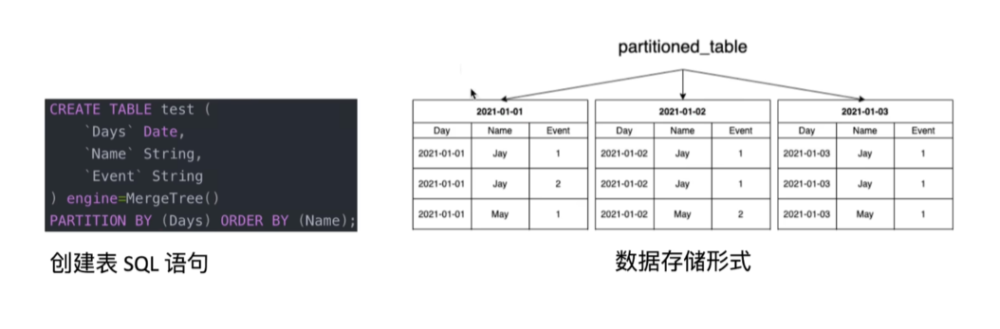

# ClickHouse学习笔记

## 一、OLAP

### 1. 1 OLTP与OLAP

**OLTP（online transaction processing）联机事务处理系统**

- 对数据的增删改操作性能更好

- 典型代表有 MySQL、Oracle

- 存储业务数据，记录某类业务事件的发生

- 大多数支持事务

- 针对事务进行操作，对响应时间要求高，数据量相对少

  

  `针对TB、PB级别的数据，传统的MySQL难以胜任海量的查询任务，尤其是以数据分析这种典型的全盘扫描式的统计业务。`

**OLAP（online analytical processing）联机分析处理系统**

- 支持复杂的分析操作，提供直观的查询结果
- 典型代表有ClickHouse、Doris
- 数据量非常大，常规是TB级别的 
- 不擅长对数据的修改操作
- 对于读取，从数据库中提取相当多的行，但只提取列的一小部分（适配宽表）
- 事务不是必须的
- 对数据一致性要求低

## 二、概览

### 2.1  ClickHouse基本介绍

- 俄罗斯Yandex开源的列式存储数据库，C++编写，主要用于在线分析处理查询
- 支持标准的SQL语言查询，支持复杂的聚合函数、窗口函数、跨表查询
- 关键特性：列式存储、数据分区、线程并行查询、支持丰富的表引擎

### 2.2  特性：列式存储


**优点**

- 不用读取整行，计数、求和等统计操作优于行式存储

- 查询部分列时，查询IO量小

- 同一列的数据类型相同，更容易进行数据压缩

  - RLE/Delta/LZ4/字典压缩等压缩算法

    ```
    对于性别列['m','f','m','m','f']，可以使用字典压缩算法：
    1. 原始数据：['m','f','m','m','f']
    2. 字典：{'m': 0, 'f': 1}
    3. 压缩后的数据：[0, 1, 0, 0, 1]
    ```

- 由于压缩后数据量小，更节省磁盘空间，可间接地提高缓存命中率与网络中传输效率

### 2.3  特性：数据分区和线程并行


#### 2.3.1 分区

分区是按照一定的业务逻辑，将数据“分门别类”地整理，方便后续查询管理



#### 2.3.2 线程并行

ClickHouse 将数据划分为多个partition，面对涉及划分区的查询，ClickHouse会以分区为单位并行处理

- 优点：单条query能利用整机所有CPU，极致的并行处理能力，极低的查询耗时
- 缺点：对于单条query使用多CPU，不利于同时并发多条查询，所以对于高QPS的场景，ClickHouse不是强项

### 2.4  特性：支持丰富表引擎


#### 2.4.1 表引擎决定了什么

- 数据的存储方式和位置，写到哪里以及从哪里读取数据
- 支持哪些查询以及如何支持
- 如何并发访问数据，是否可以执行多线程请求
- 是否存在索引，如何使用
- 数据复制如何进行

#### 2.4.2 有哪些表引擎

- MergeTree：最常用，支持分区，支持TTL
- 日志引擎（TinyLog/StripeLog/Log）：具有最小功能的轻量级引擎，当需要快速写入许多小表（最多100万行）并在未来整体读取它们时，该类型最有效
- 集成引擎（kafka/MySQL/JDBC）：用于与其他的数据存储与处理系统集成的引擎

### 2.5  缺点

- 不支持高并发

- 对 Update/Delete 操作不友好

- 单个插入性能低 

### 2.6  适用/不适用场景

**适用场景**

- 数据量大，数据分析的场景
- 大宽表场景，读大量行但是少量列
- 数据批量写入，且数据少更新或者不更新
- 无需事务，数据一致性要求低

**不适用场景**

- 不支持事务，不适合作为业务数据库
- 不擅长根据主键按行粒度进行查询，所以不适合key-value场景
- 不擅长频繁的更新和删除


## 三. 数据类型


## 四. 表引擎

### 4.1 MergeTree

```sql
#建表语句示例
create table t_order_mt(
	id UInt32，
	sku_id String，
    total_amount Decimal(16,2)，
    create_time Datetime
)engine = MergeTree # 表引擎
partition by toYYYYMMDD(create_time) # 分区字段，可选的
primary key(id) # 主键（但是ch不会加唯一约束），可选的
order by(id, sku_id); # 必须有的
```

<br>

#### 4.4.1 partition by 分区（可选字段）

- **目的**：降低扫描的范围，优化查询速度
- **位置**：在本地磁盘分区
- **分区目录**：MergeTree是以列文件 + 索引文件 + 表定义文件组成的，如果设定了分区那么这些文件就会保存到不同的分区目录中
- **并行**：分区后，面对涉及跨分区的查询统计，ClickHouse会以分区为单位并行处理

```
未定义分区键：默认生成一个目录名为all的数据分区，所有数据均存放在all目录下
整型分区键：分区键为整型，直接用该整型的字符串形式作为分区id
日期类型分区键：分区键为日期类型或者可以转化为日期类型
其他类型分区键：String，Float类型等，通过128位的Hash算法得到Hash值作为分区id
```

- **数据写入和分区合并**：任何一个批次的数据写入都会产生一个临时分区，不会纳入任何一个已有的分区。写入后的某个时刻，QuickHouse会自动执行合并操作，把临时分区的数据合并到已有的分区中

<br>

#### 4.1.2 primary key  主键索引（可选字段，必须是有序的）

`primary key 本质上就是排序键（ORDER BY）的前缀，因此它一定是有序的。`

ClickHouse 的主键和其他数据库不同，它只提供了数据的一级索引，却不提供唯一约束，这意味着是可以存在相同 primary key 的数据的。

主键的设定主要是依据查询语句中的 where 条件。

根据条件对主键进行某种形式的二分查找，能够定位到对应的 index granularity，避免了全表扫描。

- index granularity：索引粒度，指在稀疏索引中两个相邻索引对应数据的间隔，默认为8192

<br>

#### 4.1.3 order by 主键表达式 -稀疏索引（必须有的字段）

- **目的**：决定数据如何存储与排序（磁盘物理结构）以及如何建立稀疏索引（skip index）

例如：

```sql
ORDER BY (user_id, ts)
```

ClickHouse 会把数据存成：

```scss
(user_id, ts) 排序过的 segment
```

并建立稀疏索引 mark 文件：

```makefile
mark1: user_id=1, ts=...
mark2: user_id=1, ts=...
...
markN: user_id=99, ts=...
```

查询效率就依赖于它。
